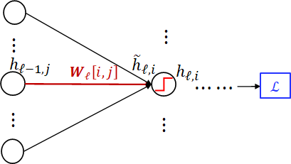

## 期末复习

[toc]

### Lec 00 Intro

1. **什么是机器学习？**
   * PTE 模型：机器学习是研究在经验为 E 的情况下，提高其在任务 T 上的性能 P 的算法。
   * 机器学习的泛化能力：模型、算法对新鲜样本的适应能力。
2. **什么是数据挖掘？**
   * 给定大量的数据来发现有效、可用、意料之外的、可理解的模式和模型。
3. **对比机器学习和数据挖掘**
   * 机器学习实践者使用数据作为训练集，来训练算法；数据挖掘使用算法从数据中发现有趣的模式。

### Lec 01 线性回归

1. **什么是回归问题？**

   * 根据给定的特征，预测感兴趣变量的值。
   * 数学表示：$\hat{y} = f(x_1, x_2,...x_m)$

2. **线性回归的数学表示**
   $$
   f(x_1, x_2, \dots, x_m) = w_0 + w_1x_1 + w_2x_2 + ... + w_mx_m
   $$

3. **线性回归的损失函数（均方误差 MSE）**
   $$
   L(w) = \frac1n\sum_{i=1}^n(f(x^{(i)}) - y^{(i)})^2
   $$

4. **单变量线性回归的损失函数构建与最优解**
   $$
   L(w_0, w_1) = \frac1n\sum_{i=1}^n(w_0 + w_1x^{(i)} - y^{(i)})^2
   $$
   算偏导，偏导为零时取得最优解
   $$
   \frac{\part L}{\part w_0} = 0, \frac{\part L}{\part w_1} = 0
   $$
   最后结果：联立 $w_0, w_1$ 时容易算错，用均值 $\overline{a} = \sum a_i$ 表示更方便
   $$
   w_0 = \frac{\overline{xy}\text{ }\overline{x} - \overline{x^2}\overline{y}}{\overline{x}^2 - \overline{x^2}}, w_1 = \frac{\overline{x}\text{ }\overline{y} - \overline{xy}}{\overline{x}^2 - \overline{x^2}}
   $$

5. **多变量情况（一般情况）线性回归的损失函数构建与最优解**（引入对向量及向量求导）
   $$
   f(\mathbf{x}) = \mathbf{x}\mathbf{w} \\
   \mathbf{x} = [1, x_1, x_2, ..., x_m] \in \mathbb{R}^{1\times(m+1)} \\
   \mathbf{w} = [w_0, w_1, w_2, ..., w_m]^\mathbf{T} \in \mathbb{R}^{(m +1)\times1}
   $$
   损失函数可以写成：
   $$
   L(\mathbf{w}) = \frac1n\sum_{i = 1}^n(\mathbf{x}^{(i)}\mathbf{w}-y^{(i)})^2 \\
   L(\mathbf{w}) = \frac1n ||\mathbf{X}\mathbf{w}-\mathbf{y}||^2 \\
   \mathbf{X} = [x^{(1)^\mathbf{T}}, x^{(2)^\mathbf{T}}, ..., x^{(n)^\mathbf{T}}]^\mathbf{T} \in \mathbb{R}^{n \times(m + 1)} \\
   \mathbf{y} = [y^{(1)}, y^{(2), ..., y^{(n)}}] \in \mathbb{R}^{n\times 1}
   $$

   > **常用的推导规则**：（**注意看分子是标量还是向量**）
   >
   > * **标量对向量求导**：分子标量，分母向量，结果与分母一个形状
   >
   > $$
   > ||\mathbf x||^2 = \mathbf x^T\mathbf x \\
   > \frac{\part \mathbf a^T\mathbf x}{\part \mathbf x} = \frac{\part\mathbf x^T \mathbf a}{\part \mathbf x} = \mathbf a \\
   > \frac{\part \mathbf x^T\mathbf x}{\part \mathbf x} = 2\mathbf x\\
   > \frac{\part \mathbf x^T \mathbf A \mathbf x}{\part \mathbf x} = (\mathbf A + \mathbf A^T)\mathbf x \\
   > \frac{\part z}{\part \mathbf x} = (\frac{\part \mathbf y}{\part \mathbf x})^T\frac{\part z}{\part \mathbf{y}} \text{ 链式法则 } \mathbf x \to \mathbf y \to z
   > $$
   >
   > * **向量对向量求导**：分子向量，分母向量，结果往往是矩阵（？）
   >   $$
   >   \frac{\part \mathbf A\mathbf x}{\part \mathbf x} = \mathbf A \\
   >   \frac{\part\mathbf x^T \mathbf A}{\part \mathbf x} = \mathbf A^T \\
   >   \frac{\part \mathbf z}{\part \mathbf x} = \frac{\part \mathbf z}{\part \mathbf y}\frac{\part \mathbf y}{\part \mathbf x} \text{ 链式法则 } \mathbf x \to \mathbf y \to \mathbf z
   >   $$
   >
   > * **标量对矩阵求导**：分子标量，分母矩阵
   >   $$
   >   \frac{\part \mathbf a^T\mathbf X \mathbf b}{\part \mathbf X} = \mathbf a\mathbf b^T \\
   >   \frac{\part z}{\part \mathbf X} = \mathbf A^T \frac{\part z}{\part \mathbf Y} \text{ 链式法则 } z = f(\mathbf Y), \mathbf Y = \mathbf A \mathbf X + \mathbf B
   >   $$
   >   

   蒜偏导：
   $$
   \frac{\part{L(\mathbf{w})}}{\part\mathbf{w}} = \frac2n\mathbf{X}^T(\mathbf{X}\mathbf{w}-\mathbf{y}) = 0 \\
   \mathbf{w}^* = (\mathbf{X}^T\mathbf{X})^{-1}\mathbf{X}^T\mathbf{y}
   $$

6. **梯度下降**
   $$
   \mathbf{w}^{(t+1)} = \mathbf{w}^{(t)} - r \cdot \frac{\part L(\mathbf{w})}{\part \mathbf{w}}|_{w = w^{(t)}} = \mathbf{w}^{(t)} - r \cdot\frac1n\sum_{i = 1}^n\frac{\part l(\mathbf{w}, \mathbf{x}^{(i)}, y^{(i)})}{\part{\mathbf{w}}}
   $$

7. **随机梯度下降**：将样本分为若干 Batch
   $$
   \mathbf{w}^{(t+1)} = \mathbf{w}^{(t)} - r \cdot\frac1{|B_t|}\sum_{i \in B_t}\frac{\part l(\mathbf{w}, \mathbf{x}^{(i)}, y^{(i)})}{\part{\mathbf{w}}}
   $$

### Lec 02 线性分类器

1. **二分类问题**（逻辑回归与 Sigmoid 函数）

   * **Sigmoid 函数**：$ \sigma(x) = \frac{1}{1 + e^{-x}} $：

     

   * 逻辑回归问题：$f(\mathbf x) = \sigma(\mathbf x\mathbf w)$，就是在线性回归的基础上套一个 Sigmoid 函数

   * **平方误差损失函数**：$L(\mathbf w) = (\sigma(\mathbf x\mathbf w) - y)^2, y \in \{0, 1\}$

   * **交叉熵损失函数**：
     $$
     L(\mathbf w) = -y\log(\sigma(\mathbf x\mathbf w)) - (1 - y) \log(1 - \sigma( \mathbf x\mathbf w))
     $$
     交叉熵函数曲线是凸函数，而平方误差函数曲线非凸，凸函数更容易进行优化。

     > 取对数：一个是为了防止下溢，一个是使得连乘变连加

   * **判别边界**：
     $$
     \begin{equation}
     \hat y = 
     \left\{
     \begin{aligned}
     1&\text{ if }\sigma(\mathbf x\mathbf w) \ge 0.5 \text{ (equivalent to } \mathbf x\mathbf w \ge 0)\\
     0&\text{ else }\\
     \end{aligned}
     \right.
     \end{equation}
     $$

2. **多分类问题**（Softmax 函数）

   * 基于二分类的 One vs All 方法：每次划分一个类，结果取 argmax

   * **Softmax 函数**：
     $$
     softmax_i(\mathbf z) = \frac{e^{z_i}}{\sum_{k = 1}^Ke^{z_k}}
     $$
     数据 $\mathbf x$ 属于第 $i$ 类的概率：

     $f_i(\mathbf x) = softmax_i(\mathbf x\mathbf W) = \frac{e^{\mathbf x \mathbf w_i}}{\sum_{k = 1}^Ke^{\mathbf x \mathbf w_k}}, \mathbf x \in \mathbb R^{1\times d}, \mathbf W  = [\mathbf w_1, ..., \mathbf w_k] \in \mathbb R^{d\times k} $

   * Softmax 函数与 Sigmoid 函数的关系：当 $K = 2$ 时，有两类softmax分类等价于逻辑回归，参数为 $\mathbf w_1 - \mathbf w_2$
     $$
     softmax_1(\mathbf x\mathbf W) = \sigma(\mathbf x(\mathbf w_1 - \mathbf w_2)) \\
     softmax_2(\mathbf x\mathbf W) = 1 - \sigma(\mathbf x(\mathbf w_1 - \mathbf w_2))
     $$

   * **独热向量**

   * **交叉熵损失函数**：
     $$
     L(\mathbf w_1, \mathbf w_2, ..., \mathbf w_K) = -\frac1n\sum_{i = 1}^n\sum_{k = 1}^K y_k^{(i)}\log softmax_k(\mathbf x
     ^{(i)}\mathbf W)
     $$

   * 梯度下降：$\frac{\part L(\mathbf W)}{\part \mathbf W} = \frac1n\sum_{i = 1}^n(softmax(\mathbf x^{(i)}\mathbf W) - \mathbf y^{(i)})$

   > * Sigmoid 的导数：$\sigma'(x) = \sigma(x)(1 - \sigma(x))$

### Lec 03 从概率角度理解回归和分类问题

* 从概率的角度来看，线性回归实际上等于
  * 建模：假设条件分布为高斯分布
  * 训练：通过最大化对数似然来训练模型
* 从概率的角度来看，逻辑回归等价于
  * 建模：假设输出为伯努利条件分布
  * 训练：通过最大化对数似然来训练模型
* 从概率的角度来看，多类分类问题等价于
  * 建模：假设输出为类别分布
  * 训练：通过最大化对数似然来训练模型

### Lec 04 非线性模型，过拟合和正则化

* 线性模型非线性化：使用基函数非线性化线性模型：$f(\mathbf x) = \Phi(\mathbf x)\mathbf w$
  $$
  [x_1, x_2, ...,x_m] \in \mathbb R^m \to [\phi_1(\mathbf x), \phi_2(\mathbf x), ..., \phi_n(\mathbf x)] \in \mathbb R^n
  $$
  

  * 损失函数：$L(\mathbf w) = \frac1N||\Phi(\mathbf{X})\mathbf w - \mathbf y||^2$，$\mathbf w^* = (\Phi^T\Phi)^{-1}\Phi^T\mathbf y$
  * 交叉熵存实函数：同理把原来线性公式中的$\mathbf x^{(i)}$ 替换成 $\Phi^{(i)}$ 即可

* **过拟合**：指模型在训练集上表现很好（损失函数绩极小），到了验证和测试阶段就很差，即模型的泛化能力很差。原因：数据量太少而模型太复杂

  * **模型的泛化能力**：模型能够很好地处理（拟合）不可见数据的能力称为模型的泛化能力
  * **欠拟合**：指模型在训练集、验证集和测试集上均表现不佳的情况，原因：模型复杂度过低；特征量过少

* **模型的选择**：给定若干模型，选择出能在不可见的测试集上表现最好的模型。
  * **验证集**：留出一部分(20% ~ 30%)训练数据作为验证集，剩下的作为训练数据。在训练集上训练模型，在等待验证集上对模型进行评估；在验证集中选择性能最好的模型
  * **交叉验证**（K-Fold）：将整个训练集划分成 K 个子集，每次取 K -1 个子集作为训练集进行训练，剩下的子集作为验证集，重复 K 次。
* **正则化**：**除了拟合训练数据外，对参数施加一些先验偏好**
  
  * **L2 正则化**：$\tilde L(\mathbf w) = L(\mathbf w) + \lambda ||\mathbf w||_2^2, ||\mathbf w||_2 = (\sum_{k = 1}^K w_k^2)^\frac{1}{2}$
    * 倾于将模型参数缩小到零；$\lambda$ 越大，说明 $\mathbf w$ 对小值的偏好越强
  * **L1 正则化**：$\tilde L(\mathbf w) = L(\mathbf w) + \lambda ||\mathbf w||_1, ||\mathbf w||_1 = \sum_{k = 1}^K |w_k|$
    * L1 正则化也倾于使用较小的模型参数值，但经常导致 $\mathbf w$ 稀疏解，即 $\mathbf w$ 中的许多元素都是零

### Lec 05 支持向量机

* 线性分类器的判决边界：$\{\mathbf x|\mathbf w^{*^T}\mathbf x + b^* = 0\}$，判决边界是与 $\mathbf w^*$ 垂直的超平面，与原点的距离是 $-\frac{b^*}{||\mathbf w^*||}$

* **最大边界分类器 Maximum-Margin Classifier**：找到一个超平面使得边界尽可能大

  * **边界：边界用样本点到超平面的最小距离表示**
    $$
    Margin = \min_{l}\frac{y^{(l)}\cdot(\mathbf{w}^T\mathbf x^{(l)} + b)}{||\mathbf w||}
    $$

  * **最大边界分类的问题描述**：
    $$
    \mathbf w^*, b^* = \arg\max_{\mathbf w,b} \{ \frac{1}{||\mathbf w||} \min_{l} [y^{(l)}\cdot(\mathbf{w}^T\mathbf x^{(l)} + b)]\}
    $$

  * **推导过程**：（下面懒得给向量加粗）
    
    1. 将 $x$ 分解为 $m_1, m_2$，其中 $m_2$ 与超平面垂直，即 $m_2 || w$，$m_1$ 在在超平面上，即满足 $w^Tm_1 + b = 0$；
    2. 从而计算 $w^Tx + b = w^T(m_1 + m_2)+ b = w^Tm_2$，令这个式子为 $h(x)$；
    3. 又因为 $m_2||w$，$m_2$ 可以写成 $m_2 = \gamma \cdot \frac{w}{||w||}$（前者表示长度，后者表示方向）；
    4. 将 $m_2$ 代入 $h(x)$，有 $ h(x) = \gamma \cdot\frac{w^Tw}{||w||} = \gamma \cdot ||w||$，变形得到$\gamma = \frac{h(x)}{||w||}$；
    5. 因为 $\gamma$ 表示距离，在超平面的另一端，$h(x)$ 为负数，故此是要乘以 $-1$，负负得正；
    6. 最后得到：$\gamma = \frac{y\cdot h(x)}{||w||} = \frac{y\cdot(w^Tx+b)}{||w||}, y \in \{-1, 1\}$
    
    |  |  |
    | ------------------------------------------------------------ | ------------------------------------------------------------ |
    
    
    
  * **最大边界分类的等价对偶函数**：优化另一个目标函数，与原始问题具有相同的优化值，转化成的目标函数如下（凸二次优化问题，数值方法可求出最优解）：
    $$
    \min_{\mathbf w,b}\frac12||\mathbf w||^2 \\
    \text{s.t. }y^{(l)}\cdot(\mathbf w^T\mathbf x^{(l)} + b) \ge 1, \text{ for } l = 1,2,...,N
    $$

    * 原始优化问题的拉格朗日函数：拉格朗日乘子 $a_l$ 满足 $a_l \ge 0$
      $$
      L(\mathbf w,b,\mathbf a) = \frac12||\mathbf w||^2-\sum_{l = 1}^{N}a_l(y^{(l)}(\mathbf w^T \mathbf x^{(l)} + b)-1)
      $$

    * 拉格朗日对偶函数：
      $$
      g(\mathbf a) = \min_{\mathbf w,b}L(\mathbf w,b,\mathbf a) \\
      $$

    * 原优化问题的对偶公式
      $$
      \max_{\mathbf a} g(\mathbf a) \\
      \text{s.t. } a \ge 0
      $$

    * 推导函数 $g(\mathbf a)$ 的近似表达式(又称解析解)，即消去公式中的 $\mathbf w, b$ 。

    * 通过计算梯度：$\frac{\part L}{\part \mathbf w} = 0$ 和 $\frac{\part L}{\part b} = 0$，得到的式子再代入 $g(\mathbf a)$ 中（计算的秘诀是看清楚标量向量，向量点乘）
      $$
      \mathbf w = \sum_{l = 1}^N a_ly^{(l)}\mathbf x^{l}, \sum
      _{l=1}^Na_ly^{(l)}= 0  \\
      $$
      得到：
      $$
      g(\mathbf a) = \sum_{l=1}^Na_l-\frac12\sum_{l=1}^N\sum_{j=1}^Na_la_jy^{(l)}y^{(j)}\mathbf x^{(l)^T}\mathbf x^{(j)}
      $$

    * 对偶优化变成：该式子可以使用数值优化
      $$
      \max_{\mathbf a} g(\mathbf a) = \max_a (\sum_{l=1}^Na_l-\frac12\sum_{l=1}^N\sum_{j=1}^Na_la_jy^{(l)}y^{(j)}\mathbf x^{(l)^T}\mathbf x^{(j)})\\
      \text{s.t. } a \ge 0 \text{ and } \sum_{l=1}^Na_ly^{(l)}= 0
      $$

    * 计算 $\mathbf a^*$ 后转化为 $\mathbf w^*, b^*$
      $$
      \mathbf w^* =\sum_{l = 1}^N a_l^*y^{(l)}\mathbf x^{(l)}
      $$
      对于每一个在边界 $S$ 上的样本 $(\mathbf x^{(i)}, y^{(i)})$ ，有 $y^{(i)}(\mathbf w^{*^T}\mathbf x^{(i)} + b^*) = 1$，可以解出 $b^*$，最后可以对所有边界样本求出的结果取均值：
      $$
      b^* = \frac1{|S|}\sum_{i \in S}(y^{(i)} - \mathbf w^{*^T}\mathbf x^{(i)}) = \frac1{|S|}\sum_{i \in S}(y^{(i)} - \sum_{l = 1}^N a_l^*y^{(l)}\mathbf x^{(l)^T}\mathbf x^{(i)})
      $$

    * 最后将 $\mathbf w^*, b^*$ 代入回 $\hat y(\mathbf x)=sign(\mathbf w^{*^T}\mathbf x + b^*)$  即可得到**对偶的最大边界分类器**：
      $$
      \hat y(\mathbf x) = sign(\sum_{n = 1}^N a_n^*y^{(n)}\mathbf x^{(n)^T}\mathbf x + b^*)
      $$

  * **支持向量**：**满足 $y^{(n)}(\mathbf w^{*^T} \mathbf x^{(n)} + b^*) = 1$ 的样本 $\mathbf x^{(n)}$，即在边界上的样本。**

    * 在处理测试样本时，只需要评估训练样本 $\mathbf x$ 和支持向量 $\mathbf x^{(n)}, n \in S$ 的相似性 $\mathbf x^{(n)^T}\mathbf x$

* **软最大边界分类器 Soft Maximum-Margin Classifier**

  * **松弛变量**：引入松弛变量 $\xi_n$，解决最大边界分类器出现超平面不存在的情况。
    $$
    y^{(n)}\cdot(\mathbf w^T\mathbf x^{(n)} + b) \ge 1 - \xi_n, \xi_n \ge 0
    $$

  * **优化任务**：（$C$ 是控制因子）
    $$
    \min_{\mathbf w, b, \xi}\frac12||\mathbf{w}^2||+C\sum_{n=1}^N \xi_n \\
    \text{s.t. } y^{(n)}\cdot(\mathbf w^T\mathbf x^{(n)} + b) \ge 1 - \xi_n \\
    \xi_n \ge 0, \text{ for }n=1,2,...,n
    $$

  * **对偶形式**：可以看到，对比最大边界分类器，只多了一个 $a_n\le C$ 的条件，其他全部一致

  $$
  \max_{\mathbf a} g(\mathbf a) = \max_a (\sum_{n=1}^Na_n-\frac12\sum_{n=1}^N\sum_{m=1}^Na_na_my^{(n)}y^{(m)}\mathbf x^{(n)^T}\mathbf x^{(m)})\\
  \text{s.t. } a_n \ge 0, a_n \le C \text{ and } \sum_{n=1}^Na_ny^{(n)}= 0
  $$

  * 计算过程：（重点是拉格朗日函数的编写，因为多了一个$\xi_n\ge 0$的条件，引入了$\beta$）
    $$
    L(\mathbf w, b, \xi, \alpha, \beta) = \frac12||\mathbf w||^2 + C\sum_{l = 1}^N\xi_l - \sum_{l=1}^Na_l(y^{(l)}(\mathbf w^T\mathbf x^{(l)} + b)-(1-\xi_n)) - \sum_{l=1}^N\beta_l\xi_l \\
    \text{s.t. } a_l \ge 0, \beta_l \ge 0
    $$
    计算偏导：$\frac{\part L}{\part w}, \frac{\part L}{\part b}, \frac{\part L}{\part \xi_l}$ 前两者没有变化，$\frac{\part l}{\part \xi_l} = C - a_l - \beta_l = 0$，从而得到 $a_n \le C$ 的条件

    > 拉格朗日对偶的通用公式：
    >
    > * 原始问题：
    >   $$
    >   \min_{x}f(x) \\
    >   \text{s.t. } c_i(x) \le 0, i = 1,2,...,m \\
    >   h_j(x) = 0, j = 1,2,...,n
    >   $$
    >
    > * 拉格朗日对偶函数：
    >   $$
    >   g(\alpha,\beta) = \min_{x}L(x,\alpha, \beta)=\min_x(f(x) + \sum_{i=1}^m\alpha_ic_i(x) + \sum_{j = 1}^n\beta_jh_j(x)) 
    >   $$
    >   

* **支持向量机 Support Vector Machine**

  * **基本模型的优化目标函数：**
    $$
    \arg\min_{w,b}\frac12||w^2|| \\
    \text{s.t.} y_i (w^Tx_i+b) \ge 1, i = 1,2,...,m
    $$
    
  * **核函数 Kernel Function：核函数是一个双变量函数** $k(\mathbf x, \mathbf x')$，可以表示为某个函数 $\Phi(\cdot)$ 的内积：$k(\mathbf x,\mathbf x') = \Phi(\mathbf x)^T\Phi(\mathbf x')$。
  
    * **引入核函数的原因：直接使用基函数替换 $x$ 会导致计算内积时代价昂贵**
    * Mercer 定理：若核函数是对称正定（$\int\int g(\mathbf x)k(\mathbf x, \mathbf y)g(\mathbf y)d\mathbf x d\mathbf y \ge 0, \forall g(\cdot)\in L^2$）的，则存在函数 $\Phi(\cdot)$ 满足 $k(\mathbf x, \mathbf x') = \Phi(\mathbf x)^T\Phi(\mathbf x')$
    * **高斯核函数：$k(\mathbf x, \mathbf x') = \exp\{-\frac1{2\sigma^2}||\mathbf x - \mathbf x'||^2\}$，可以实现无限维非线性最大边缘分类器**
  
  * 对偶软最大边界分类器可以写成：
    $$
    \max_\mathbf a g(\mathbf a) \\
    \text{ s.t. } a_n \ge 0, a_n \le C, \sum_{n=1}^Na_ny^{(n)}=0 \\
    \text{ where } g(\mathbf a)=\sum_{n=1}^Na_n-\frac12 \sum_{n=1}^N \sum_{m=1}^Na_na_m y^{(n)}y^{(m)}k(\mathbf x^{(n)}, \mathbf x^{(m)})
    $$
    测试时有：
    $$
    \hat y(\mathbf x) = sign(\sum_{n = 1}^N a_n^*y^{(n)}k(\mathbf x^{(n)},\mathbf x) + b^*)
    $$

### Lec 06 神经网络

* 回归核分类的神经网络表示：（其中 $a$ 表示激活函数，$W_l$ 表示第 $l$ 层的参数）
  * 回归：$\hat y(\mathbf x) = \mathbf W_L a(...a(\mathbf W_2a(\mathbf W_1x)))$
  * 分类：$\hat y(\mathbf x) = softmax(\mathbf W_L a(...a(\mathbf W_2a(\mathbf W_1x))))$

* 常见激活函数：

  |             Sigmoid：$a(x) = \frac{1}{1+e^{-x}}$             |          Tanh：$a(x) = \frac{1-e^{-2x}}{1+e^{-2x}}$          |
  | :----------------------------------------------------------: | :----------------------------------------------------------: |
  |  |  |
  |                 **ReLU**：$a(x) = max(0,x)$                  |             **Leaky ReLU**:$a(x) = max(0.1x,x)$              |
  |  |  |

* 激活函数评价（主要围绕值域、梯度消失和计算成本）

  * Sigmoid：由于饱和而梯度消失、只能输出正值、计算指数的成本较高
  * Tanh：由于饱和而梯度消失、正负值都能输出、计算指数的成本较高
  * ReLU：小于零时出现梯度消失、只能输出正值、计算效率高
  * Leaky ReLU：不会出现梯度消失、正负值都能输出、计算效率高

* 损失函数：

  * 回归：均方误差损失 $L_r(\theta) = \frac1N\sum_{(x,y)\in D}|y-\hat y(x)|^2$
  * 分类：交叉熵损失 $L_r(\theta) = \frac1N\sum_{(x,y)\in D}\sum_{k = 1}^K -y_k\log \hat y_k(x)$

* 反向传播：计算 $\frac{\part L}{\part \mathbf W_t}$

  * $l$ 层的前馈可以表示为：$\hat h_t = W_lh_{l-1}, h_l = a(h_l)$，即 $h_l = a(W_lh_{l-1})$

  * **梯度计算**（链式法则）：

    * 计算步骤：

      * 第一步：从后往前计算$\frac{\part L}{\part h_l}$
      * 第二部：从后往前计算$\frac{\part L}{\part W_l[i,j]}$

    * 计算 $\frac{\part L}{\part W_l[i,j]}$：
      $$
      \frac{\part L}{\part W_l[i,j]} = \frac{\part L}{\part h_{l,i}}\frac{\part h_{l,i}}{\part W_l[i,j]} \\= \frac{\part L}{\part h_{l,i}}\frac{\part h_{l,i}}{\part \hat h_{l,i}}\frac{\part \hat h_{l,i}}{\part W_l[i,j]} \\= \frac{\part L}{\part h_{l,i}}\frac{\part h_{l,i}}{\part \hat h_{l,i}}h_{l-1.j}
      $$
      

    * 计算 $\frac{\part L}{\part h_{l,i}}$：
      $$
      \frac{\part L}{\part h_{l,i}} = \sum_{j=1}^m[\frac{\part L}{\part h_{l+1,i}}\frac{\part h_{l+1,i}}{\part h_{l,i}}] \\ = \sum_{j=1}^m[\frac{\part L}{\part h_{l+1,i}}\frac{\part h_{l+1,i}}{\part \hat h_{l+1,i}}\frac{\hat h_{l+1,i}}{\part h_{l,i}}] \\ = \sum_{j=1}^m[\frac{\part L}{\part h_{l+1,i}}\frac{\part h_{l+1,i}}{\part \hat h_{l+1,i}}W_{l+1}[j,i]]
      $$
      

    * 计算输出层：

      * 回归（均方误差损失）：$\frac{\part L}{\part h_L} = (h_L - y)$

      * 分类（交叉熵损失）：$\frac{\part L}{\part h_L} = \frac{h_L - y}{h_L(1-h_L)}$

    

  * 经典网络结构：
    * CNN：卷积、池化操作
      * LeNet、AlexNet、ResNet
    * GCN：图卷积网络、GraphAttentionNetwork 图注意力网络
    * RNN

### Lec 07 神经网络的优化和训练技巧

* 算法优化：

  * 随机梯度下降 SGD
    $$
    w_{t+1}=w_t-lr\times\nabla f(w_t)
    $$

    * $\nabla f(w_t)$：损失函数 L 的随机梯度

  * SGD + 动量：
    $$
    v_t = \rho v_{t-1} + \nabla f(w_t) \\
    w_{t+1}=w_t-lr\times v_t
    $$

    * $\rho\in(0,1)$：退化率

  * RMSProp
    $$
    s_t = \rho\times s_{t-1} + (1-\rho)(\nabla f(w_t) \odot \nabla f(w_t)) \\
    w_{t+1}=w_t-lr\times\nabla f(w_t) \oslash\sqrt{s_t}
    $$

    * $s_t$：累计平方梯度，$\odot$ 逐元素乘法，$\oslash$ 逐元素除法

  * Adam
    $$
    m_t = \beta_1 \times m_{t-1} + (1-\beta_1)\nabla f(w_t) \\
    s_t = \beta_2\times s_{t-1} + (1-\beta_2)(\nabla f(w_t) \odot \nabla f(w_t)) \\
    w_{t+1}=w_t-lr\times m_t \oslash\sqrt{s_t}
    $$

    * $m_t$：历史梯度的移动平均

    

* 训练技巧

  * 预处理：

    * 中心化（减均值）、归一化（Normalizing the variance 除方差）、白化（Whitening）

      

  * 初始化：使用高斯分布（$N(0,0.01^2)$）来随机化权重参数，随着网络层数加深，可以使用 $N(0,\sigma_i^2)$ 的高斯分布，使得每一层的方差与前一层的神经元数量成反比

  * 超参数微调：在开始训练之前有很多参数需要设置，为了给这些超参数设置合适的值，将整个数据集分成三部分，即训练集、验证集和测试集，分别用于训练模型、调整超参、测试最终性能。

### Lec 08 集成学习：Bagging & Boosting

* 集成的思想：训练一堆弱分类器，这些分类器可能只在数据集的一部分上表现良好，如果将在不同部分上表现良好的弱分类器结合在一起，就可以得到一个强分类器。
  * 结合的思路：使用投票机制或投票，更优秀的分类器有更高的权重
* **Bagging：首先通过 Bootstrapping 创建训练数据集的子集（有放回采样），然后在每个子集上训练一棵决策树（或者其他模型），最后通过多数投票将决策树们合并为一个决策树（或者其他模型）**
  * 随机森林：在构建决策树时，只使用随机属性子集
* Boosting：
  * 弱分类器创建：重复执行以下步骤：识别被错误分类的例子，重新训练分类器，对错误分类的例子给予更多的权重
  * 弱分类器合并：将各分类器的预测结果进行加权平均
  * **Adaboost 算法**：（以二分类问题为例）
    * 迭代：计算第一个分类器 $h_1$ 上的错误率 $\epsilon_1$，并为此分类器赋予权值 $\alpha_1 = \frac12\ln(\frac{1-\epsilon_1}{\epsilon_1})$。最开始的时候，每一个样本 $x_i$ 的权重都是一样的，而现在需要将被错误分类的样本的权重以 $e^{\alpha_1}$ 的倍率增强，被正确分类的样本的权重以 $e^{-\alpha_1}$ 的倍率减弱，不断迭代计算 $h_2, h_3,...$
    * 结合：每个弱分类器的输出乘以权重后加和做为最终输出。

### Lec 09 线性降维 PCA

* **PCA 基本原理：通过线性变换将原始数据变换为一组各维度线性无关的表示，可用于提取数据的主要特征分量，常用于高维数据的降维。**（高维数据经常可以使用一个低维表示来近似，即存在一个内在维度，可以保存数据的大部分信息）

* **从最小化重构误差的角度理解 PCA**

  * 高维空间中的正交方向是一组两两正交的（单位）向量组，**正交可以表示成向量内积等于 0。**

  * **定理：在给定 M 个标准正交方向 $u_i$ 下，与数据样本 $x$ 的最佳近似为：$\hat {\mathbf x} = \alpha_1 \mathbf u_1 + \alpha_2 \mathbf u_2 +...+\alpha_M \mathbf u_M$， $\alpha_i = \mathbf u_i^T\mathbf x$（系数 $\alpha_i$ 可以算出，但最佳方向还未确定）。**

  * 目标：确定最佳方向

    * 给定数据 $\{\mathbf x^{(n)}\}_{n=1}^N \in \mathbb R^D$ ，找出最能代表原始数据的正交方向 $u_i$，即 $\mathbf x^{(n)} \approx \sum_{i=1}^{M}\alpha_i^{(n)}\mathbf u_i$
    * 目标可以表述为最小化数据 $\mathbf x^{(n)}$与其近似值 $\hat{\mathbf x}^{(n)} =  \sum_{i=1}^{M}\alpha_i^{(n)}\mathbf u_i$ 之间的误差

  * 推导步骤：

    1. 中心化样本：$\mathbf x^{(n)} - \overline {\mathbf x} = \mathbf x^{(n)} - \frac1N\sum_{n=1}^N\mathbf x^{(n)}$

    2. 描述目标问题：
       $$
       E = \frac1N\sum_{n=1}^N||(\mathbf x^{(n)}-\overline{\mathbf x})-\hat{\mathbf x}^{(n)}||^2 \\
       \alpha_I^{(n)} = \mathbf u_i^T(\mathbf x^{(n)}-\overline{\mathbf x})
       $$

    3. 将 $ \hat{\mathbf x}^{(n)}$ 的表达式代入 $E$，并将平方展开，再将 $\alpha_i^{(n)}$ 的表达式代入展开后的 $E$ 得到：
       $$
       E = \frac1N(\sum_{i=1}^{N}||\mathbf{x}^{(n)}-\overline{\mathbf x}||^2 - 2\sum_{n=1}^N\sum_{i=1}^M\alpha_i^{(n)}(\mathbf{x}^{(n)}-\overline{\mathbf x})^T\mathbf u_i + \sum_{n=1}^N\sum_{i=1}^M(\alpha_i^{(n)})^2) \\
       E = \frac1N\sum_{i=1}^{N}||\mathbf{x}^{(n)}-\overline{\mathbf x}||^2 - \sum_{i=1}^M\mathbf u_i^T\frac1N\sum_{n=1}^N(\mathbf x^{(n)}-\overline{\mathbf x})(\mathbf x^{(n)}-\overline{\mathbf x})^T\mathbf u_i
       $$
       我们令 $s = \frac1N\sum_{n=1}^N(\mathbf x^{(n)}-\overline{\mathbf x})(\mathbf x^{(n)}-\overline{\mathbf x})^T$，$E$ 的前半部分是常数

    4. 将 $E$ 写成矩阵形式：
       $$
       E = ||\mathbf X - \overline{\mathbf X}||^2_F - \sum_{i=1}^M\mathbf u_i^T\mathbf S\mathbf u_i
       $$
       其中：$\mathbf X = [\mathbf x^{(1)}, \mathbf x^{(2)}, ..., \mathbf x^{(N)}]$，$||\cdot||_F$ 是 Frobenius范数，定义为矩阵各项元素的绝对值平方的总和开根。

    5. 问题转换：

       * 在 $M=1$ 的情况下，使用拉格朗日方法，可以看出 $u_1$ 应该是 $S$ 最大特征值对应的特征向量
         $$
         \max_{u_1} u_1^TSu_1\\
         \text{s.t. } u_1^Tu_1 = 1\\
         \text{Lagrange Method: }L =  u_1^TSu_1- \lambda(u_1^Tu_1-1) \\
         \text{derivative of u1 = 0: } Su_1 = \lambda u_1
         $$

       * 在 $M = k$ 的情况下（推导同样使用拉格朗日方法，注意利用正交的条件），**$u_i$ 就是 $S$ 最大的 $k$ 个特征值对应的特征向量**

* **从最大化方差的角度理解 PCA**：最大化方差等于尽可能保留原始数据的信息

  * 推导过程：

    * 以 $M=1$ 为例：

      * **对于第一个方向 $u_1$，我们希望投影到 $u_1$ 方 向上的数据方差，即 $\mathbf u_1^T\mathbf x^{(n)}$，是最大的。**

      * 方差的表达式：
        $$
        var = \frac1N\sum_{n=1}^N(\mathbf u_1^T(\mathbf x^{(n)}-\overline{\mathbf x}))^2 \\
         = \mathbf u_1^T\frac1N\sum_{n=1}^N(\mathbf x^{(n)}-\overline{\mathbf x})(\mathbf x^{(n)}-\overline{\mathbf x})^T\mathbf u_1 \\
         = \mathbf u_1^T\mathbf S\mathbf u_1
        $$

      * 同样可以推出  $u_1$ 应该是 $S$ 最大特征值对应的特征向量

    * 在 $M = k$ 的情况下（推导同样使用拉格朗日方法，注意利用正交的条件），**$u_i$ 就是 $S$ 最大的 $k$ 个特征值对应的特征向量**

* 从奇异值分解 SVD 的角度理解 PCA：

  * **SVD**：$U,V$ 的列向量 $u_i, v_i$ 分别是 $AA^T,A^TA$ 的第 $i$ 个特征向量，$\Sigma$ 是特征值对角矩阵，是 $AA^T,A^TA$ 特征值的平方根，也是 $A$ 的特征值，并且从大到小有序排列。

    
    $$
    \mathbf A = \mathbf U\Sigma \mathbf V^T = \sum_{i=1}^M\Sigma_{ii}\mathbf u_i\mathbf v_i^T
    $$

  * 定义 $\hat X = [x^{(1)}-\overline x, ..., x^{(N)}-\overline x]$，有$\hat X\hat X^T = \sum_{n=1}^N(x^{(n)}-\overline x)(x^{(n)}-\overline x)^T = N\cdot S$，对 $\hat X$ 做 SVD分解，就可以得到主方向。

> 计算特征值、特征向量
>
> * 求解特征值：计算行列式 $|A-\lambda E|$，方程的根就是特征值
> * 将特征向量代入方程 $(A-\lambda E)x = 0$，求解

### Lec 10 K-Means 聚类

* 聚类的目标：类内高相似性和类间低相似性

* K-Menas **算法原理**：通过最小化几何点之间的平均距离将相似数据点分组成集群。以迭代方式将数据集分为 K 个非重叠集群，其中每个数据点均属于集群中心均值最近的集群。

* K-Means **算法步骤**：

  1. 随机初始化 K 个中心 $\mu_k, k\in \{1,2,...,K\}$，然后计算样本 $x^{(n)}$ 和各个中心点的距离

  2. 将与样本 $x^{(n)}$ 最近的中心点所在的类作为 $x^{(n)}$ 的类

     

  3. 使用每个集群中所有样本的平均作为集群新的中心：$\mu_k \leftarrow \frac{\sum_{n=1}^Nr_{nl}\mathbf x_n}{\sum_{n=1}^Nr_{nl}}$
  4. 重复上面的赋值和中心更新过程，直至算法收敛，样本的类不再发生变化

* 算法能够收敛的证明：样本到中心点的总距离 $J$ 有下限，算法每次迭代总距离减小

* 算法讨论：

  * 聚类个数 $K$ 的选择：观察总距离 J 曲线随 K 的变化曲线，选择肘点（elbow point）
  * 初始点选择：
    * 随机选择样本点
    * 基于距离选择样本点：随机选择一个，然后接下来每次选择与已选点的平均最远的一个点
    * 结合上述两种方法：每次选最远的若干点，从中随机选择一个点
  * Soft K-Means：每个样本点 $x_i$ 以概率 $p_{i,j}$ 在类 $j$ 中

### Lec 11 决策树

* 归纳学习任务 Inductive Learning：利用特定的事实来得出更一般化的结论

* 决策树：基于布尔测试分支系列的预测模型

* 决策树建立：

  * 首先给出一个可以度量的离散属性列表；然后我们选择一个我们想要预测的目标属性‘然后创建一个经验表，列出我们过去所看到的
  * 选择最好的属性来分割剩余的实例，并使该属性成为决策节点，对每个子节点递归地重复此过程，当所有实例都具有相同的目标属性值，或没有更多的属性，或没有更多的实例时停止

* **ID3 算法**

  * 熵 Entropy：$E(S) = -\sum_{i=1}^l\frac{|s_i|}{|S|}\log_2(\frac{|s_i|}{|S|})$，其中 $S$ 是样本集合，$s_i$ 是在目标属性下值为 $v_i$ 的样本子集，$l$ 是目标属性的可选范围

  * 算法思想：每次选择熵增最小的属性进行分割，计算一个属性的所有值的熵作为子集熵的加权和，然后计算熵增
    $$
    Gain = E(S) - \sum_{i = 1}^k\frac{|s_i|}{|S|}E(S_i)
    $$

  * 剪枝：

    * 前向剪枝 Pre-pruning：在构建过程中决定何时停止添加属性
    * 后向剪枝 Post-pruning：一直等到构建完整的决策树，然后再修剪属性

* 决策树讨论：

  * 连续属性：离散化
  * 误差传播 Error Propagation：决策树是通过一系列局部决策来工作的，那么当其中一个局部决策出错时，从那以后的每一个决定都可能是错误的

### Lec 12 EM 算法

* **无监督分类问题，有点像 K-Means**

* **问题的一般形式**：给定一个联合分布 $p(x,z;\theta)$（在概率模型的参数 $\theta$ 下，$x,z$ 的联合概率分布），$x$ 是观测变量，$z$ 是隐变量（Latent variable），目标是最大化似然分布：$\theta = \arg\max_\theta\log p(x;\theta)$，满足 $ p(x;\theta) = \sum_z p(x,z;\theta)$。即我们需要根据联合概率分布函数 $p(x,z;\theta)$，优化边缘概率分布函数 $p(x;\theta)$

* **EM 算法（期望最大化算法）算法步骤：**

  * **E 步**：评估期望（下标所示分布下，括号内的随机变量的期望）

    * 假定参数已知，计算此时隐变量的后验概率（**求出每一个样本属于类别的期望值**）

    $$
    Q(\theta;\theta^{(t)})=\mathbb E_{p(z|x;\theta^{(t)})}[\log p(x,z;\theta)]
    $$

  * **M 步**：更新参数

    * 带入隐变量的后验概率，最大化样本分布的对数似然函数，求解相应的参数（**通过当前数据求出最可能的分布参数**）

    $$
    \theta^{(t+1)} = \arg\max_{\theta}Q(\theta;\theta^{(t)})
    $$

  * 参数说明：

    * $p(z|x;\theta^{(t)})$：隐变量的后验分布（条件概率）

    * $Q$：联合分布的对数⁡ $\log p(x,z;\theta)$ 关于后验概率分布 $p(z|x;\theta^{(t)})$ 的期望

      > 条件概率：$P(B|A) = \frac{P(AB)}{P(A)}$；
      >
      > 全概率公式：$P(A) = \sum_{i=1}^nP(B_i)P(A|B_i)$

* EM 的证明：证明算法可以保证每一步的 likelihood 增加
  $$
  \log p(x;\theta) = \sum_z q(z) \log \frac{p(x,z;\theta)}{p(z|x;\theta)} \\
  = \sum_z q(z) \log \frac{p(x,z;\theta)}{q(z)} + \sum_z q(z) \log \frac{q(z)}{p(z|x;\theta)} \\
  =L(q,\theta) + KL(q||p(z|x;\theta)), \forall \theta,q(z)
  $$

  * 其中：$KL(q||p) = \int q(z)\log\frac{q(z)}{p(z)}dz$ 是 KL 散度，用于衡量两个分布的距离

  
  $$
  L(p(z|x;\theta^{(t)}),\theta^{(t)}) = \sum_z p(z|x;\theta^{(t)})\log\frac{p(x,z;\theta^{(t)})}{p(x|z;\theta^{(t)})}
  $$

* **训练高斯混合模型的例子**

  * 混合高斯分布：
    $$
    p(x) = \sum_{k=1}^{K}\pi_k\mathcal N(x;\mu_k,\Sigma_k) 
    $$

    * 可以将其表示为联合分布的边缘分布（？）
      $$
      p(x,z)=p(x|z)p(z)=\prod_{k=1}^K[\pi_k\mathcal N(x;\mu_k, \Sigma_k)]^{z_k}
      $$
      其中，$\mathbf z = [z_1, z_2, ..., z_k]$ 服从分类分布，参数为 $\pi$

      > 分类分布：$P(X=x_k\theta_1,\theta_2,...\theta_K) = \prod_{k=1}^K\theta_k^{x_k}$，其中$\sum_{k=1}^K\theta_k =1, x_k\in {0,1}, k\in {1,2,...,K}$

  * **E 步**：

    * 后验分布：其中 $1_k$ 指第 $k$ 个元素为 1 的独热向量
      $$
      p(z=1_k|x;\theta)=\frac{p(x,z=1_k;\theta)}{\sum_{i=1}^Kp(x,z=1_i;\theta)}
      $$

    * 对数联合分布：就直接在混合高斯分布上加 $\log$ 就行了
      $$
      \log p(x,z;\theta) = \sum_{k=1}^K z_k \cdot [\log \mathcal N(x|\mu_k, \Sigma_k) + \log \pi_k]
      $$

    * 计算期望：
      $$
      \mathbb E_{p(z|x;\theta^{(t)})}[\log p(x,z;\theta)] \\
      = \sum_{k=1}^K \mathbb E_{p(z|x;\theta^{(t)})}[z_k][\log \mathcal N(x|\mu_k, \Sigma_k) + \log \pi_k]
      $$
      其中，$E_{p(z|x;\theta^{(t)})}[z_k]$ 用后验分布的式子代替（将混合高斯分布代入 $p$，参数加上标）
      $$
      E_{p(z|x;\theta^{(t)})}[z_k] = \frac{\mathcal N(x|\mu_k^{(t)}, \Sigma_k^{(t)})\pi_k}{\sum_{i=1}^K \mathcal N(x|\mu_i^{(t)}, \Sigma_i^{(t)})\pi_i} = \gamma_k^{(t)}
      $$
      最后代入到 $Q(\theta;\theta^{(t)})$：
      $$
      Q(\theta;\theta^{(t)})=\sum_{k=1}^K \gamma_k^{(t)} [\log \mathcal N(x|\mu_k, \Sigma_k) + \log \pi_k]
      $$

    * 将 $\mathcal N(x|\mu_k,\Sigma_k) = \frac1{(2\pi)^{D/2}|\sigma|^{1/2}}\exp\{-\frac12(x-\mu_k)^T\Sigma_k^{-1}(x-\mu_k)\}$ 代入 $Q(\theta;\theta^{(t)})$：
      $$
      Q(\theta;\theta^{(t)})= \sum_{k=1}^K\gamma_k^{(t)} [-\frac12(x-\mu_k)^T\Sigma_k^{-1}(x-\mu_k)-\frac12|\Sigma_k| + \log \pi_k] + C
      $$
      $C$ 是常量（$\frac{1}{(2\pi)^{D/2}}$ 部分）

    * 最后，考虑所有样本：
      $$
      Q(\theta;\theta^{(t)})= \frac1N\sum_{n=1}^{N}\sum_{k=1}^K \gamma_k^{(t)} [-\frac12(x^{(n)}-\mu_k)^T\Sigma_k^{-1}(x^{(n)}-\mu_k)-\frac12|\Sigma_k| + \log \pi_k] + C
      $$

  * **M 步**：通过对 $\mu_k, \Sigma_k, \pi_k$ 求导并将它们设为零，得到最佳 $\theta$：
    $$
    \mu_{k}^{(t+1)} = \frac1{N_k}\sum_{n=1}^N\gamma_{nk}x_n \\
    \Sigma_k^{(t+1)} = \frac{1}{N_k}\sum_{n=1}^{N}\gamma_{nk}(x_n-\mu_k^{(t+1)})(x_n-\mu_k^{(t+1)})^T \\
    \pi_k^{(t+1)} = \frac{N_k}{N}
    $$
    其中：$N_k = \sum_{n=1}^{N}\gamma_{nk}$，分配给第 $k$ 类的样本数

* **训练高斯混合模型的EM算法总结：**

  * 给定当前估算值：$\{\mu_k, \Sigma_k, \pi_k\}_{k=1}^K$，更新 $\gamma_{nk}$：
    $$
    \gamma_{nk} \leftarrow \frac{\mathcal N(x|\mu_k,\Sigma_k)\pi_k}{\sum_{i=1}^{K}\mathcal N(x|\mu_i,\Sigma_i)\pi_i}
    $$

  * 跟据 $\gamma_{nk}$，更新 $\mu_k, \Sigma_k, \pi_k$
    $$
    N_k \leftarrow \sum_{n=1}^N\gamma_{nk} \\
    \mu_{k} \leftarrow \frac1{N_k}\sum_{n=1}^N\gamma_{nk}x_n \\
    \Sigma_k \leftarrow \frac{1}{N_k}\sum_{n=1}^{N}\gamma_{nk}(x_n-\mu_k)(x_n-\mu_k)^T \\
    \pi_k \leftarrow \frac{N_k}{N}
    $$

* 二维高斯混合模型EM算法的例子：[EM算法视频](https://www.bilibili.com/video/BV1RT411G7jJ?spm_id_from=333.337.search-card.all.click&vd_source=ec9ba6f83a7109d606c9de88cd0e3463)

  

  

### Lec 13 推荐系统：基于内容的推荐和协同滤波

* **推荐系统问题**：推荐系统问题旨在用户推荐相关项，项可以是用户未观看过的电影、书籍，未访问过的网站，可以是任何可以购买的产品，实现一种个性化的推荐。推荐系统可以总结为以下模型：
  $$
  \text{Utility Function: } u: X \times S \to R
  $$
  其中，$X$ 是用户的集合，$S$ 是项的集合，$R$ 是用户对项评分的集合，并且是关于项的有序集。

  * 推荐系统问题关键问题：如何为矩阵收集已知的评级，如何从已知的评级中推断未知的评级，如何评估推断的好坏。

  * 冷启动问题：项没有被评分，用户的评分记录为空。

* **基于内容的推荐系统**：**向客户推荐与用户之前评价较高的产品相似的产品**

  * **跟据用户对项的评分建立项的画像（特征向量），在建立用户画像（特征向量），根据用户画像推荐项（计算相似度）。**

  * **项的画像**：**一个特征向量**

    * 例如文本挖掘使用TF-IDF，即项的频率乘以逆文档频率
      $$
      f_{ij} = \text{项 i 在文档 j 的出现频率} \\
      TF_{ij} = \frac{f_{ij}}{\max_k f_{kj}} \\
      n_i = \text{出现项 i 的文档的数目} \\
      IDF_i = \log\frac N{n_i} \\
      w_{ij} = TF_{ij}\times IDF_{i}
      $$

  * **用户画像**：例如评分项画像的加权平均

    * 给定项画像 $i$ 和用户画像 $x$，可以使用余弦相似度评估：$u(x,i)=\cos(x,i)=\frac{x\cdot i}{||x||\cdot||i||}$

  * **基于内容的推荐系统的优点：**

    * 不需要其他用户的数据，没有冷启动和稀疏性问题
    * 能够推荐给口味独特的用户
    * 能够推荐新的和不受欢迎的项目，没有 First-Rater 问题
    * 有很好的可解释性：它可以通过列出导致项目被推荐的内容-功能来提供推荐项目的解释

  * **基于内容的推荐系统的缺点**：

    * 难以找到合适的特征向量
    * 难以向新用户推荐项，因为新用户没有用户画像
    * 过度专门化：永远不会推荐用户兴趣之外的项，同时难以处理人多种信兴趣爱好的问题；无法利用其它用户进行推荐质量的评估

* **基于协同滤波的推荐算法** 

  * **基于用户的协同滤波算法**：找出评分与用户 $x$ 评分相似的其他用户的集合，根据集合中用户的评分估计用户 $x$ 对项的评分。

    * 第一步：读取用户-项的**评分矩阵** $R$。

    * 第二步：跟据评分矩阵计算**用户相似度矩阵** $S_U$，在计算相似度时我们选择**皮尔森相关系数**。我们可以将计算出的评分矩阵保存在文件中，以免下次重复计算。

    * 第三步：假定我们要预测用户 $u$ 给项 $i$ 的评分。首先找到于目标用户最相似的 K 个用户 $U_{sim}$，并且这些用户对项 $i$ 有评分记录，根据以下公式计算预测评分：
      $$
      r_{u,i} = \frac{\sum_{v \in U_{sim}} s_{u,v}r_{v,i}}{\sum_{v \in U_{sim}} s_{u,v}}
      $$
      其中，$r_{u,i}$ 指用户 $u$ 对项 $i$ 的预测评分，$s_{u,v}$ 指用户 $u$ 和用户 $v$ 的相似度。

  * **基于项的协同滤波算法**

    * 第一步：读取用户-项的评分矩阵 $R$。

    * 第二步：跟据评分矩阵计算用户相似度矩阵 $S_I$，在计算相似度时我们选择皮尔森相关系数。我们可以将计算出的评分矩阵保存在文件中，以免下次重复计算。

    * 第三步：假定我们要预测用户 $u$ 给项 $i$ 的评分。首先找到于目标项最相似的 K 个项 $I_{sim}$，并且用户 $u$ 对这些项有评分记录，根据以下公式计算预测评分：
      $$
      r_{u,i} = \frac{\sum_{j \in I_{sim}} s_{i,j}r_{v,i}}{\sum_{j \in I_{sim}} s_{i,j}}
      $$
      其中，$r_{u,i}$ 指用户 $u$ 对项 $i$ 的预测评分，$s_{i,j}$ 指项 $i$ 和项 $j$ 的相似度。

  * 计算相关性的几种方法：

    * Jaccard：两个集合A和B交集元素的个数在A、B并集中所占的比例

    * Cosine：$\cos(i,j)=\frac{i\cdot j}{||i||\cdot||j||}$

    * Pearson：
      $$
      sim(x,y) = \frac{\sum_{s\in S_{xy}}({r_{xs}-\overline r_x})({r_{ys}-\overline r_y})}{\sqrt{\sum_{s\in S_{xy}(r_{xs}-\overline r_x)^2}}\sqrt{\sum_{s\in S_{xy}(r_{ys}-\overline r_y)^2}}}
      $$

  * **协同滤波算法的评价**

    * 适用场景：
      * 基于用户的协同滤波算法：具备更强的社交特性，适用于用户少物品多，时效性较强的场景。比如新闻、博客、微内容推荐场景。此外基于用户的协同滤波算法能够为用户发现新的兴趣爱好。
      * 基于项的协同滤波算法：更适用于兴趣变化较为稳定的应用，更接近于个性化的推荐，适合物品少用户多，用户兴趣固定持久，物品更新速度不是太快的场合，比如电影推荐。
    * **协同滤波算法的优点**：适用于任何类型的项，不需要特征选择
    * 协同滤波算法的缺点：
      * **冷启动问题：对于基于用户的协同滤波算法，需要积累足够多的用户，并且用户有一定评分时才能找到一个用户的相似用户，而基于项的协同滤波算法没有此问题。**
      * **稀疏性问题：项的数目一般很多，一个用户对项的评分往往不会很多，评分矩阵是稀疏的，难以找到对相同的项评分过的用户。**
      * First-Rater 问题
      * 新的项、评分较少的项因为评分较少，难以被推荐。

    > - 冷启动问题：
    >   - 用户冷启动：如何给新用户做个性化推荐
    >   - 物品冷启动：如何将新的物品推荐给可能对它感兴趣的用户
    >   - 系统冷启动：如何在新开发的网站(无用户，用户行为，只有部分物品信息)上设计个性化推荐系统，从而使得网站刚发布时就让用户体会到**个性化推荐**。
    > - 冷启动的解决方案：
    >   1. **提供非个性化推荐**，比如说热门排行榜，等用户数据收集到一定的时候，切换为个性化推荐
    >   2. **利用用户注册信息**，**人口统计学信息**；**用户兴趣描述**；**从其它网站导入的用户站外行为**等。
    >   3. **选择合适的物品启动用户的兴趣**，用户登录时对一些物品进行反馈，收集用户对这些物品的兴趣信息，然后给用户推荐和这些物品相似的物品。
    >   4. **利用物品的内容信息**，userCF算法需要解决第一推动力的问题，第一个用户从哪里发现新物品。考虑**利用物品的内容信息**，将**新物品先投放给曾经喜欢过和它内容相似的其他物品的用户**。对于itemCF，只能利用物品的内容信息计算物品的相关程度。基本思路就是将物品转换为关键词向量，通过计算向量之间的相似度(如余弦相似度)，得到物品的相关程度。
    >   5. **采用专家标注**，针对很多系统在建立的时候，既没有用户的行为数据，也没有充足的物品内容信息来计算物品相似度，这时就需要利用专家标注。
    >   6. **利用用户在其他地方已经沉淀的数据进行冷启动**，比如引导用户通过社交网络账号登录，一方面降低注册成本提高转化率，另一方面获取用户的社交网络信息，解决冷启动问题。
    >   7. **利用用户的手机等兴趣偏好进行冷启动**：Android手机开放的比较高，所以在安装自己的app时，就可以顺路了解下手机上还安装了什么其他的app。然后可以总结用户的特点和类型。

  * 评估指标

    * RMSE：（测试样本的）均方误差

