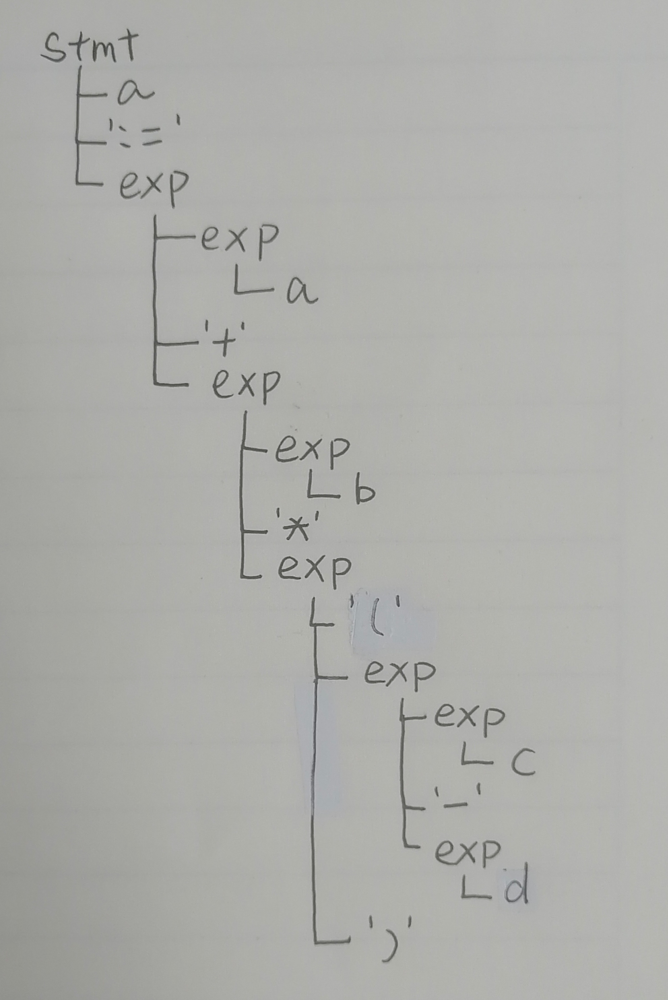
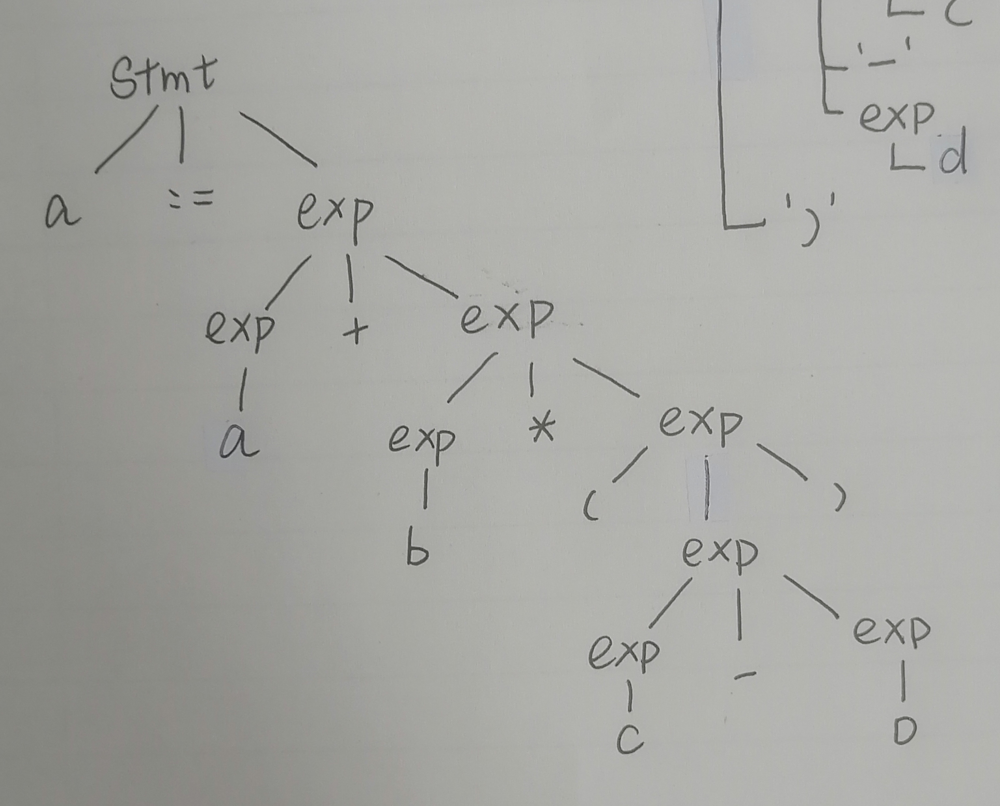

# 语法分析实验

**19335286 郑有为**

[toc]

## Ⅰ. 作业要求

* 实验目的：为扩展语言TINY+构造语法分析程序，从而掌握语法分析程序的构造方法。
* 实验内容：用EBNF描述TINY+的语法，构造TINY+语法分析器。
* 实验要求：将TOKEN序列转换成语法分析树，并能检查移动的语法错误。

## Ⅱ. 实现说明

在之前的基于 **Lex** 的TINY+词法分析程序的基础上实现语法分析，使用 **Yacc** 来帮助代码的生成。

修改词法分析定义和部分代码，返回TOKEN（跟之前的代码有较大的不同），但词法定义几乎不变，只有一下两点更改：

* **区分字符和字符串**，分别用 string 和 char 表示，string 用双引号包住，char 用单引号包住
* 增加一个**取非标识符**：**not**，优先级高于与运算

## Ⅲ. 词法语法定义

### 3.1 词法定义

参考C语言、老师的资料和华南理工的TINY+实验，以下给出TINY+的词法定义：

**关键字定义**如下，区分大小写，共 20 个。

| or         | and       | int      | float     | bool     | char      |
| ---------- | --------- | -------- | --------- | -------- | --------- |
| **while**  | **do**    | **if**   | **then**  | **else** | **end**   |
| **repeat** | **until** | **read** | **write** | **true** | **false** |
| **string** | **not**   |          |           |          |           |

**操作符定义**如下，也称为特殊符号，共 16 个。

| >     | <=    | >=    | < | {     | }     | **=** | :=    |
| ----- | ----- | ----- | ----- | ----- | ----- | ----- | ----- |
| **+** | **-** | ***** | **/** | **(** | **)** | **,** | **;** |

**其他词法**

| 标识       | 正则表达式（Lex语法）                           | 注释                                                     |
| ---------- | ----------------------------------------------- | -------------------------------------------------------- |
| DIGIT      | `[0-9]`                                         |                                                          |
| LETTER     | `[A-Za-z]`                                      |                                                          |
| DIGITS     | `[0-9][0-9]*`                                   |                                                          |
| **ID**     | `{LETTER}({LETTER}|{DIGIT})*`                   | 标识符，以字母开头，可包含数字                           |
| **INT**    | `[+-]?({DIGIT})+`                               | 整数，如+0，-5，100                                      |
| **FLOAT**  | `[+-]?{DIGITS}"."{DIGITS}`                      | 浮点数，如-0.14                                          |
| **CHAR**   | `'[^']'`                                        | 字符，如`'a'`                                            |
| **STRING** | `\"[^\n\"]*\"`                                  | 如`"Hi"`，不可跨行，不可嵌套                             |
| **注释**   | `"/*".*"*/"`或`"/*"([^\n"*/"]*\n)*"*/"		` | 如 `/*Hi*/` ，可跨行，不可嵌套，其内容会被词法分析器忽略 |

### 3.2 语法定义

* TOKEN列表（%left 约束了优先级，越在后面的优先级越高）：

  ```
  %token INT FLOAT CHAR STRING BOOL ID
  %token WHILE DO IF THEN ELSE END REPEAT UNTIL
  %token READ WRITE
  %token TRUE FALSE
  %token TYPE
  %token LE GE ASSIGN
  %token ',' ';' '(' ')' '{' '}' '<' '>'
  
  %left '+' '-'
  %left '*' '/'
  
  %left OR
  %left AND
  %left NOT
  ```

* EBNF描述语法（Yacc格式）：

| 编号 | 产生式                                                       | 注释                                                         |
| ---- | ------------------------------------------------------------ | ------------------------------------------------------------ |
| 1    | **program**: declarations stmt \| stmt                       | **程序（program）**<br >由**声明部分（declarations）**和**语句部分（stmt）**组成，变量声明需要在语句部分之前完成。 |
| 2    | **declarations**: declaration ';' \| declaration ';' declarations | **声明部分（declarations）**<br >由若干条**声明（declaration）**组成，声明部分可以为空。 |
| 3    | **declaration**: TYPE varlist                                | **声明（declaration）**<br >由**变量类型（TYPE）**和**变量列表（varlist）**组成。 |
| 4    | **varlist**: ID \| ID ',' varlist                            | **变量列表（variable_list）**<br >由若干个**标识符（ID）**组成，标识符之间由**逗号（,）**隔开。 |
| 5    | **stmt**: xstmt ';' \|  xstmt ';' stmt                       | **语句序列（stmt）<br >**由若干**语句块（xstmt）**组成，标识符之间由**分号（;）**隔开。 |
| 6    | **xstmt**: WHILE boolexp DO stmt END                         | **循环语句块（while-stmt）<br >**有固定格式，包含关键字 ***while***，条件判断表达式和关键字 ***do***、***end*** |
| 7    | **xstmt**: IF boolexp THEN stmt ELSE stmt END \| IF boolexp THEN stmt END | **条件判断语句块（if-stmt）<br >**有固定格式，包含关键字 ***if***，条件判断表达式和关键字 ***then***、***end***，其中***else***是可选项。 |
| 8    | **xstmt**: REPEAT stmt UNTIL boolexp                         | **重复语句块（repeat-stmt）<br >**有固定格式，包含关键字 ***repeat***， ***until*** 和条件判断表达式，逻辑上类似于C语言的 *do while* 。 |
| 9    | **xstmt**: ID ASSIGN exp                                     | **赋值环语句块（assign-stmt）<br >**由**标识符（ID）**、**赋值符号（:=）**、**表达式（exp）**组成。 |
| 10   | **xstmt**: READ ID                                           | **读入语句块（read-stmt）**<br >从某个地方读入一个**标识符（ID） ** |
| 11   | **xstmt**: WRITE exp                                         | **写入语句块（write-stmt）**<br >写入一个**表达式（exp）**   |
| 12   | **exp**: arithmeticexp \| boolexp \| strexp                  | **表达式（exp）<br >**有三种不同的类型**（x-exp）**，包括算术表达式、布尔表达式和字符串表达式。 |
| 13   | **arithmeticexp**: INT \| FLOAT \| ID \| '(' arithmeticexp ')' \| arithmeticexp '+' arithmeticexp \| arithmeticexp '-' arithmeticexp \| arithmeticexp '*' arithmeticexp \| arithmeticexp '/' arithmeticexp | **算术表达式（arithmetric_exp）**<br >可以是整形、浮点数、标识符，也可以是加减乘除运算。 |
| 14   | **boolexp**: BOOL \| comparison \| '(' boolexp ')' \| NOT boolexp \| boolexp AND boolexp \| boolexp OR boolexp | **布尔表达式（bool_exp）**<br >定义为比较表达式，布尔型遍历或逻辑与或非运算。 |
| 15   | **comparison**: arithmeticexp '>' arithmeticexp \| arithmeticexp '<' arithmeticexp \| arithmeticexp '=' arithmeticexp \| arithmeticexp GE arithmeticexp \| arithmeticexp LE arithmeticexp | **比较表达式（comparison）**<br >含小于、等于、大于、小于等于、大于等于。 |
| 16   | **strexp**: CHAR \| STRING                                   | **字符表达式（strexp）**<br >为字符变量或字符串变量          |

## Ⅳ. 程序说明

### 4.1 树的定义 `df.h`

* **属性**：定义语法树的结点，结点包含该节点对应的字符串，子节点的数目和指向其子节点的指针数组。

* **方法**：（实现于 `ga.y` 文件中）

  * `Node* genNode(char* content)` 生成一个新的空节点；
  * `void addChild(Node* p, Node* child);` 为一个节点`p`添加一个子节点`child`；

  * `void freeNode(Node* p);`释放所申请的空间；
  * `void showNode(Node* p, int d = 0, int i = 0)`输出语法树，其中 d 是节点的深度，i 是节点标识父节点的第几个子节点。

* **代码**：

  ``` c
  /* Declarations of the syntax tree */
  #ifndef TREE
  typedef struct Node
  {
      char* content;
      int cnum;
      struct Node* children[10];
  } Node;
  
  Node* genNode(char* content);
  void addChild(Node* p, Node* child);
  void freeNode(Node* p);
  void showNode(Node* p, int d, int i);
  #endif
  ```

### 4.2 Lex 词法程序 `la.l`

* **以变量类型`TYPE`为例**：在识别后调用 genNode 生成叶子节点，并范围类型 TYPE 供语法分析使用，在此之前，我们通过 `#define YYSTYPE Node*` 将 `YYSTYPE` 的类型修改为 `Node*`，这样变量的内容就能方便地在词法分析和语法分析之间传递了。

  ``` c
  int		|
  float	|
  bool	|
  char	|
  string	{ yylval = genNode(yytext);   return TYPE; }
  ```

* **重写 `yyerror` 函数**：实现自己的错误输出（返回错误信息和代码行数）

  ``` c
  void yyerror(char *s) {
  	fprintf(stderr, "Error at Line %02d: %s\n", Line, s);
  	exit(1);
  }
  ```

### 4.3 Yacc 语法程序 `ga.y`

* **语法定义部分**：以第一条规则 `**program**: declarations stmt \| stmt` 为例，说明规约时的操作。

  ```c
  program: declarations stmt	
  	{ 
  		$$ = genNode("program");	/* 生成节点 */
  		addChild($$, $1);		/* 加入子节点，也就是 declarations 生成的节点 */
  		addChild($$, $2);		/* 加入子节点，也就是 stmt 生成的节点 */
  		
  		printf("\nSyntax Tree:\n"); /* 由于 program 是根节点，故输出语法分析树*/
  		showNode($$, 0, 1); 	/* 输出语法分析树 */
  		freeNode($$);  			/* 销毁树，释放内存 */
  		exit(0); 				/* 安全退出 */
  	}
  	| stmt	
  	{ 
  		$$ = genNode("program"); 	/* 定义部分为空的情况 */
  		addChild($$, $1);		/* 加入子节点，也就是 stmt 生成的节点 */
  		
  		printf("\n语法树的前序遍历:\n0: ");
  		showNode($$, 0, 1); 
  		freeNode($$);  
  		exit(0); 
  	}
  ```

* **语法树的实现**：

  ```c
  Node* genNode(char* content){
  
  	printf("[%s] ", content); /* 输出规约的符号以便于观察结果 */
  	
  	Node* p = NULL;
  	if ((p = malloc(sizeof(Node))) == NULL){
  		yyerror("out of memory");
  	}
  	p->content = strdup(content); 
  	p->cnum = 0;
  	for(int i = 0; i < 10; i++){
  		p->children[i] = NULL;
  	}
  	return p;
  }
  
  void addChild(Node* p, Node* child){
  	p->children[p->cnum] = child;
  	p->cnum++;
  }
  
  void freeNode(Node* p){
  	if(p == NULL){
  		return;
  	}
  	for(int i = 0; i < p->cnum; i++){
  		freeNode(p->children[i]);
  	}
  	free(p->content);
  	free(p);
  }
  
  void showNode(Node* p, int d, int i){
  	if(p == NULL){
  		return;
  	}
  	for(int i = 0; i < d; i++){
  		printf("   ");
  	}
  	
  	printf("(%d,%d) %s \n", d, i, p->content);
  	for(int i = 0; i < p->cnum; i++){
  		showNode(p->children[i], d+1, i+1);	
  	}
  }
  ```

* 错误检测：使用 Yacc 工具帮助检测错误，遇到错误直接返回错误并终止。

  ```
  %error-verbose
  ```

## Ⅴ. 运行说明

* 运行脚本 `co.sh` 编译，生成可运行文件 `ga.out`，脚本代码：

  ``` sh
  lex la.l
  yacc -d ga.y 
  gcc df.h lex.yy.c y.tab.c -o ga.out
  ```

* 运行可执行文件，输入文件地址即可读取文件中的代码并构建语法分析树。

  ``` sh
  ./ga.out
  ```

## Ⅵ. 运行测试

### 4.1 全模块测试

* **测试输入**：`in/t1.txt`，包含变量测试、赋值测试、读写测试、运算优先级测试、布尔变量测试、语句块测试和嵌套测试。

  ```
  /* Test: 变量声明 */
  int a, b, c; 
  float e, f;
  
  /* Test: 赋值 */
  a := 7;
  b := -10;
  c := 5;
  e := 0.15;
  
  
  /* Test: 读写 read / write */
  read f;
  write "hey";
  
  
  /* Test: 逻辑运算符 and or not */
  if not (a > 0 and not b > 0) then
  	write 'N';
  end;
  	
  /* Test: 布尔变量 true false */
  if true or false or c >= 0 then
  	b := f * d;
  end;
  
  
  /* Test: 嵌套 */
  /* Test: if 语句 */
  if a >= b and a < c then
  	/* Test: if-else 语句 */ 
  	if a >= 5 and a = c then 
  		/* Test: while 语句 */
  		while a < 1000 do 
  			a := a + 1; 
  		end; 
  	else
  		/* Test: repeat 语句 */
  		repeat 
  			a := a + b * 2;
  		until a < 2000;
  	end;
  end;
  
  /* Test: 运算 */
  a := a + b * (c - d);
  ```

* **输出**：输出结果三百多行，位于`out/t1.txt`，这里选出`a := a + b * (c - d);`的子树来进行分析。

  ```
  (12,1) a 
  (12,2) := 
  (12,3) arithexp 
  	(13,1) arithexp 
  		(14,1) a 
  	(13,2) + 
  	(13,3) arithexp 
  		(14,1) arithexp 
  			(15,1) b 
  		(14,2) * 
  		(14,3) arithexp 
  			(15,1) ( 
  			(15,2) arithexp 
  				(16,1) arithexp 
  					(17,1) c 
  				(16,2) - 
  				(16,3) arithexp 
  					(17,1) d 
  			(15,3) ) 
  ```

* **`(12,1) a`表示节点上的值为 a，位于程序语法树的第12层节点上，是父节点的第一个节点，根据空格和节点深度和标号，我们可以得出出一棵语法树。**语法树的形状类似于：

  | 画出来                                                  | 横过来                 |
  | ------------------------------------------------------- | ---------------------- |
  |  |  |

### 4.2 求解Fibonacci数代码测试

* **输入**：`in/t2.txt`

  ```
  /* 求解 Fibonacci 数列 */
  
  int t1, t2, t3;
  int ite; /* 迭代次数 */
  
  t1 := 0;
  t2 := 1;
  
  read ite;
  
  while ite > 0 do
  	ite := ite - 1;
  	t3 := t1 + t2;
  	t1 := t2;
  	t2 := t3;
  end;
  
  write "Result of Fibonacci is: ";
  write t3;
  ```

* **输出**：`out/t2.txt` 语法树有近100行，故不在报告中展示。

### 4.3 错误检测测试Ⅰ- 缺少分号

* **输入**：`in/t3.txt`

  ```
  /* 求解 Fibonacci 数列（第一行漏了分号） */
  
  int t1, t2, t3
  int ite; /* 迭代次数 */
  
  t1 := 0;
  t2 := 1;
  
  read ite;
  
  while ite > 0 do
  	ite := ite - 1;
  	t3 := t1 + t2;
  	t1 := t2;
  	t2 := t3;
  end;
  
  write "Result of Fibonacci is: ";
  write t3;
  ```

* **输出**：`out/t3.txt` **方框内显示每行依次规约的TOKEN**

  * 报错信息：**Error at Line 04: syntax error, unexpected TYPE, expecting ';'**

  ```
  Input File: 
  in/t3.txt
  Line 01: 
  Line 02: 
  Line 03: [int] [t1] [,] [t2] [,] [t3] 
  Error at Line 04: syntax error, unexpected TYPE, expecting ';'
  Line 04: [int] [varlist] [varlist] [varlist] [declaration] 
  ```

### 4.4 错误检测测试Ⅱ - 赋值符号写成等号

* **输入**：`in/t4.txt`

  ```
  /* 求解 Fibonacci 数列(第六行赋值符号写成了等号) */
  
  int t1, t2, t3;
  int ite; /* 迭代次数 */
  
  t1 = 0;
  t2 := 1;
  
  read ite;
  
  while ite > 0 do
  	ite := ite - 1;
  	t3 := t1 + t2;
  	t1 := t2;
  	t2 := t3;
  end;
  
  write "Result of Fibonacci is: ";
  write t3;
  ```

* **输出**：`out/t4.txt` 

  * 报错信息：**Error at Line 06: syntax error, unexpected '=', expecting ASSIGN**

  ```
  Input File: 
  in/t4.txt
  Line 01: 
  Line 02: 
  Line 03: [int] [t1] [,] [t2] [,] [t3] [;] [varlist] [varlist] [varlist] [declaration] 
  Line 04: [int] [ite] [;] [varlist] [declaration] 
  Line 05: 
  Error at Line 06: syntax error, unexpected '=', expecting ASSIGN
  Line 06: [t1] [declarations] [declarations] [=] 
  ```

### 4.5 错误检测测试Ⅲ - WHILE格式错误

* **输入**：`in/t5.txt`

  ```
  /* 求解 Fibonacci 数列(第11行，while do 写成了 while then) */
  
  int t1, t2, t3;
  int ite; /* 迭代次数 */
  
  t1 := 0;
  t2 := 1;
  
  read ite;
  
  while ite > 0 then
  	ite := ite - 1;
  	t3 := t1 + t2;
  	t1 := t2;
  	t2 := t3;
  end;
  
  write "Result of Fibonacci is: ";
  write t3;
  
  ```

* **输出**：`out/t5.txt` 

  * 报错信息：**Error at Line 11: syntax error, unexpected THEN, expecting DO or OR or AND**

  ```
  Input File: 
  in/t5.txt
  Line 01: 
  Line 02: 
  Line 03: [int] [t1] [,] [t2] [,] [t3] [;] [varlist] [varlist] [varlist] [declaration] 
  Line 04: [int] [ite] [;] [varlist] [declaration] 
  Line 05: 
  Line 06: [t1] [declarations] [declarations] [:=] [0] [arithexp] [;] [xstmt] 
  Line 07: [t2] [:=] [1] [arithexp] [;] [xstmt] 
  Line 08: 
  Line 09: [read] [ite] [xstmt] [;] 
  Line 10: 
  Error at Line 11: syntax error, unexpected THEN, expecting DO or OR or AND
  Line 11: [while] [ite] [arithexp] [>] [0] [arithexp] [then] [comparison] [boolexp]
  ```

## Ⅶ. 参考

* %error-verbose 的使用：https://www.thinbug.com/q/33430619
* Bison 官方文档：https://www.gnu.org/software/bison/manual/html_node/
* lexyacc 文档：../../resource/lexyacc.pdf