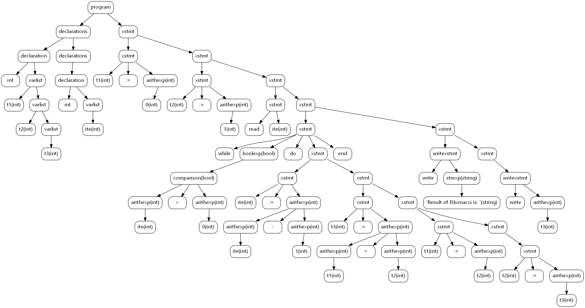
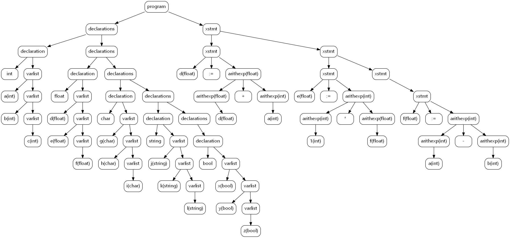
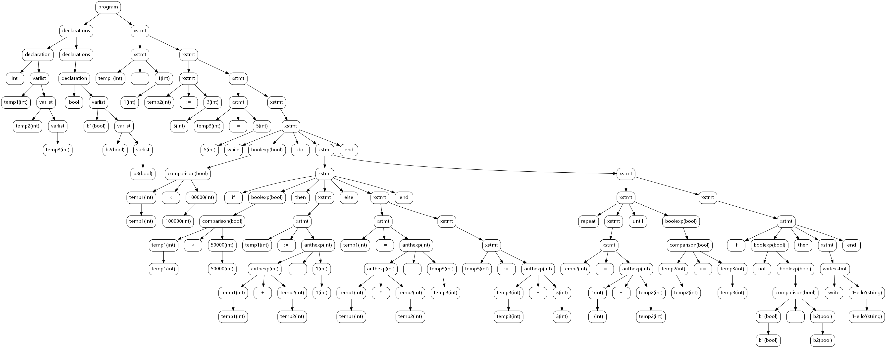
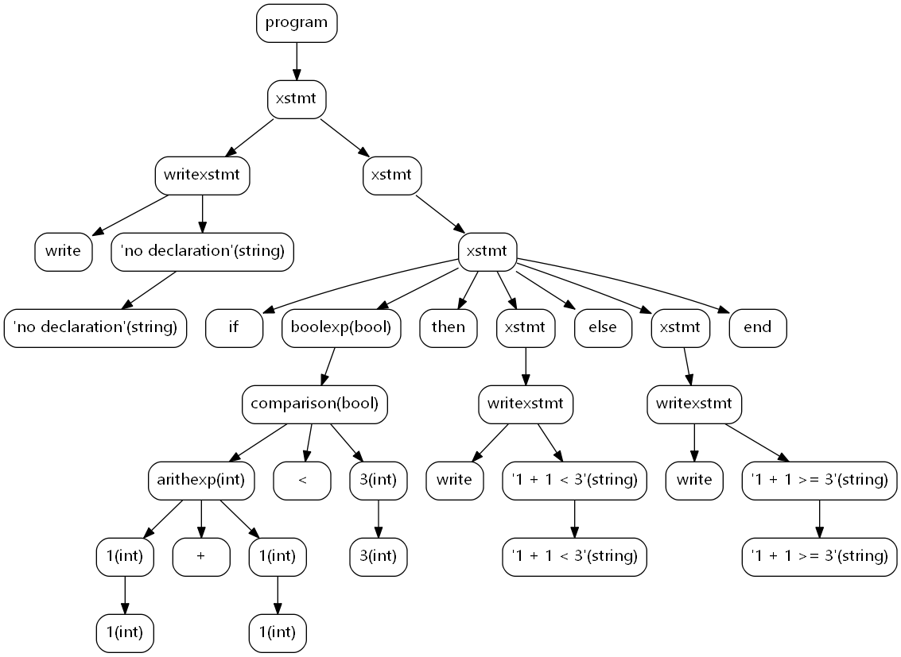
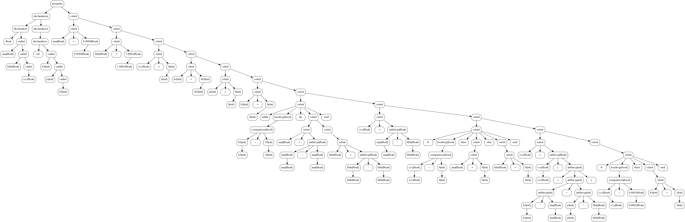

# 语义分析及中间代码生成实验

**19335286 郑有为**

[toc]

## Ⅰ. 作业要求

* 实验目的：构造TINY+的语义分析程序并生成中间代码。
* 实验内容：构造符号表，构造TINY+语义分析器，构造TINY+的中间代码生成器。
* 实验要求：能检查一定的语义错误，将TINY+程序转换为三地址中间代码。
* 提交词法分析、语法分析和语义分析程序和中间代码生成的实验报告。

## Ⅱ. 实现说明

语义分析和中间代码生成实验基于 **Lex** 的TINY+词法分析程序的基础上实现语法分析和使用 **Yacc** 来帮助代码的生成的语法分析实验。

## Ⅲ. TINY+定义

### 3.1 词法定义

参考C语言、老师的资料和华南理工的TINY+实验，以下给出TINY+的词法定义：

**关键字定义**如下，区分大小写，共 20 个。

| or         | and       | int      | float     | bool     | char      |
| ---------- | --------- | -------- | --------- | -------- | --------- |
| **while**  | **do**    | **if**   | **then**  | **else** | **end**   |
| **repeat** | **until** | **read** | **write** | **true** | **false** |
| **string** | **not**   |          |           |          |           |

**操作符定义**如下，也称为特殊符号，共 16 个。

| >     | <=    | >=    | < | {     | }     | **=** | :=    |
| ----- | ----- | ----- | ----- | ----- | ----- | ----- | ----- |
| **+** | **-** | ***** | **/** | **(** | **)** | **,** | **;** |

**其他词法**

| 标识       | 正则表达式（Lex语法）                           | 注释                                                     |
| ---------- | ----------------------------------------------- | -------------------------------------------------------- |
| DIGIT      | `[0-9]`                                         |                                                          |
| LETTER     | `[A-Za-z]`                                      |                                                          |
| DIGITS     | `[0-9][0-9]*`                                   |                                                          |
| **ID**     | `{LETTER}({LETTER}|{DIGIT})*`                   | 标识符，以字母开头，可包含数字                           |
| **INT**    | `[+-]?({DIGIT})+`                               | 整数，如+0，-5，100                                      |
| **FLOAT**  | `[+-]?{DIGITS}"."{DIGITS}`                      | 浮点数，如-0.14                                          |
| **CHAR**   | `'[^']'`                                        | 字符，如`'a'`                                            |
| **STRING** | `\"[^\n\"]*\"`                                  | 如`"Hi"`，不可跨行，不可嵌套                             |
| **注释**   | `"/*".*"*/"`或`"/*"([^\n"*/"]*\n)*"*/"		` | 如 `/*Hi*/` ，可跨行，不可嵌套，其内容会被词法分析器忽略 |

### 3.2 语法定义

* TOKEN列表（%left 约束了优先级，越在后面的优先级越高）：

  ```
  %token I 
  %token WHILE DO IF THEN ELSE END REPEAT UNTIL
  %token READ WRITE
  %token TRUE FALSE
  %token TYPE
  %token LE GE ASSIGN
  %token ',' ';' '(' ')' '{' '}' '<' '>'
  
  %left '+' '-'
  %left '*' '/'
  
  %left OR
  %left AND
  %left NOT
  ```

* EBNF描述语法（Yacc格式）：

| 编号 | 产生式                                                       | 注释                                                         |
| ---- | ------------------------------------------------------------ | ------------------------------------------------------------ |
| 1    | **program**: declarations stmt \| stmt                       | **程序（program）**<br >由**声明部分（declarations）**和**语句部分（stmt）**组成，变量声明需要在语句部分之前完成。 |
| 2    | **declarations**: declaration ';' \| declaration ';' declarations | **声明部分（declarations）**<br >由若干条**声明（declaration）**组成，声明部分可以为空。 |
| 3    | **declaration**: TYPE varlist                                | **声明（declaration）**<br >由**变量类型（TYPE）**和**变量列表（varlist）**组成。 |
| 4    | **varlist**: ID \| ID ',' varlist                            | **变量列表（variable_list）**<br >由若干个**标识符（ID）**组成，标识符之间由**逗号（,）**隔开。 |
| 5    | **stmt**: xstmt ';' \|  xstmt ';' stmt                       | **语句序列（stmt）<br >**由若干**语句块（xstmt）**组成，标识符之间由**分号（;）**隔开。 |
| 6    | **xstmt**: WHILE boolexp DO stmt END                         | **循环语句块（while-stmt）<br >**有固定格式，包含关键字 ***while***，条件判断表达式和关键字 ***do***、***end*** |
| 7    | **xstmt**: IF boolexp THEN stmt ELSE stmt END \| IF boolexp THEN stmt END | **条件判断语句块（if-stmt）<br >**有固定格式，包含关键字 ***if***，条件判断表达式和关键字 ***then***、***end***，其中***else***是可选项。 |
| 8    | **xstmt**: REPEAT stmt UNTIL boolexp                         | **重复语句块（repeat-stmt）<br >**有固定格式，包含关键字 ***repeat***， ***until*** 和条件判断表达式，逻辑上类似于C语言的 *do while* 。 |
| 9    | **xstmt**: ID ASSIGN exp                                     | **赋值环语句块（assign-stmt）<br >**由**标识符（ID）**、**赋值符号（:=）**、**表达式（exp）**组成。 |
| 10   | **xstmt**: READ ID                                           | **读入语句块（read-stmt）**<br >从某个地方读入一个**标识符（ID） ** |
| 11   | **xstmt**: WRITE exp                                         | **写入语句块（write-stmt）**<br >写入一个**表达式（exp）**   |
| 12   | **exp**: arithmeticexp \| boolexp \| strexp                  | **表达式（exp）<br >**有三种不同的类型**（x-exp）**，包括算术表达式、布尔表达式和字符串表达式。 |
| 13   | **arithmeticexp**: INT \| FLOAT \| ID \| '(' arithmeticexp ')' \| arithmeticexp '+' arithmeticexp \| arithmeticexp '-' arithmeticexp \| arithmeticexp '*' arithmeticexp \| arithmeticexp '/' arithmeticexp | **算术表达式（arithmetric_exp）**<br >可以是整形、浮点数、标识符，也可以是加减乘除运算。 |
| 14   | **boolexp**: BOOL \| comparison \| '(' boolexp ')' \| NOT boolexp \| boolexp AND boolexp \| boolexp OR boolexp | **布尔表达式（bool_exp）**<br >定义为比较表达式，布尔型遍历或逻辑与或非运算。 |
| 15   | **comparison**: arithmeticexp '>' arithmeticexp \| arithmeticexp '<' arithmeticexp \| arithmeticexp '=' arithmeticexp \| arithmeticexp GE arithmeticexp \| arithmeticexp LE arithmeticexp | **比较表达式（comparison）**<br >含小于、等于、大于、小于等于、大于等于。 |
| 16   | **strexp**: CHAR \| STRING                                   | **字符表达式（strexp）**<br >为字符变量或字符串变量          |

### 3.3 语义说明

**语义分析器**所做的：构建符号表，检查语义错误

* **生成符号表**：根据变量声明部分的内容构建一个符号表
* **变量检查**：所有变量必须在使用前声明，且每个变量只能声明一次
* **类型检查**：声明变量、变量赋值和做比较时，要考虑运算符两边变量类型是否一致。
* **强制类型转换**：必要时进行强制类型转换。（INT -> FLOAT）

### 3.4 三地址码定义

根据教材，给出几种常见的三地址指令形式：

| 序号 | 指令形式              | 注释                                                |
| ---- | --------------------- | --------------------------------------------------- |
| 1    | ***x = y op z***      | 双目运算符赋值指令                                  |
| 2    | ***x = op y***        | 单目运算符赋值指令                                  |
| 3    | ***x = y***           | 值复制指令                                          |
| 4    | ***goto L***          | 跳转指令，下一步从标号为 ***L*** 的指令开始执行     |
| 5    | ***if-not x goto L*** | 条件转移指令（为了简化实现选用了 if-not 而不是 if） |
| 6    | ***read x***          | 输入 ***x***                                        |
| 7    | ***write x***         | 写出 ***x***                                        |
| 8    | ***Label L***         | 声明一个标号 ***L***                                |

### 3.5 语义规则(含中间代码生成)

* **相关属性：**

  ```c
  enum SymbolType type;   // 节点类型 
  // 中间代码生成
  int t_id; // 临时变量编号 （ID的临时编号为-1）
  char code[BUF_SIZE];
  int next; // L 属性
  ```

以下为伪代码，具体实现参考 `ga.y`。

* `program: declarations stmt | program: stmt`

  ```c
  strcpy($$->code, $2->code);
  UpdateNext(root, root->code); // root 是数根节点
  ```

* **变量声明部分**：

  * `declarations: declaration ';' | declaration ';' declarations `

    ``` c
    // Do nothing
    ```

  * `declaration: TYPE varlist`

    ```c
    // 生成符号表
    updateSymbolTable($$);
    ```

  * `varlist: ID | ID ',' varlist `

    ``` c
    // Do Nothing
    ```

* **条件循环语句**：

  * `stmt: xstmt ';'`

      ``` c
      $$->code = $1->code;
      ```

  * `stmt: xstmt ';' stmt`

    ``` c
    $1->next = newLabel(); // L 属性赋初始值的地方
    $$->code = $1->code || Label $1->next || $3->code
    ```

  * **`xstmt: IF boolexp THEN stmt ELSE stmt END`**

    ``` c
    int fabegin = newLabel();
    $$->code = $2->code || "If-not _t($2->t_id) Goto Label fabegin" || $4->code || Goto $$->next || Label fabegin || $6->code
    ```

  * **`stmt: IF boolexp THEN stmt END `**

    ``` c
    $$->code = $2->code || "If-not _t($2->t_id) Goto Label $$->next" || $4->code
    ```

  * **`stmt: WHILE boolexp DO stmt END`**

    ``` c
    int begin = newLabel();
    $$->code = Label begin || $2->code || "If-not _t($2->t_id) Goto Label $$->next" || $4->code || Goto begin
    ```

  * **`stmt: REPEAT stmt UNTIL boolexp`**

    ``` c
    int begin = newLabel();
    $$->code = Label begin || $2->code || $4->code || "If-not _t($4->t_id) Goto $$->next || Goto Label begin"
    ```

  * **`stmt: ID ASSIGN exp`**

    ```c
    checkID($1); // 检查 ID 是否在符号表中
    checkType($1, $3, 2); // 检查类型是否匹配
    
    $$->code = $3->code || "$1->name = $3->name"
    ```

  * **`stmt: READ ID`**

    ``` C
    checkID($2); // 检查 ID 是否在符号表中
     $$->code = "Read $2->name"
    ```

  * **`stmt: WRITE exp`**

    ``` c
    $$->code = $2->code || "Write $2->name"
    ```

* **算术运算：**

  * **`arithmeticexp: INT | FLOAT`** 

    ``` c
    setNodeType($$, st_int); // 设置节点类型(FLOAT 时为 st_float)
    $$->t_id = newTempID();	// 申请一个临时变量
    sprintf($$->code, "_t%d = %s\n", $$->t_id, $$->content);
    ```

  * **`arithmeticexp: ID`**

    ``` c
    checkID($1); // 检查 ID 是否在符号表中
    setNodeType($$, $1->type); // 设置节点类型

  * **`arithmeticexp: '(' arithmeticexp ')' `**

    ``` c
    setNodeType($$, $2->type); // 设置节点类型
    $$->t_id = newTempID();	// 申请一个临时变量
    $$->code = $2->code || "$$->t_id = $2->t_id" 
    ```

  * **`arithmeticexp: arithmeticexp '+' arithmeticexp`** (加减乘除)

    ``` c
    checkType($1, $3, 1); // 检查类型是否匹配
    setNodeType($$, $1->type); // 设置节点类型
    $$->t_id = newTempID();	// 申请一个临时变量
    $$->code = $3->code || $1->code || "$1->t_id + $3->t_id"

* **条件运算**：

  * `boolexp: BOOL`

    ``` c
    setNodeType($$, st_bool); // 设置节点类型
    $$->t_id = newTempID();	// 申请一个临时变量
    sprintf($$->code, "_t%d = %s\n", $$->t_id, $$->content);
    ```

  * `boolexp: comparison `

    ``` c
    setNodeType($$, st_bool); // 设置节点类型
    $$->t_id = newTempID();	// 申请一个临时变量
    $$->code = $1->code || "$$->t_id = $1->t_id" 
    ```

  * `boolexp: '(' boolexp ')' `

    ``` c
    setNodeType($$, st_bool); // 设置节点类型
    $$->t_id = newTempID();	// 申请一个临时变量
    $$->code = $2->code || "$$->t_id = $2->t_id" 
    ```

  * `boolexp: NOT boolexp `

    ``` c
    setNodeType($$, st_bool); // 设置节点类型
    $$->t_id = newTempID();	// 申请一个临时变量
    $$->code = $2->code || "$$->t_id = not $2->t_id" 
    ```

  * `boolexp: boolexp AND boolexp | boolexp OR boolexp `

    ``` c
    setNodeType($$, st_bool); // 设置节点类型
    $$->t_id = newTempID();	// 申请一个临时变量
     $$->code = $1->code || $3->code || "$$->t_id = $1->t_id AND(OR) $3->t_id" 
    ```

* **比较运算**：

  * `arithmeticexp '>' arithmeticexp` （包括小于，等于，大于，大于等于，小于等于）

    ``` c
    setNodeType($$, st_bool); // 设置节点类型
    $$->t_id = newTempID();	// 申请一个临时变量
    $$->code = $1->code || $3->code || "$$->name = $1->name > $3->name" 
    ```


* **字符和字符串：**

  * `strexp: CHAR | STRING`

    ``` c
    $$->t_id = newTempID(); // 申请一个临时变量
    sprintf($$->code, "_t%d = %s\n", $$->t_id, $$->content);
    ```

    

## Ⅳ. 代码实现

### 4.1 文件说明

* `df.h`：**定义语法树的节点结构和符号表的单元结构**，并包含相关函数声明。
* `la.l`：**语义定义部分代码**，使用 Lex 进行代码生成，生成代码为 `lex.yy.c`。
* `ga.y`：**定义语法、语义和中间代码生成的代码**，使用 Yacc 生成代码 `y.tab.h` 和 `y.tab.c`。
* `tree.py`：可视化语法树程序。
* `co.sh`：编译项目的命令，使用 `chmod +x ./co.sh` `./co.sh` 运行，生成可执行代码`sa.out`。

### 4.2 数据结构

数据结构定义在文件`df.h`中。

**符号表和节点的类型 type 的取值**：

```c
typedef enum SymbolType{
    st_null, st_int, st_float, st_char, st_string, st_bool
} SymbolType;
```

**语法分析树的节点：**

```c
typedef struct Node
{
    int id;
    char* content;  // 节点信息
    int line;       // 终结符号所在行编号（令非终结符号的line为0，以区分终结非终结符号）
    int cnum;       // 儿子节点的数量
    enum SymbolType type;   // 节点类型 
    struct Node* children[CHILD_ULIMIT]; // 儿子节点数组

    // 中间代码生成
    int t_id; // 临时变量编号 （ID的临时编号为-1）
    char code[BUF_SIZE];
    int next; // L 属性

} Node;
```

**语法树节点的操作函数：**(实现于 `ga.y` 中)

```c
// 生成一个内容为 content 行数为 line 的空节点
Node* genNode(char* content, int line);

// 为一个节点 p 添加一个子节点 child
void addChild(Node* p, Node* child);
// 递归释放以该节点为根的子树的空间
void freeNode(Node* p);

// 可视化生成树
void showNode(Node* p, int d, int i);

// 生成 pydotplus 文本，用它可以生成可视化的语法分析树
// end = 1
void getTreeCode(Node* p, int end);

// 设置节点类型
void setNodeType(Node*p, SymbolType type);
```

**符号表的基本单元**：

```c
typedef struct Symbol
{
    enum SymbolType type;   // 符号表的类型
    char id[ID_SIZE];       // ID
    char value[VALUE_SIZE]; // 值
} Symbol;
```

**符号表的相关操作函数：**(实现于 `ga.y` 中)

``` c
// 为符号表添加一个新的符号
void appendSymbol(enum SymbolType type, Node *node);

// 符号表可视化
void showSymbolTable();

// 根据 变量声明部分 declaration 生成符号表
int updateSymbolTable(Node *declaration);

// 检查 ID 是否出现在符号表中，若不出现则报错
void checkID(Node *node);

// 检查两个节点的类型是否相同，不同则出错
void checkType(Node *node1, Node* node2, int level);
```

**语义部分函数**：(定义、实现于 `ga.y`)

```c
// 中间代码生成：临时标号申请
int label_id = 0;
int newLabel();
// 中间代码生成：临时变量申请
int temp_id = 0;
int newTempID();

void UpdateNext(Node* root, char code[]);
```

### 4.3 关键函数

**符号表生成函数：`int updateSymbolTable(Node *declaration)`**

```c
// 根据 变量声明部分 declaration 生成符号表
// Node *declaration 是以一行变量声明生成的子树
// 其左节点为变量类型，右节点为ID构成的子树
int updateSymbolTable(Node* declaration){
    if(declaration == NULL || declaration->children[0] == NULL || declaration->cnum == 0) {
        return 0;
    }
    enum SymbolType type;
    char typeSpecifier = declaration->children[0]->content[0]; // 类型的首字母
    switch (typeSpecifier) {
        case 'i': // int
            type = st_int;
            break;
        case 'f': // float
            type = st_float;
            break;
        case 'b': // bool
            type = st_bool;
            break;
        case 'c': // char
            type = st_char;
            break;
        case 's': // string
            type = st_string;
            break;
    }
    appendSymbol(type, declaration->children[1]);
    return 1;
} 

// 更新符号表的同时更新节点的类型
void appendSymbol(enum SymbolType type, Node* node){
    if(node->line == 0) { // 处理非终结符号 varlist
        for(int i = 0; i < node->cnum; i++){
            appendSymbol(type, node->children[i]);
        }
    }
    else { // 处理终结符号 ID
        int len1 = strlen(node->content);
        for(int j = 0; j < symbolNum; j++){
            int len2 = strlen(symbolTable[j].id);
            if(len1 == len2 && memcmp(symbolTable[j].id, node->content, len1) == 0) {
                // 检测到符号表已经出现同名 ID
                fprintf(stderr, "Error at Line %02d: 重复定义变量 %s\n", node->line, node->content);
                exit(1);
            }    
        }
        symbolTable[symbolNum].type = type;
		node->type = type;
		node->t_id = -1;
        memcpy(symbolTable[symbolNum].id, node->content, len1);
        symbolNum++;
    }
}
```

**语义分析器符号表检查ID函数：`void checkID(Node *node)`**

```c
// 检查 ID 是否出现在符号表中，若不出现则报错
void checkID(Node* node) {
	int len1 = strlen(node->content);
	for(int j = 0; j < symbolNum; j++){
		int len2 = strlen(symbolTable[j].id);
		if(len1 == len2 && memcmp(symbolTable[j].id, node->content, len1) == 0) {
			// 在符号表中检测到了该 ID 名
			node->type = symbolTable[j].type;
			return;
		}    
	}
	// ID 不存在，出错
	fprintf(stderr, "Error at Line %02d: 使用未定义变量 %s\n", node->line, node->content);
    exit(1);
}
```

**语义分析器类型检查函数：`void checkType(Node *node1, Node* node2, int level);`**

将类型检查分为了三级：

* ***level 0***：不支持隐式类型转换，只要 node1 和 node2 的类型不同就出错。
* ***level 1***：主要针对算术运算符，只要 node1 和 node2 的类型想同或任意一个为 int 另一个为 float，就不会出错，因此支持整形和浮点类型的直接运算。
* ***level 2***：主要针对赋值语句，并默认 node1 为左值，当 node1 为浮点类型而 node2 为整形时不会报错。 

```c
// 检查两个节点的类型是否相同，不同则出错
void checkType(Node *node1, Node* node2, int level) {
	if(level == 2){ // 针对赋值语句
		if(node1->type == st_float && node2->type == st_int){
			return;
		}
	}
	
	if(level == 1){ // 针对算术运算
		if((node1->type == st_float && node2->type == st_int) || (node1->type == st_int && node2->type == st_float))
		return;
	}
	
	if(node1->type != node2->type){
		fprintf(stderr, "Error at Line %02d: 类型不匹配 %s, %s\n", node1->line, node1->content, node2->content);
		exit(1);
	}
}
```


**中间代码更新函数 -处理 L属性 next：`void UpdateNext(Node* root, char code[])`**

在子底向下的语法分析过程中顺便构造三地址中间代码，但由于自底向上过程中，L属性的next不能计时传到下一层，故需要先做标记再等到整棵树完成后在处理。

我采取的方案是：在自底向上分析过程中，为每一个节点赋予一个全局ID，用 \_\_label ID\_\_ 替代 label T_ID，T_ID为标签号。在完成树的构建后，再自顶向下地填充T_ID。

```c
// 因为我们有节点的全局ID 中间代码中每一个为定义next标号可以先用全局ID给他标记下来
// 这样对于一个中间代码文本中，我们可以找到他，并识别他的原本在语法树中的节点。
// 我们遍历一遍树，将必要的next = $$->next自顶向下更新。
// 同时我们每更新一个节点，就去中间代码串中寻找他的位置，并修改成我们新赋值的next值。

void UpdateNext(Node* root, char code[]){
	for(int i = 0; i < root->cnum; i++){
		Node* child = root->children[i];
		if(child->next == -1){
			child->next = root->next;
			char nullnext[25];
			char realnext[25];
			sprintf(nullnext, "__Label %03d__", child->id);
			sprintf(realnext, "Label %03d    ", root->next);
			// printf("%s,%s\n",nullnext, realnext);
			while(1){
				char* h = strstr(code, nullnext);
				if(h == NULL){
					break;
				}
				for(int i = 0; i < strlen(realnext); i++){
					h[i] = realnext[i];
				}
			}
		}
		UpdateNext(child, code);
	}
}
```

``` c
// 生成中间代码时：对 L 属性 next 的预先标记 __Label %03d__
if($$->next != -1){
	sprintf(ifnotcode, "If-not _t%d Goto Label %03d\n", $2->t_id, $$->next);
}
else{
	sprintf(ifnotcode, "If-not _t%d Goto __Label %03d__\n", $2->t_id, $$->children[0]->id);
}
```

## Ⅴ. 运行说明

* 运行脚本 `co.sh` 编译，生成可运行文件 `ga.out`，脚本代码：

  ``` sh
  lex la.l
  yacc -d ga.y 
  gcc df.h lex.yy.c y.tab.c -o sa.out
  ```
  
* 运行可执行文件，输入文件地址即可读取文件中的代码并构建语法分析树。

  ``` sh
  ./sa.out
  ```

* 主函数在 `ga.y` 的最后，执行`getTreeCode(root, 1);`即可生成可视化语法树代码，生成在`treemap.txt`，然后用python运行`tree.py`即可生成可视化语法树`tree.png`。

  ```c
  int main(void) {
  	char infile[100];
  	printf("Input File: \n");
  	scanf("%s", infile);
  	yyin = fopen(infile, "r");
  	if(yyin == NULL){
  		printf("Error: 文件无法打开\n");
  		exit(1);
  	}
  	
  	yyparse();
  	
  	// 输出语法分析树
  	showNode(root, 0, 1); 
  
  	// 输出符号表
  	showSymbolTable();
  
  	// 生成可视化语法树
  	// 成在`treemap.txt`，然后用python运行`tree.py`即可生成可视化语法树`tree.png`。
  	getTreeCode(root, 1);
  
  	// 中间代码生成器：输出中间代码
  	printf("\nCode:\n%s", root->code);
  
  	// 释放内存
  	freeNode(root);
  
  	return 0;
  }
  ```

## Ⅵ. 运行测试

**测试文件位置：`in/tx.txt`，每个代码的执行结果在对应的 `out` 文件夹中，`out/tx.txt`的内容为源代码生成的符号表和三地址吗，`out/treex.txt`和`out/treex.png`为生成的语法树。**

### 6.1 语义分析器测试

#### 6.1.1 求解 Fibonacci 数列测试

**程序代码：**

```
/* 求解 Fibonacci 数列 */
int t1, t2, t3;
int ite; /* 迭代次数 */
t1 := 0;
t2 := 1;
read ite;
while ite > 0 do
	ite := ite - 1;
	t3 := t1 + t2;
	t1 := t2;
	t2 := t3;
end;
write "Result of Fibonacci is: ";
write t3;

```

**程序输出：**

**符号表：**

```
Input File: 
in/t1.txt

Symbol Table 
      TYPE       ID        VAL
  0    int       t1           
  1    int       t2           
  2    int       t3           
  3    int      ite  
```

**语法分析树：**

语法分析树由`getTreeCode`函数生成 pydotplus 格式的代码（存放在 treemap.txt 中），再通过 python （tree.py 程序）生成以下树状图。



#### 6.1.2 强制类型转换测试

**程序代码：**

```
/* 强制类型转换 */

int a,b,c;
float d,e,f;
char g,h,i;
string j,k,l;
bool x,y,z;

d := d + a;
e := 1 * f;
f := a - b;
```

**程序输出：**

**符号表：**

```
Input File: 
in/t2.txt

Symbol Table 
      TYPE       ID        VAL
  0    int        a           
  1    int        b           
  2    int        c           
  3  float        d           
  4  float        e           
  5  float        f           
  6   char        g           
  7   char        h           
  8   char        i           
  9 string        j           
 10 string        k           
 11 string        l           
 12   bool        x           
 13   bool        y           
 14   bool        z           
```

**语法分析树：**



#### 6.1.3 检错测试 - 使用未定义的变量

**出错代码：**

```
int t1, t2, t3;
...
read ite; /* Here */
```

**程序输出：**

```
in/t3.txt
Error at Line 09: 使用未定义变量 ite
```

#### 6.1.4 检错测试 - 重复定义同名变量

**错误代码：**

```
int t1, t2, t3;
float t1; /* Here */
...
```

**程序输出：**

```
Input File: 
in/t4.txt
Error at Line 05: 重复定义变量 t1
```

#### 6.1.5 检错测试 - 非法的类型转换

**错误代码：**

```
int t1, t2, t3;
...
t1 := 0.0; /* Here */
```

**程序输出：**

```
Input File: 
in/t5.txt
Error at Line 07: 类型不匹配 t1, arithexp
```

### 6.2 中间代码生成器测试

#### 6.2.1 求解 Fibonacci 数列测试

**程序代码：**

```
/* 强制类型转换 */

int a,b,c;
float d,e,f;
char g,h,i;
string j,k,l;
bool x,y,z;

d := d + a;
e := 1 * f;
f := a - b;
```

**程序输出：**中间代码，经过验证三地址码无误。

```
_t0 = 0
t1 = _t0
Label 008:
_t1 = 1
t2 = _t1
Label 007:
Read ite
Label 006:
Label 003:
_t2 = 0
_t3 = ite > _t2
_t4 = _t3
If-not _t4 Goto Label 005    
_t5 = 1
_t6 = ite - _t5
ite = _t6
Label 002:
_t7 = t1 + t2
t3 = _t7
Label 001:
t1 = t2
Label 000:
t2 = t3
Goto Label 003
Label 005:
_t8 = 'Result of Fibonacci is: '
Write _t8
Label 004:
Write t3
```

#### 6.2.2 测试 - `t6.txt`

**代码：**

```
int temp1, temp2, temp3;
bool b1, b2, b3;

temp1 := 1;
temp2 := 3;
temp3 := 5;

while temp1 < 100000 do
	if temp1 < 50000 then
		temp1 := temp1 + temp2 - 1;
	else
		temp1 := temp1 * temp2 - temp3;
		temp3 := temp3 + 3;
	end;
	
	repeat
		temp2 := 1 + temp2;
	until temp2 >= temp3;
	
	if not b1 = b2 then
		write "Hello";
	end;
	
end; 
```

**程序输出：**

**语法树：**



**符号表：**

```
Symbol Table 
      TYPE       ID        VAL
  0    int    temp1           
  1    int    temp2           
  2    int    temp3           
  3   bool       b1           
  4   bool       b2           
  5   bool       b3           
```

**中间代码：其中 Goto Label -01  指的是到文件末尾**

```
_t0 = 1
temp1 = _t0
Label 008:
_t1 = 3
temp2 = _t1
Label 007:
_t2 = 5
temp3 = _t2
Label 006:
Label 005:
_t3 = 100000
_t4 = temp1 < _t3
_t5 = _t4
If-not _t5 Goto Label -01    
_t6 = 50000
_t7 = temp1 < _t6
_t8 = _t7
If-not _t8 Goto Label 004    
_t10 = 1
_t9 = temp1 + temp2
_t11 = _t9 - _t10
temp1 = _t11
Goto Label 004    
_t12 = temp1 * temp2
_t13 = _t12 - temp3
temp1 = _t13
Label 000:
_t14 = 3
_t15 = temp3 + _t14
temp3 = _t15
Label 004:
Label 002:
_t16 = 1
_t17 = _t16 + temp2
temp2 = _t17
_t18 = temp2 >= temp3
_t19 = _t18
If _t19 Goto Label 003    
Goto Label 002
Label 003:
_t20 = b1 == b2
_t21 = _t20
_t22 = not _t21
If-not _t22 Goto Label -01    
_t23 = 'Hello'
Write _t23
Goto Label 005
```

#### 6.2.3 测试 - `t7.txt`

**代码：**

```
write "no declaration";

if 1 + 1 < 3 then
	write "1 + 1 < 3";
else 
	write "1 + 1 >= 3";
end;
```

**程序输出：**

**语法树**：



**符号表：**符号表为空

```
Symbol Table 
      TYPE       ID        VAL
```

**中间代码：其中 Goto Label -01  指的是到文件末尾**

```
_t0 = 'no declaration'
Write _t0
Label 001:
_t2 = 1
_t1 = 1
_t3 = _t1 + _t2
_t4 = 3
_t5 = _t3 < _t4
_t6 = _t5
If-not _t6 Goto Label -01    
_t7 = '1 + 1 < 3'
Write _t7
Goto Label -01    
_t8 = '1 + 1 >= 3'
Write _t8
```

#### 6.2.4 测试 - `t8.txt`

**代码：**

```
float aaa, bbb, ccc;
int h3, j3, k3;

aaa := 0.9999;
bbb := 1.0001;
ccc := 0;

h3 := 365;
j3 := 0;
k3 := 0;

while h3 < 10 do
	aaa := aaa * aaa;
	bbb := bbb * bbb;
end;

ccc := aaa - bbb;

if ccc > 0 then
	aaa := 0;
else
	bbb := 0;
end;
	
ccc := ccc / (h3 * aaa + j3 * bbb);

if ccc > 0.0001 then
	k3 := 1;
end;
```

**程序输出：**

**语法树**：



**符号表：**

```
Symbol Table 
      TYPE       ID        VAL
  0  float      aaa           
  1  float      bbb           
  2  float      ccc           
  3    int       h3           
  4    int       j3           
  5    int       k3  
```

**中间代码：其中 Goto Label -01  指的是到文件末尾**

```
_t0 = 0.9999
aaa = _t0
Label 012:
_t1 = 1.0001
bbb = _t1
Label 011:
_t2 = 0
ccc = _t2
Label 010:
_t3 = 365
h3 = _t3
Label 009:
_t4 = 0
j3 = _t4
Label 008:
_t5 = 0
k3 = _t5
Label 007:
Label 001:
_t6 = 10
_t7 = h3 < _t6
_t8 = _t7
If-not _t8 Goto Label 006    
_t9 = aaa * aaa
aaa = _t9
Label 000:
_t10 = bbb * bbb
bbb = _t10
Goto Label 001
Label 006:
_t11 = aaa - bbb
ccc = _t11
Label 005:
_t12 = 0
_t13 = ccc > _t12
_t14 = _t13
If-not _t14 Goto Label 004    
_t15 = 0
aaa = _t15
Goto Label 004    
_t16 = 0
bbb = _t16
Label 004:
_t18 = j3 * bbb
_t17 = h3 * aaa
_t19 = _t17 + _t18
_t20 = _t19
_t21 = ccc / _t20
ccc = _t21
Label 003:
_t22 = 0.0001
_t23 = ccc > _t22
_t24 = _t23
If-not _t24 Goto Label -01    
_t25 = 1
k3 = _t25
```

## Ⅶ. 实验心得

​		终于完成了编译原理的三次实验，通过实验，更加深刻的理解了正则表达式、EBNF和语义规则的设计，整个过程是一个循循渐进的过程，在已完成的代码的基础上进行完善，不断修改。

​		因为老师没有给一份”固定“的TINY+，而是要我们自己优化，所以我结合多方资料和自己的理解，进行了词法、语法、语义、中间代码的设计，相比于一般的程序设计语言还是差别很多，首先没有考虑数组、函数调用、变量显示类型转化等等。

​		最开始，我没有使用 Lex 而是手写词法分析实验，考虑到之后写语法分析和语义分析实验要基于以前的代码，于是我就学 Lex 和 Yacc 并重写了代码。使用 Lex 和 Yacc 比直接编写方便太多，而且它们还提供各种方便的实现，例如定义优先级和异常检测上，简化了编程。

​		虽然使用 Yacc 写语法分析和语义分析方便太多，但自己还是写了1k行的代码，钻研过程耗费了不少时间。

