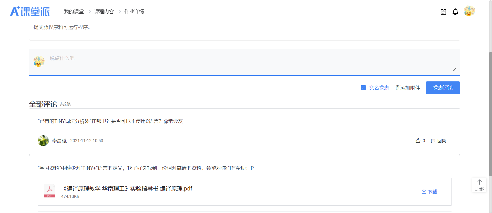
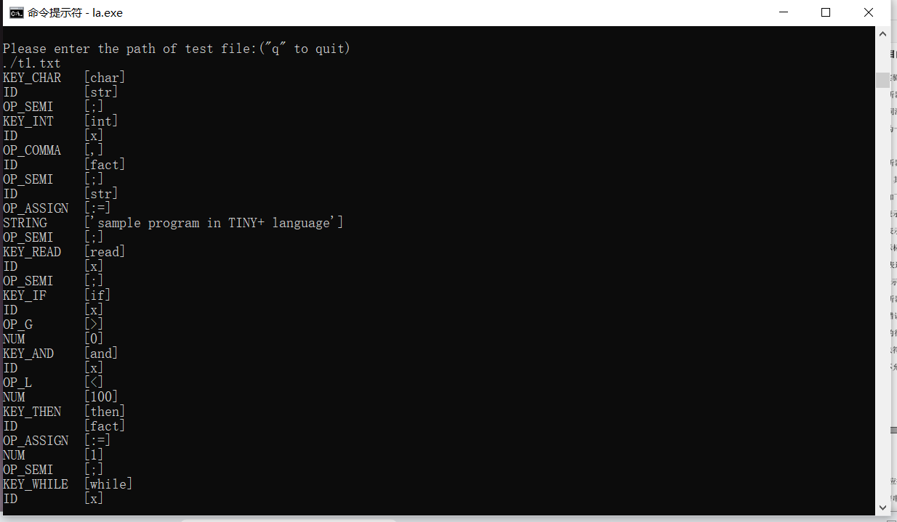
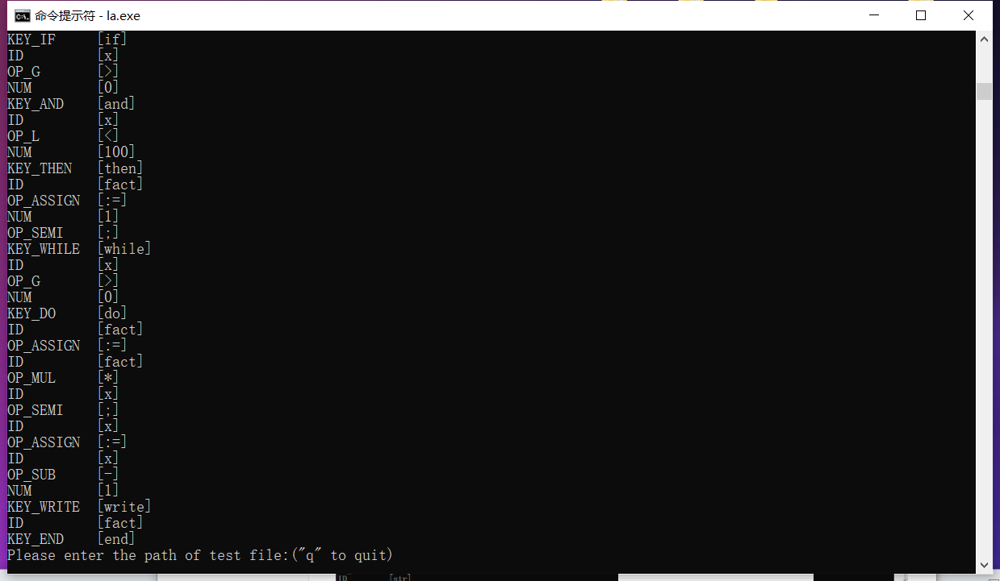
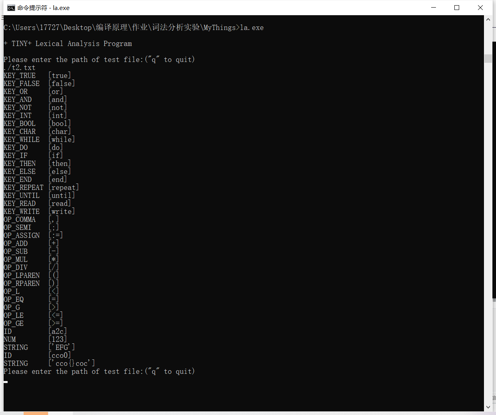
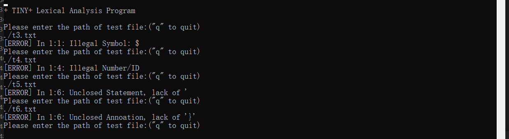

# 编译原理 词法分析实验 

**19335286 郑有为**

[toc]

## 一、实验说明

词法分析程序实验： 

1. 实验目的：通过扩充已有的样例语言TINY语言的词法分析程序，为扩展TINY语言TINY＋构造词法分析程序，从而掌握词法分析程序的构造方法 
2. 实验内容：了解样例语言TINY及TINY编译器的实现，了解扩展TINY语言TINY＋，用C语言在已有的TINY词法分析器基础上扩展，构造TINY＋的词法分析程序。 
3. 实验要求：将TINY＋源程序翻译成对应的TOKEN序列，并能检查一定的词法错误。

提交源程序和可运行程序。

## 二、TINY+词法定义

> 来源：同学在作业连接下分享的文件
>
> 

### 2.1 关键字

关键字包括：（小写）

`or`, `and `, `int`, `bool`, `char`, `while`, `do`, `true`, `false`

`if`, `then`, `else`, `end`, `repeat`, `until`, `read`, `write`

### 2.2 操作符

操作符包括：

`>`,  `<=`, `>=`, `<`, `=`

`,`, `'`, `{`, `}`, `;`, `:=`

`(`,`)`, `+`, `-`, `*`, `/`

### 2.3 分隔符

空格符包括：` `, `\t`, `\n`，在词法分析后不被保留。 

### 2.4 其他符号

其他符号有四种，他们的正则定义如下：

* 标识符 `ID`：`letter(letter|digit)*`
* 数字 `NUM`：`digit digit*`
* 字符串 `STRING`：`'any char except ' '`（不能跨行定义）
* 注释：`{...}`（用花括号标注，可以跨行定义）

## 三、程序说明

### 3.1 编译运行

* Windows下运行

  ``` sh
  gcc la.c -o la.exe
  a.exe
  ```

* 测试文件位于`\test`文件夹

### 3.2 数据定义

* 程序中定义的 TOKEN 类型

  ```c
      // Keyword tokens                   // |-18 Keywords-----------|
      KEY_OR, KEY_AND, KEY_NOT,           // | or    | and   | not   |    
      KEY_INT, KEY_BOOL, KEY_CHAR,        // | int   | bool  | char  |    
      KEY_WHILE, KEY_DO,                  // | while | do    |       |    
      KEY_IF, KEY_THEN, KEY_ELSE,         // | if    | then  | else  |    
      KEY_END, KEY_REPEAT, KEY_UNTIL,     // | end   | repeat| until |    
      KEY_READ, KEY_WRITE,                // | read  | write |       | 
      KEY_TRUE, KEY_FALSE,                // | true  | false |       | 
  
      // Operator tokens                  // |-17 Operators-|
      OP_G, OP_L, OP_ASSIGN,              // | >  | <  | := |  
      OP_GE, OP_LE, OP_EQ,                // | >= | <= | =  |
      OP_COMMA, OP_QUOTA, OP_SEMI,        // | ,  | '  | ;  |
      OP_LPAREN, OP_RPAREN,               // | (  | )  |    |
      OP_LBRACE, OP_RBRACE,               // | {  | }  |    |
      OP_ADD, OP_SUB,                     // | +  | -  |    |
      OP_MUL, OP_DIV,                     // | *  | /  |    |
  
      // Other tokens     // |-Each NF--------------------|-Example-|
      ID,                 // | letter(letter|digit)*      | c1      |
      NUM,                // | digit digit*               | 123     |
      STRING,             // | ' any character except' '  | 'hi!'   |
      NONE,               // |                            | 1c      |
      ANNO                // | { any character }          | {hi}    |
  };
  ```

  并提供相关函数获取TOKEN_TYPE，其字符串形式

  ```c
  char* getTokenName(enum TOKEN_TYPE i);
  enum TOKEN_TYPE getTokenType(char *token);
  ```

* 以下是词法分析有关数据结构

  ``` c
  typedef struct TOKEN{			// TOKEN 二元组
      enum TOKEN_TYPE type;		// 词素
      char info[SIZE_2];			// 含义
  }TOKEN;
  
  FILE* file;						// 待分析文件的指针
  TOKEN file_tokens[SIZE_1];		// 保存词法分析结果
  int file_tokens_num;			// 分析的TOKEN总数
  
  int current_row;				// 当前扫描位置（行数）
  int current_col;				// 当前扫描位置（列数）
  char current_word[SIZE_2];		// 当前扫描得到的单词
  int current_word_ptr;			// 当前扫描单词的长度
  enum TOKEN_TYPE current_type;	// 当前的预测TOKEN类型
  int operator_flag = 0;			// 操作符标记
  
  int error;						// 词法分析错误处
  ```

### 3.3 核心函数

``` c
/**
 * 初始化：为所有用到的变量（@line 136- 147）赋初始值，若文件无啊打开，提示报错。
 * @param file_path
 * @return 1 if the file is opened successfully, otherwise 0. 
 */
int la_initial(char file_path[]);

/**
 * 根据当前的 current_word 和 current_type 生成 Tokens 并保存在 file_tokens 中。
 */
void la_make_token();

/**
 * 输出词法编译结果：显示出错原因和出错位置（几行几列）
 * @param message 出错信息
 * @param row 出错位置（行数）
 * @param col 出错位置（列数）
 */
void la_show_error(const char* message, int row, int col);

/**
 * 在扫描新的一行时进行预处理
 */
void la_update_line();

/**
 * 根据下一个字符 c 来更新 current_word 和 current_type。
 * @param c lookahead symbol
 */
void la_update_word(char c);

/**
 * 词法分析入口：执行文件字符扫描和词法分析，在出现错误时或读完程序时终止
 */
void la_start();
```

### 3.4 主函数

* 用户可以输入文件地址，每次输入一个文件路径，程序读取文件内容并作语法分析，将词法分析结果直接输出。

* 核心部分代码：

  ```c
  if(la_initial(file_path)){	// 1、初始化，若成功则进入词法分析
      la_start();				// 2、执行词法分析
      if(error == 0)			// 3、若没有错误出现
      	la_show_result();	// 4、则输出TOKEN序列
  }
  ```

## 四、测试效果

### 测试 1 

* 测试一段普通的TINY+程序的词法分析结果

  ```
  char str;
  int x, fact;
  str:= 'sample program in TINY+ language';
  read x;
  if x > 0 and x < 100 then { don't do it }
  	fact:=1;
  	while x > 0 do 
  		fact:=fact*x;
  		x:=x-1
  	write fact
  end
  ```

* 测试结果：如下图所示。

  

  

### 测试 2

* 测试内容：测试所有关键字和运算符，并给出几个比较特殊的嵌套例子：`{cc'oo'o}`、`'cco{}coc'`

```
true false or and not
int	bool char while do
if then else end repeat
until read write , ;
:= + - * /
( )	< = >
<= >= a2c 123 'EFG'
{cc'oo'o} cco0 'cco{}coc'
```

* 测试结果：所有词都被正确识别并转化为Token

  

### 测试 3 

* 测试内容：测试击中错误代码，分别保存在`t3.txt`，`t4.txt`，`t5.txt`，`t6.txt`中。

  ``` 
  $ hello
  123hello
  hello'
  hello}
  ```

  它们分别代表：非法字符输入、非法ID、字符串不完整、注释不完整。

* 测试结果：

  

## 实验总结

* 本次词法分析程序实验在TINY语言的基础上进行扩充，为扩展后的TINY+语言构造词法分析程序 。实验过程中充分了解了TINY及TINY词法分析器的实现，编写的程序不仅可以将TINY＋源程序翻译成对应的TOKEN序列，还能检查一定的词法错误。

* 但编写的代码比较杂乱不易于维护修改，同时，在测试上未必完善，可能还存在未发现的错误。除了直接使用C语言编写词法分析程序之外，另一种选择是使用Lex来构造词法分析程序，这种方法不仅能确保程序的正确性，还能降低工作量。
