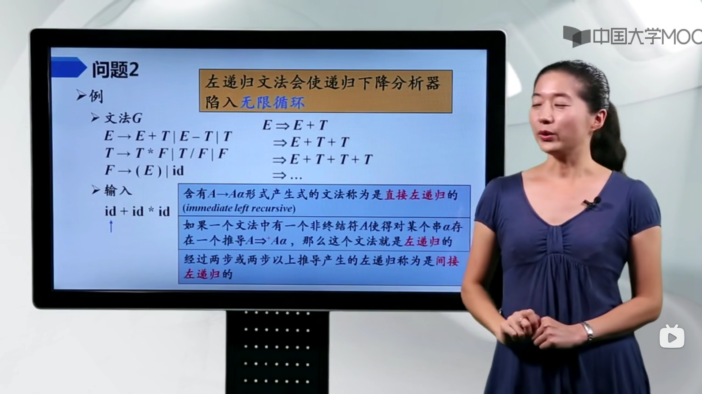
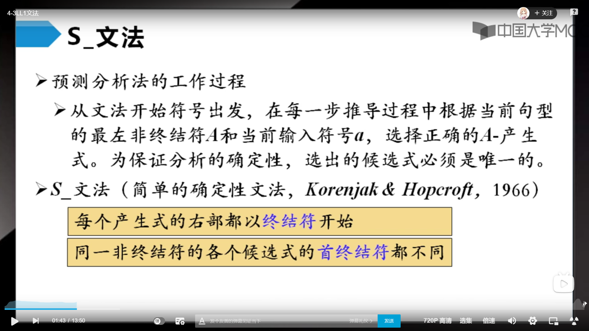

# Bilibili is future - 4 语法分析

看视频的截图，助理解

[toc]

## 一、自顶向下

### 1. 最右推导和最左规约

### 2. 左递归的问题所在

### 3. 消除左递归的直观理解

### 4. 消除间接左递归

### 5. 提取左公因子来推迟决定

### 6. S 文法（不重要）

### 7. 自顶向下推导例子

### 8. Q 文法（不重要）

### 9. FIRST / FOLLOW / SELECT 三件套

### 10. LL(1) 文法的定义

### 11. 计算 FIRST 集合

### 12. 计算 FOLLOW 集合

### 13. 计算 SELECT 集

### 14. 做一个预测分析表

### 15. 递归预测分析法

### 16. 非递归预测分析法

### 17. 预测分析实现步骤

### 18. 预测分析法的错误恢复和实例

## 二、自底向上

### 1. 自底向上的语法分析概述

### 2. 移入-规约分析举例

### 3. LR分析概述

### 4. LR分析法的状态

### 5. LR分析法的结构：ACTION + GOTO

### 6. LR分析器的工作过程（注意符号栈状态栈的动态变化）

### 7. LR(0)中项目的概念

### 8. 增广文法

### 9. LR(0) 文法中的项目

### 10. 计算 CLOSURE() 函数

### 11. 计算 GOTO() 函数

### 12. 构造规范 LR(0) 项集族

### 13. 构造 LR(0) 分析表

### 14. 移入/规约冲突和规约/规约冲突

### 15. SLR分析法基本思想（FOLLOW）

### 16. 构造 SLR 分析表

### 17. LR(1) 项目

### 18. LALR 规约-规约冲突

### 19. 恐慌模式与短语层析错误恢复

