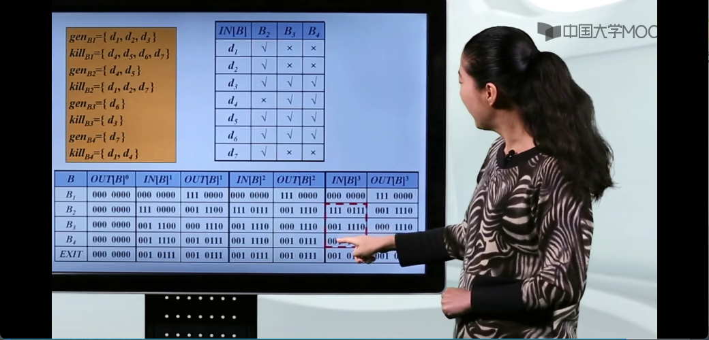

# 第八章 代码优化

[toc]

#### 基本块

一个基本块的指令要么都不执行，要么全部执行。

#### 流图

### 代码优化

#### 删除公共子表达式

#### 删除无用代码

#### 常量合并 Constant Folding

#### 代码移动

#### 强度削弱 Strength Reduction

#### 删除归纳变量 Induction Variable

### 基本块的优化（局部优化）

#### 基本块的DAG表示

#### 基于基本块的DAG删除无用代码

#### DAG：数组元素赋值指令的表示

#### DAG重构基本块

#### 例题

### 数据流分析（全局优化）

#### 到达定值分析

#### 到达定值方程的传递函数和数据流方程

#### 引用定值链 UD链 Use-Definition

#### 活跃变量分析 

 

#### 活跃变量的传递函数和数据流方程

#### 定值-引用链 DU链 Definition Use

#### 可用表达式的分析

（区分语句、变量、表达式）

#### 可用表达式的传递函数和数据流方程

#### 支配节点

#### 支配节点的数据流方程

#### 回边

#### 自然循环及识别

### 全局优化的几种实现方法

#### 删除全局公共子表达式

#### 删除复制语句

#### 代码移动

#### 作用于归纳变量的强度削弱

#### 归纳变量的删除

（测试是判断的意思，例如判断他是否大于十）

