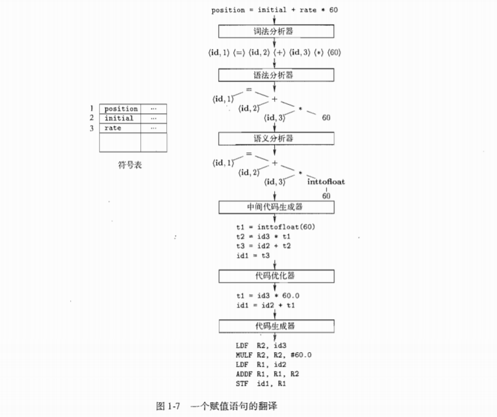

# Chapter01 introduction

## 1.1 语言处理器

* **编译器：先翻译后执行**，将源程序翻译成目标程序，目标程序在根据程序输入得到程序输出

  * 优点：速度快

* **解释器：边翻译边执行**，直接利用程序输入执行源程序以得到输出

  * 优点：错误诊断效果好，适合跨平台

* 混合编译器（Java）：源程序先通过翻译器翻译成中间程序（字节码），然后再通过一个虚拟机解释执行字节码

* 一个语言处理系统：预处理器（聚合多个源程序、转化宏为源语言）、编译器（产生汇编语言，**因为汇编语言比较容易输出和调试**）、汇编器（生成可重定位的机器代码）、链接器（解决可重定位代码外部内存地址的问题）、加载器（将可执行目标文件放入内存以执行）

  ```mermaid
  graph LR
  A[源程序]-->B(预处理器)
  B-->C[经过预处理后的源程序]
  C-->D(编译器)
  D-->E[目标汇编程序]
  E-->F(汇编器)
  F-->G[可重定位机器代码]
  G-->H(链接器/加载器)
  O[库文件 可重定位对象文件]-->H
  H-->I[目标机器代码]
  ```

## 1.2 编译器结构

* **分析部分**（analysis）：把源程序分解成多个组成要素，加上语法结构来创建一个源程序的中间表示，并收集源程序信息生成符号表，过程中出现错误需返回给用户（前端：与机器平台无关）

* **综合部分**（synthesis）：根据中间表示和符号表来构造目标程序（后端：与平台相关）

* 优化部分：有些机器会在前后端之间增加优化步骤，以提高代码质量。

* 一个编译器的各个步骤

  ```mermaid
  graph LR
  A(程序)--"字符流"-->B(词法分析器)
  B-->符号流-->C(语法分析)
  C-->语法树-->D(语义分析)
  D-->语法树-->E(中间代码生成器)
  E-->中间表示形式-->F(与机器无关的代码优化器)
  F-->中间表示形式-->G(代码生成器)
  G-->目标机器语言-->H(机器相关的代码优化器)
  H-->I(目标机器语言)
  符号表
  ```

  举例：

* **词法分析（lexical analysis）**：又称为扫描（scanning），读入字符流，组织成有意义的**词素**（lexeme）序列，对于每个词素，产生**词法单元**（token）作为输出。

  * 词法单元（token）：指代有附加信息的字符串，单纯的字符串称为词素（lexeme）
    * <token-name, attribute-value>
      * 前者是由语法分析步骤使用的抽象符号，后者是符号表中关于这个词法单元的条目（会在语义分析和代码生成阶段被使用）。
      * 词法单元传递给语法分析，语法分析对不同类型的token采取不同的处理。
  * 词法分析器的两个任务：识别词素，识别词素的类型
    * 类型：关键字/保留字、标识符、数字

* **语法分析（syntax analysis）**：又称为解析（parsing），输出语法树

* **语义分析（semantic analysis）**：使用语法树和符号表中的信息来检查源程序是否和语言定义的语义一致

  * 类型检查、自动类型转换

* 中间代码生成、代码优化和代码生成、符号表管理、多步骤组合成趟（pass）

## 1.3 程序设计语言的发展历程

* 通过代来分类：
  * 第一代：机器语言
  * 第二代：汇编语言
  * 第三代：高级程序设计语言，Fortran、Cobol、Lisp、C、C++、C#、Java
  * 第四代：为特定应用设计的语言：生成报告的NOMAD，数据库查询的SQL，文本排本的Postscript
  * 第五代：基于逻辑和约束的语言：Prolog和OPS5
* 强制性语言和声明式语言：
  * 强制式语言 Inperative 指明如何完成一个计算任务的语言 C C++ C# Java
  * 声明式语言 Declarative 指明要进行哪些计算的语言 ML Haskell Prolog
* 冯诺依曼语言：以冯诺依曼计算机体系结构为计算模型的语言 C Fortran
* 面向对象语言：支持面向对象的语言 Simula67 Smalltalk C++ C# Java Ruby 
* 脚本语言：具有高层次运算符的解释型语言 Awk JS Perl PHP Python Ruby Tcl

## 1.4 构建一个编译器的相关科学

## 1.5 编译技术的应用

* 面向对象的主要思想：数据抽象和特性的继承
* 针对计算机体系结构的优化：并行和内存层次结构技术
* 新计算机体系结构的设计：RISC和专用体系结构
* 程序翻译：二进制翻译、硬件合成、SQL、编译然后模拟
* 软件生产率工具：类型检查、边界检查、内存管理工具

## 1.6 程序设计语言基础

* 静态和动态的区别

  * 静态策略：编译时决定
  * 动态策略：运行时决定
  * 静态作用域和动态作用域：前者通过阅读程序就可以确定一个声明的作用域

* 环境与状态：名字和内存位置的关联，及之后和值的关联可以用两个映射来描述，映射随程序的运行而改变

  * 环境：一个名字到储存位置（变量）的映射，环境的改变需要遵循语言的作用域规则
  * 状态：一个内存位置到他们的值的映射，对C语言，状态把左值映射为他们相应的右值

* 静态作用域与块结构

  * 块：声明和语句的一个组合，C使用大括号来界定一个块
  * 名字、标识符和变量：所有的标识符是名字，变量指向储存中的某个特定位置
  * 过程、函数和方法

* 显式访问控制

  * 定义和声明：声明告诉我们事物的类型、定义告诉我们事物的值
    * 给出方法的泛型：声明；给出方法的代码：定义

* 动态作用域：一个作用域策略依赖于若干个只有程序执行时才能知道的因素，它就是动态的

  * 静态规则寻找位于最内层、包含变量使用位置的块，而动态规则让我们寻找最内层的，包含了变量使用时间的过程调用中

* 参数传递机制

  * 值调用：对实在参数求值或拷贝，值被放在属于被调用过程的相应形式参数的内存位置上
  * 引用调用：实在参数的地址作为相应形式参数的值被传递给被调用者（高效）

* 别名

  * 两个形式参数指向同一位置，变量称为另一个变量的别名（这会造成一个变量的修改会改变另一个变量的值）

  
