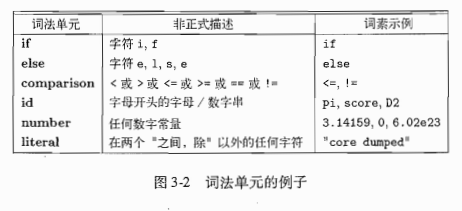
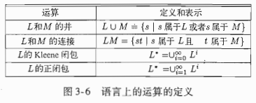
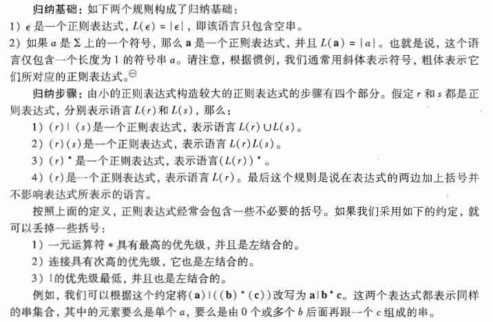
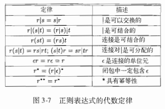
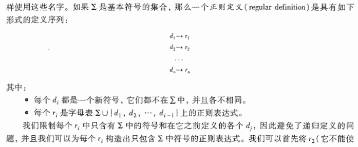
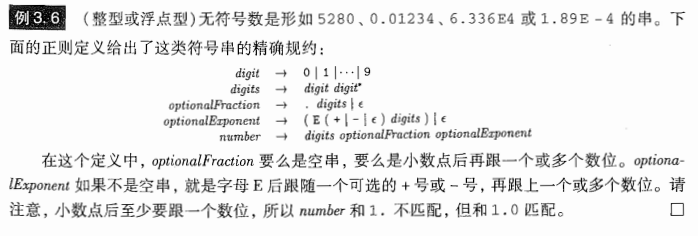

# Chapter 03 词法分析

[toc]

## 3.1 词法分析器的作用

* 词法分析器的主要任务：读入源程序的输入字符、将它们组成词素，生成并输出一个词法单元序列，每个词法单元对应于一个词素。

* 语法分析器与词法分析器的交互：通常是由语法分析器调用语法分析器来实现的。

* 词法分析器的其他任务：包括过滤程序中的注释和空白，将编译器生成的错误消息与源程序的位置联系起来。

* 词法分析器可以分为以下两个阶段：

  * 扫描阶段：负责完成一些简单处理，例如删除注释和将多个连续空白字符压缩成一个字符。
  * 词法分析阶段：，负责处理扫描阶段的输出，生成词法单元。

* **词法单元、模式和词素**

  * 词法单元：由一个词法单元名和一格可选的属性值组成，词法单元名是表示某种词法单位的抽象符号，它也是语法分析器处理的输入符号。

  * 模式：描述了一个词法单元所可能具有的形式，当词法单元是关键字时，模式就是该关键词的字符序列，对于标识符和其他词法单元，模式是一个复杂的结构，它可以和很多符号串匹配。

  * 词素：源程序中的一个字符序列，它被词法分析器识别为该词法单元的一个实例。

  * 词法单元举例：

    

* 词法单元的属性：
  * 引入词素的原因：如果有多个词素可以和一个模式匹配，那么词法单元必须向后续阶段提供有关于被匹配词素的附加信息。
  * 一般来说，和一个标识符有关的信息，例如它的词素、类型、第一次出现的位置（报错时可能需要）都保存在符号表中，因此一个标识符的属性是一个指向该符号表中该标识符对应条目的指针。
* 词法错误：如果没有其他组件的帮助，词法分析器很难发现源代码中的错误。
  * 错误恢复动作：多种策略。	

## 3.2 输入缓冲

* 动机：我们通常要查看一个词素后的若干个字符才能确定是否找到了正确的词素，来判断事都已经到达了一个标识符的末尾。
* 缓冲区对：利用两个交替读入的缓冲区，来减少处理单个输入字符的时间开销。
  * 程序维护了两个指针：一个指向当前词素的开始处，我们正在试图确定他的结尾；另一个一直向前扫描，知道发现某个模式被匹配为止。两个指针一直向前跑不断分析词素。
* 哨兵标记：哨兵标记缓冲区末尾。考虑缓冲区的大小限制，前移指针到达缓冲区末尾后，加载另一个缓冲区。

## 3.3 词法单元的规约

* 串和语言
  * **字母表**：一个有限符号集合。
  * **串**：某个字母表上的串是该字母表中符号的一个有穷序列，记串$s$的长度为$|s|$，空串用$\epsilon$表示。
    * 串的有关术语：（真）前缀、（真）后缀、（真）**子串**（串删除前缀或后缀之后得到的串）、**子序列**（删除串中若干个字符得到的串，不要求删除符号必须相邻）、**连接**（$x$和$y$的连接记作$xy$，即把$y$加到$x$后面得到的串，在此基础上，我们定义其”指数运算“，例如$s^3$，表示$sss$）
  * **语言**：某个给定字母表上一个任意的可数的串的集合。
  
* **语言上的运算**：并、连接和闭包运算。

  

* **正则表达式**：一种描述语言的表示方法，可以描述所有通过对某个字母表上的符号应用上述三个运算符而得到的语言。

  * 每一个正则表达式$r$可以描述定义在一个字母表上的一个语言$L(r)$

  * 某个字母表上的正则表达式以及正则表达式所表示的语言的归纳定义：

    > 这里注意一下规定的运算优先级

    

  * **正则集合**：可以用一个正则表达式定义的语言称为正则集合，两个正则表达式表示同样的语言，则称它们等价（=）

    * 推出正则表达式的代数定律（在分析正则表达式时可以使用）

      

* **正则定义**（定义一些符号，用于简化正则表达式的书写）

  * 很简单，用一组$\to$形式的序列，每个定义左边为新定义的符号，右边为已定义符号和字母表符号的组合，后定义的符号可以用之前定义的符号作为表示。

  * 严格定义：

    

  * 举例子：

    

* 正则表达式的扩展
  * 一个或多个实例：$r^+$，表示正闭包
  * 零个或一个实例：$r?$
  * 字符类：$[abc]$是$a|b|c$的缩写，$[a-z]$是$a|b|c|...|z$的缩写，类似的还有[0-9]。

## 3.4 词法单元的识别

## 3.5 词法分析器生成工具 Lex

## 3.6 有穷自动机

## 3.7 从正则表达式到自动机

## 3.8 词法分析器生成工具的设计

## 3.9 基于DFA的模式匹配的优化

