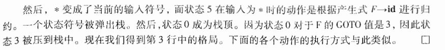

# Chapter 04 语法分析

[toc]

## 4.1 Intro

* 语法分析器的作用：从词法分析器中获得一个由词法单元组成的串，并验证这个串可以由源语言的文法生成。除此之外，我们期望语法分析器能够以易于理解的方式报告语法错误，并且能够从常见的语法错误中恢复并继续处理程序的其他部分。

  处理文法的语法分析器有三类：通用的、自顶向下的、自顶向上的。

  * 自顶向下：从语法分析树的根节点开始向叶子节点构造语法分析树。

  * 自顶向上：从叶子节点开始，逐渐向根节点方向构造。

    注：在以上两种方法中，输入总是以从左向右的方式被扫描，每次一个符号。

## 4.2 上下文无关文法

* 一个上下文无关文法（简称：文法）由终结符号、非终结符号、一个开始符号和一组产生式组成。
  * **终结符号是组成串的基本符号**（常使用“词法单元”来指称终结符号）
  * **非终结符号是表示串的集合的语法变量**，用于定义由文法生成的语言，给出了语言的层次结构。
  * **开始符号：某个*非终结符号*，这个符号表示的串集合就是文法生成的语言**。按照惯例，首先列出开始符号的表达式。
  * 产生式：描述了将终结符号和非终结符号组合成串的方法。一个产生式由左部（产生式头：一个非终结符号），$\to$，右部（产生式体：一个由零个或多个终结符号域非终结符号组成）组成。

* 符号约定：
  * 终结符号：前面的小写字母（a，b，c）、运算符号（+，*）、标点符号、数字、黑体字符串（如 **if**）
  * 非终结符号：前面的大写字母（A，B，C）、字母 S 、小写斜体字符串（例如 *expr*）
  * 文法符号（终结符号或非终结符号）：后面的大写字母（X，Y，Z）
  * （可能为空的）终结符号串：后面的小写字母（x，y，z）
  * （可能为空的）文法符号串：小写希腊字母$\alpha, \beta, \gamma$
  * 简写：$A \to \alpha_1, A \to \alpha_2$可以写作$A \to \alpha_1 | \alpha_2$， $\alpha_1, \alpha_2$为$A$的不同选择体
  * 第一个产生式的产生式头默认为开始符号
* 推导：选择需要替换哪个非终结符号，选择一个以此非终结符号作为头的产生式，
  * 一般性定义：考虑一个文法符号序列中间的非终结符号A，比如$\alpha A \beta$ 和 $\alpha, \beta$是任意的文法符号串。假设$A \to \gamma$是一个产生式。那么我们写作$\alpha A \beta \Rightarrow \alpha \gamma \beta $。
  * 句型：如果文法$G$的开始符号$S$能够推出$\alpha$，则$\alpha$是$G$的一个**句型（Sentential Form）**，句型可以是终结符号，也可以包含非终结符号，也可以是空串。
  * 句子：文法$G$的一个**句子（Sentence）**是不包含非终结符号的句型。
  * 语言：一个文法$G$生成的**语言$L(G)$**是所有句子的集合，一个终结符号串$\omega$在$L(G)$中，当且仅当$\omega$是$G$的一个句子。
  * 上下文无关语言：可以由文法生成的语言。
  * **最左推导和最右推导**：
    * 最左推导 Leftmost Derivation：总是选择每个句型的最左边终结符号来替换。推导出的东西成为当前文法的最左句型。
    * 最右推导（也成为规范推导） Rightmost Derivation：总是选择每个句型的最右边终结符号来替换。

* 语法分析树和推导：
  * 语法分析树（Parse Tree）：
    * 内部节点：表示一个产生式的应用，内部节点的标号为对应的产生式头中的非终结符号，其子节点从左到右组成了产生式体。
    * 叶子节点：叶子节点可以是非终结符号也可以是终结符号，从左到右排列形成句型。
* 二义性 Ambiguous
* 验证文法生成的语言：
  * 证明文法$G$生成的每一个串都在语言$L$中；（归纳法（步骤数））
  * 证明语言$L$中的每一个串都可以用文法$G$生成。（归纳法（串的长度））
* 上下文无关文法和正则表达式：
  * 文法比正则表达式更强
  * 例子：$L = \{a^nb^n | n \ge 1\}$（即由同样数量的a和b组成的串的集合）

## 4.3 设计文法

* 消除二义性

* **左递归的消除 Left Recursive**：

  * 左递归定义：文法中存在一个非终结符号$A$，使得对于某个串$\alpha$存在一个推导$A \Rightarrow A \alpha$，那么这个文法就是左递归的。

  * 左递归产生式转化为非左递归产生式的例子：$A \to A\alpha | \beta$替换为$A \to \beta A', A' \to \alpha A' | \epsilon$。

  *   立即左递归：立即左递归就是$A \to A\alpha | \beta$为一步推导（非立即左递归就是多步推导才能出这个结果）

  * 消除立即左递归的共识：

    对于：$A \to A \alpha_1 | A\alpha_2 | ... | A \alpha_m | \beta_1 | ... | \beta_m$

    将这样的产生式替换为：$A \to \beta_1 A' | ... | \beta_n A', A' \to \alpha_1 A' | \alpha_2 A' | ... | \alpha_m A' | \epsilon $

  * 消除左递归的算法：（文法不存在环（$A \to A$）或$\epsilon$产生式（$A \to \epsilon$），就能保证清楚左递归）

    * 输入：没有环或$\epsilon$产生式的文法$G$（但其实$\epsilon$表达式是无害的）
    * 输出：等价的无左递归文法$G'$

    > 按照某个顺序排序非终结符号排序为 A_1, A_2, ... A_n
    > for i in [1, n]
    > 	for j in [1, i-1]
    >     	将每个形如 A_i to A_j的产生式替换为产生式组 $A_i \to \sigma_1 \gamma | \sigma_2\gamma | ... | \sigma_k \gamma$，其中存在 $A_j \to \sigma_1 | \sigma_2 | ... | \sigma_k$
    >     消除 A_i 产生式之间的左递归
  
* **提取左公因子**

  * 如果$A \to \alpha \beta_1 | \alpha \beta_2$是两个A的产生式，并且输入的开头都是从$\alpha$推导得到的一个非空串，此时提取左公因子，原产生式转化成：

    $A \to \alpha A'$

    $A' \to \beta_1 | \beta_2$

* 非上下文无关语言的构造

## 4.4 自顶向下的语法分析

* LL(k)文法类：向前看k个输入符号的预测分析器，LL(1)就是每次只向前看下一个符号。

* 一个左递归的文法会是他的递归向下语法分析器进入一个无限循环。

* **FIRST**和**FOLLOW**：

  * $FIRST(\alpha)$被定义为**可从$\alpha$（任意的文法符号串）推导得到的串的首符号的集合**

  * 对于非终结符号$A$，$FOLLOW(A)$被定义为**可能在某些句型中紧跟在A右边的中间符号集合**

  * 计算**文法符号**$X$的$FIRST(X)$：

    * 如果$X$是一个终结符号，那么$FIRST(X) = X$

    * 如果$X$是一个非终结符号，且$X \to Y_1 Y_2 ... Y_K$是一个产生式。

      * 如果对于某个$i$，$a$在$FIRST(Y_i)$中且$\epsilon$在所有的$FIRST(Y_1), ... ,FIRST(Y_{i-1})$中，就把$a$加入到$FIRST(Y_j)$中。
      * 此外，如果$\epsilon$所有$Y_i, i \in 1,2,...,K$中，则将$\epsilon$加入到$FIRST(X)$中。

      >过程就是从左往右依次推，若不能推出$\epsilon$就结束。

      * 如果$X \to \epsilon$是一个产生式，则将$\epsilon$加入到$FIRST(X)$中。

  * 计算**任意串**$X_1 X_2 ... X_n$的$FIRST$集合：

    * 向$FIRST(X_1 X_2... X_n)$中加入$FIRST(X_1)$中的非$\epsilon$符号
    * 接下来依次类推：如果$\epsilon \in FIRST(X_i)$，则加入$FIRST(X_{i+1})$中的非$\epsilon$符号。
    * 最后，如果$\forall i \in [1,n], \epsilon \in FIRST(X_i)$，则将加入$\epsilon$。

  * 计算**非终结符号**$A$的$FOLLOW(A)$：

    * 将$\$$放入$FOLLOW(S)$，其中$S$是开始符号，而$\$$是输入右端的结束标记
    * 如果存在一个产生式：$A \to \alpha B \beta$（即$B$在产生式中间），那么$FIRST(\beta)$中除了$\epsilon$之外的所有符号都在$FOLLOW(B)$中。
    * 如果存在一个产生式$A \to \alpha B$（即$B$在产生式尾部），或产生式$A \to \alpha B \beta$且$FIRST(\beta)$包含$ \epsilon$，那么$FOLLOW(A)$中所有符号都在$FOLLOW(B)$中。

* **LL(1)文法**：L：从左向右扫描，L：最左推导， 1每一步中只需要向前看一个输入符号来决定语法分析动作，是不需要回溯的递归下降语法分析器。
  
  * **预测分析器的转换图**：首先要消除左递归，对文法提取左公因子，然后**对每一个非终结符号$A$**（有一个单独的转换图）：
    
    * 创建一个初始状态和结束状态
    * 对于每一个产生式$A \to X_1 X_2 ... X_n$，创建一个从初始状态到结束状态的路径，路径的各边编号为$X_1, X_2 , ... X_n$，如果$A \to \epsilon$，则这条路径是一条标号为$\epsilon$的边。
    * 我们可以将一个标号为非终结符号的边替换为该符号的转换图，这个过程可以进行化简。（但是具体怎么化简我不懂）
    
  * **LL(1)文法的定义**：一个文法$G$是$LL(1)$的，当且仅当$G$的任意两个不同的产生式$A \to \alpha | \beta$满足以下条件：

    * 不存在终结符号$a$使得$\alpha$和$\beta$都能够推导出以$a$开头的串。

    * $\alpha$和$\beta$中最多只有一个可以推导出空串。

    * 如果$\beta$能够推导出$\epsilon$，那么$\alpha$不能推导出任何以$FOLLOW(A)$中某个终结符号开头的串，如果$\alpha$能够推导出$\epsilon$，那么$\beta$不能推导出任何以$FOLLOW(A)$中某个终结符号开头的串。

      > **前两个条件说明$FIRST(\alpha) \cap FIRST(\beta) = \empty$ ，第三个条件就是说**$\epsilon \in FIRST(\beta) \to FIRST(\alpha) \cap FOLLOW(A) = \empty$
  
  * LL(1)文法只需要检查当前输人符号就可以为一个非终结符号选择正确的产生式  
  * **构造一个预测分析表**：一个二维数组，包含$FIRST$和$FOLLOW$集合中的信息（为输列索引入符号，行索引为非终结符号）
    
    * 输入为文法$G$，输出为预测分析表$M$
    * 对于每个产生式$A \to \alpha$：
      * 对于$FIRST(\alpha)$中的每个终结符号$a$，将$A \to \alpha$加入到$M[A,\alpha]$
      * 如果$\epsilon$在$FIRST(\alpha)$中，那么对于$FOLLOW(A)$中的每一个终结符号$b$，将$A\to \alpha$加入到$M[A,b]$中。
      * 如果$\epsilon$在$FIRST(\alpha)$中，且$\$$（终止标记）在$FOLLOW(A)$中，也将$A\to \alpha$加入到$M[A,\$]$中。
    * 如果$M[A,a]$为空，则称它为错误条目。
    * 如果$M[A,a]$有多重定义，则文法是左递归或具有二义性的。

  * **非递归的预测分析**：

    * 输入：一个串$\omega$，文法$G$，预测分析表$M$

    * 输出：如果$\omega$在$L(G)$中，**输出$\omega$的一个最左推导**，斗则给出一个错误提示

    * 初始化：输入缓冲区中是$\omega$，而$G$的开始符号$S$位于栈顶，它的下面是$\$$。

    * 算法步骤：
  
      > 设置输入指针 $ip$ 使它指向 $\omega$ 的第一个符号
      >
      > 令 $X$ 为栈顶符号
      >
      > **while** $X \neq \$ $
      >
      > ​	**if** $X = a$，$a$ 为 $ip$ 指向的符号
      >
      > ​	**then** Pop出栈顶，$ip$前移  
      >
      > ​	**else if** $X$ 是一个终结符号 or $M[X,a]$是一个报错条目
      >
      > ​	**then** 出错
      >
      > ​	**else if** $M[X,a]$是一个产生式：$X \to Y_1 Y_2 ... Y_K$
      >
      > ​	**then** Pop出栈顶，将$Y_K, Y_{K-1}, ... , Y_1$依次压入栈中，其中$Y_1$位于栈顶
      >
      > ​	更新$X$为当前栈顶符号

  * **LL(1)文法实例**：

    

    

    

    
  
  * 预测分析中的错误恢复
    * 恐慌模式：语法分析器忽略输人中的一些符号， 直到输人中出现由设计者选定的**同步词法单元集合**中的某个词法单元。  
      * 一些启发式规则：
        * 首先将$FOLLOW(A)$中的所有符号都放到非终结符号 $A$ 的同步集合中。   
        * 一个语言的各个构造之间常常存在某个层次结构，可以把较高层构造的开始符号加人到较低层构造的同步集合中去。
        * 把 $FIRST(A)$ 中的符号加人到非终结符号 $A$ 的同步集合中，那么当$FIRST(A)$中某个符号出现在输人中时 ， 我们就有可能可以根据 $A$ 继续进行语法分析。
        * 如果一个非终结符号可以生成空串， 那么可以把推导出 $\epsilon$ 的产生式当作默认值使用，这个方法可以减少我们在处理错误恢复时需要考虑的非终结符号的数量。
        * 如果栈顶的一个终结符号不能和输人匹配， 一个简单的想法是将该终结符号弹出栈 ，并发出一个消息称已经插人了这个终结符号， 同时继续进行语法分析。  
    * 短语层次的恢复：短语层次错误恢复的实现方法是在预测语法分析表的空白条目中填写指向处理例程的指针。这些例程可以改变、 插入或删除输入中的符号，并发出适当的错误消息。   

## 4.5 自底向上的语法分析

* 自顶向下的语法分析过程：为一个输入串构造语法分析树，他从叶子节点开始逐步向上到达根节点。

* **规约 Reduction**：每一次规约，一个与某个产生式体相匹配的特定子串被替换为改产生式头部的非终结符号。一次规约是一个推导步骤的反向操作。

* **句柄剪枝**

  * 句柄（handle）：是和某个产生式体匹配的子串，对他的规约代表了相应的最右推导中的一个反向步骤。

    * **句柄的定义**：如果有$S \Rightarrow \alpha A \omega \Rightarrow \alpha \beta \omega$，那么紧跟着$\alpha$的产生式$A \to \beta$是$\alpha \beta \omega$的一个句柄。

      * 注意：句柄右边的串$\omega$只包含终结符号；为了方便，我们将产生式体$\beta$称为一个句柄。

    > 句子：终结符号串
    >
    > 句型：终结+非终结符号串

    * 一个例子：

      

  * 通过句柄剪枝来得到一个反向的最右推导

* **移入 - 归约语法分析技术**

  * 首先，使用一个栈来保存文法符号，用输入缓冲区来存放要进行语法分析的其余符号。

  * 在对输人串的一次从左到右扫描过程中，语法分析器将零个或多个输人符号移到栈的顶端（**移入操作**），直到它可以对栈顶的一个文法符号串 $\beta$​ 进行归约为止。  它将 $\beta$ 归约为某个产生式的头（**规约操作**）。 语法分析器不断地重复这个循环，直到它检测到一个语法错误，或者栈中包含了开始符号且输人缓冲区为空为止。 

  * 实例：

    

* **移入 - 归约语法分析中的冲突**

  * 移入/归约冲突
  * 归约/归约冲突

## 4.6 LR 语法分析技术

* **LR(k) 语法**：L表示对输入进行从左到右的扫描，R表示反向构造出一个最右推导序列，k表示在做出语法分析决定时向前看k个输入符号。

* **项** 和 **LR(0)自动机**
  
  * **项的定义**：一个文法 G 的一个LR（0）项（简称为项）是G的一个产生式加上一个位于它体中某处的点。例如$A \to XY$产生了三个项，分别是$A\to \cdot XY | X \cdot Y | XY \cdot$（一个项可以表示为一个二元组：【基础文法的产生式编号，点的位置】）
    
    * 指明了在语法分析过分析网中的给定点上，我们已经、看到了一个产生式的哪些部分，如*$X \cdot Y$表示我们刚刚在输入中看到了一个有X推导得到的串，并且我们希望接下来能看到一个能从 Y 推导得到的串。*
  * **项集**：项的集合
  * **LR(0)自动机**：**规范LR(0)项集族**的一组项提供了构建一个确定有穷自动机的基础，LR(0)自动机的每一个状态代表了规范LR(0)项集族中的一个项集。
  * **增广文法**：如果 G 是一个以 S 为开始符号的文法， 那么 G 的增广文法 G' 就
    是在 G 中加上新开始符号  S' 和产生式 $S' \to S$而得到的文法。（引入目的：方便决定何时停止并接受输入符号串）
  * **项集的闭包** $CLOSURE(I)$：如果 I 是文法 G 的一个项集，项集 I 的闭包从根据下面两个规则构造得到：
    * 将 $I$ 的各项加入到 $CLOSURE(I)$ 中
    * 如果 $A \to \alpha \cdot B \beta$在 $CLOSURE(I)$ 中，并且项 $ B \to \cdot\gamma$不在 $CLOSURE(I)$ 中，就将这个项加入到 $CLOSURE(I)$ 中 
    * 对项进行分类：
      * 内核项：包括初始项$S' \to \cdot S$以及点不在最左侧的所有项
      * 非内核项：除了初始项$S' \to \cdot S$之外的点在最左侧的所有项
  
  * **GOTO函数**：$GOTO(I,X)$，其中 I 是一个项集而 X 是一个文法符号，该函数被定义为 I 中所有形如 $[A \to \alpha \cdot X \beta]$的项所对应的项$[A \to \alpha X \cdot \beta]$的**集合的闭包。**
  
    * 它用于对应一个文法的LR(0)自动机中的转换。自动机的状态对应于项集，而该函数描述了输入为X时离开状态 I 的转换。
  
  * **增广文法 G‘ 的规范 LR(0) 项集族 C 的算法**
  
    >**void** items($G'$) {
    >
    >​		$C$ = $\{CLOSURE(\{[S' \to S]\})\}$;
    >
    >​		**repeat**
    >
    >​				**for** ( $C$ 中每一个项集 $I$ ) {
    >
    >​						**for** ( 每一个文法符号 $X$ ) {
    >
    >​								**if** ( $GOTO(I,X)$ 非空且不再 $C$ 中 ) {
    >
    >​										将 $GOTO(I,X)$ 加入到 $C$ 中				
    >
    >​								}
    >
    >​						}
    >
    >​				}
    >
    >​		**until** 在某一论中没有新的项集被加入到 $C$ 中
    >
    >}
  
  * **例子**
  
    
  
    
  
  * **简单 LR 语法分析技术（SLR）**：
  
    * 中心思想：根据文法构造出 LR(0) 的自动机，这个自动机的状态是规范LR(0)项集族中的元素，而他的转换由GOTO函数给出。
  
    * 开始状态 0 ：$CLOSURE(\{[S'\to \cdot S\})$ ，状态 j 对应于项集 $I_j$ 的状态。
  
    * 移入 - 归约：假设文法符号串$\gamma$使自动机从开始状态0运行到某个状态 j ；如果下一个输人符号为 a 且状态 j 有一个在 a 上的转换， 就 **移人** a，否则选择 **归约** 动作，状态 j 的项将告诉我们使用哪个产生式进行归约  
  
    * 例子：
  
      
  
* **LR 语法分析算法**

  * LR语法分析器：

    

  * LR语法分析表

    * 结构：由动作分析函数 ACTION 和转换函数 GOTO 组成。
      * $ACTION[i,a]$：状态 $i$ ，终结符号 $a$ （或者是输入结束标记 $ ）
        * 取值：
          * 移入 $j$ ，状态 $j$ 表示 $a$
          * 归约 $A \to \beta$：把 $\beta$ 规约为产生式头 $A$
          * 接受：完成语法分析过程
          * 报错：发现错误并执行某个纠错程序
      * $GOTO[I_i, A]$：扩展为定义在状态集上的函数：如果$GOTO[I_i, A] = I_j$，那么也把状态 $i$ 和非终结符号 $A$ 映射到状态 $j$

  * **LR语法分析程序**

    

  * **LR语法分析表举例**：主要看他的模式，如何给出表中各个条目还没有解释

    

    

    

    

* **构造 SLR 语法分析表**：以LR(0)项和LR(0)自动机为基础，此外它要求我们知道输入文法的的每一个非终结符号A的FOLLOW(A)。（还能再麻烦一点吗）

  * **SLR(1)语法分析表构造算法**：

    语法分析表算法.png)

* **可行前缀**：可以出现在一个移入 - 归约语法分析器的栈中的最右句型前缀被称为可行前缀（viable prefix）

  * 定义：一个可行前缀是一个最右句型的前缀，并且它没有越过该最右句型的最右句柄的右端。（因此我们总可以在一个可行前缀之后增加一些终结符号来得到一个最右句型）

  * LR 语法分析理论的核心定理是： 如果我们在某个文法的LR ( 0 ) 自动机中从初始状态开始沿着标号为某个可行前缀 $\gamma$ 的路径到达一个状态 ， 那么该状态对应的项集就是 $\gamma$ 的有效项集。  

    
    
  * 符号栈里头的就是可变前缀，符号栈拼上当前输入缓冲区可以得到最右句型？

## 4.7 更强大的LR语法分析器

* 之前的LR语法分析技术不会再输入中向前看一个符号，本节将引入 LR(1) 包括：规范 LR 和 LALR。

* **规范 LR(1) 项**：项变成了一个二元组 $[A \to \alpha \cdot \beta, a]$，其中前者是一个产生式，后者是一个终结符号或结束标记， 后者又被称为这个项的向前看符号。

  * 在形如 $[A \to \alpha \cdot, a]$的情形下，代表只有下一个输入符号为 $a$ 时才要求按照 $A \to \alpha$ 进行归约，这样的 $a$ 的集合总是 $FOLLOW(A)$的子集。

  * 定义：

    项的定义)

* 构造 LR(1) 项集：本质上和 LR(0) 的相同，修改 CLOSURE 和 GOTO

  项集族的构造算法)

* 规范LR(1)语法分析表

  算法如下：

  语法分析表算法.png)

  SLR(1)文法都是LR(1)文法，但是规范LR(1)的状态比对应的SLR状态多。

* 构造LALR语法分析表（向前看-LR）

  * 特点：分析表比规范LR(1)小，SLR与LALR总是具有相同数量的状态

  * 项集的核心（Core）：第一个分量的集合（因为像是一个二元组嘛，第一个分量相同的项集有相同的核心）（在这个基础上我们就可以进行项集的合并）

  * 一种在基于规范LR(1)项集族的LALR分析表构造方法

    

    

  * 高效构造 LALR 语法分析表的方法
    
