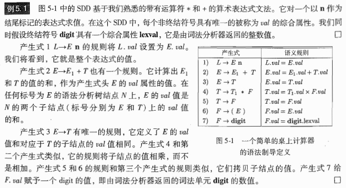
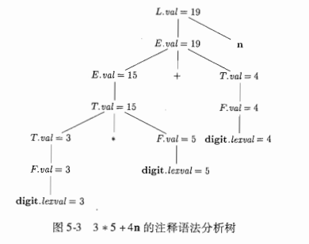
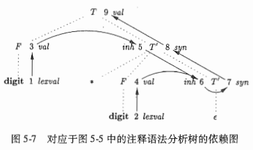
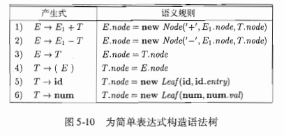
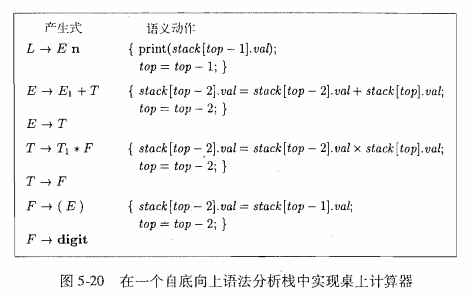
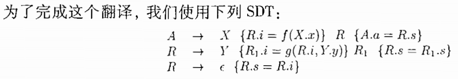

# 第5章 语法制导翻译

> 使用上下文文法来引导对语言的翻译

## 5.1 语法制导定义

* **语法制导定义SSD**：是一个上下文无关文法和属性及规则的结合。

  * 属性于与文法符号相关联，规则与产生式相关联。（**赋予属性与文法符号，赋予语义规则于产生式**）
  * 如果用 X 来表示一个符号， a 是 X 的一个属性，则用 X.a 来表示 a 在某个标号为 X 的分析书结点上的值。

* **综合属性和继承属性**：非终结符号的两种属性

  * 综合属性 Synthesized Attribute：在分析树结点 N 上的非终结符号 A 的综合属性是由 N 上的产生式（$A \to something$）关联的语义规则来定义的。  

  * 继承属性 Inherited Attribute：在分析树结点 N 上的非终结符号 B 的继承属性是由 N 的父结点上的产生式（$something \to ...B... $）所关联的语义规则来定义的。  

  * 不允许继承属性由子节点上的属性值来定义，但允许综合属性通过本身的继承属性来定义。终结符号可有综合属性，无继承属性，其属性值是由词法分析器提供的词法值。

  * S属性的SSD：一个只含有综合属性的语法制导定义，每个规则都根据相应产生式体中的属性值来计算产生式头部非终结符号的一个属性。

  * 属性文法：没有副作用的SSD，其规则仅仅通过其他属性值和常量值来确定一个属性值。（？啥是副作用）

  * 例子：

    

* 在语法分析树的节点上对SDD求值：对一棵语法树的某一个结点的一个属性进行求值时，必须首先求出这个属性值所依赖的属性值。
  * 对于综合属性，显然可以自底向上逐步求值。
  * 对于同时具有继承属性和综合属性的SDD，可能会出现循环依赖关系。

* 注释语法分析树：显示了各个属性值的语法分析树。

  

## 5.2 SDD的求值顺序

* 依赖图 Dependency Graph：用于确定一棵给定的语法分析树中各个属性实例的求值顺序，描述了某个语法分析树之间的信息。

  * 从一个属性实例到另一个属性实例的边表示计算第二个属性实例时需要第一个属性的值

  * 例子：

    

  * 依赖图刻画了一棵语法分析树中不同节点上的属性求值时可能采取的顺序（拓扑排序）

* S属性的定义：如果一个SDD的每一个属性都是综合属性，则该SDD是S属性的

* L属性的定义（L-attributed Definition）：一个产生式体所关联的各个属性之间，依赖图的边总是从左到右

## 5.3 语法制导翻译的应用

* 抽象语法树的构造：通过SDD将一个输入串转化成一棵语法树

  * 使用具有适当数量的字段的对象来实现一个语法分析树的各个节点，叶子节点有一个字段存放词法值，内部节点有若干字段存放操作符和子节点字段的指针。

    例子：

    

* 类型的结构：当语法分析树的结构和输入的抽象语法树结构不同时，继承属性可以将信息从语法分析树的一部分传递到另一部分。（不晓得他想说什么）

## 5.4 语法制导的翻译方案（SDT）

> Syntax-directed Translation Scheme

* **SDT：在其产生式体中嵌入程序片段的一个上下文无关文法，程序片段又被称为语义动作，可以出现在产生式体中的任何地方。**

  * 一般在语义动作外面套花括号，里面可以是**语义规则**对应的操作或一些其他代码。
  * **在语法分析过程中，产生式体的一个动作在它的左边的所有文法符号都被匹配后立刻执行。**
  * **在语法分析过程中实现SDT**：将每个内嵌语义动作替换成一个独有的标记非终结符号（marker nonterminal），每个标记非终结符号只有一个产生式$M \to \epsilon$。对带有标记的非终结符的文法用某种方法进行语法分析。

* 如何使用SDT来实现两类重要的SD（将一个SDD中的语义规则转换成一个带有语义动作的SDT），包括：

  * 基本文法可以使用 LR （自底向上）技术分析，且 SDD 是 S 属性的
  * 基本文法可以使用 LL （自顶向下）技术分析，且 SDD 是 L 属性的

* **后缀翻译方案：所有动作都在产生式最右端的 SDT**  

  * **用自底向上方法来分析且该 SDD 是 S 属性定义，通过构造出一个 SDT，其中的每个动作都放在产生式的最后，并且在按照这个产生式将产生式体归约为产生式头的时候执行这个动作。**
  * **后缀SDT的语法分析栈实现**：当规约发生时执行相应的语义动作，可以将属性和文法符号一起放在栈中记录里。

  

* **产生式内部带有语义动作的SDT**：动作可以放置在产生式体中的任何位置上。 当一个动作左边的所有符号都被处理过后， 该动作立刻执行。 

* 不是所有 DST 都能在语法分析过程中实现，任何 DST  都可以按照以下方式实现：

  * 忽略语义动作，构造一棵语法分析树
  * 在内部节点以附加子节点的形式加入语义动作，位置与产生式要求一致
  * 前序遍历语法分析树，访问到语义动作的结点立在刻执行语义动作。

* **从 SDT 中消除左递归**：**如果只是简单的打印操作，当转换文法时，将动作当作终结符号处理**，如果 SDD 的动作是计算属性的值，则需要小心考虑如何消除文法中的左递归，可能需要给新增的非终结符号添加属性。

  

  

  > 左递归消除复习：将 $A \to A\alpha | \beta$转换成$A \to \beta R, R \to \alpha R | \epsilon$

* **L 属性定义的 SDT**：
  * 将 L 属性的 SDD 转化为一个 SDT 的规则：
    * 把计算某个非终结符号 4 的继承属性的动作插人到产生式体中紧靠在 4 的本次出现之前的位置上 
    * 将计算一个产生式头的综合属性的动作放置在这个产生式体的最右端   

