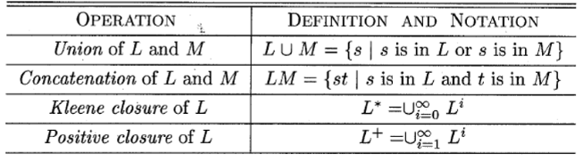
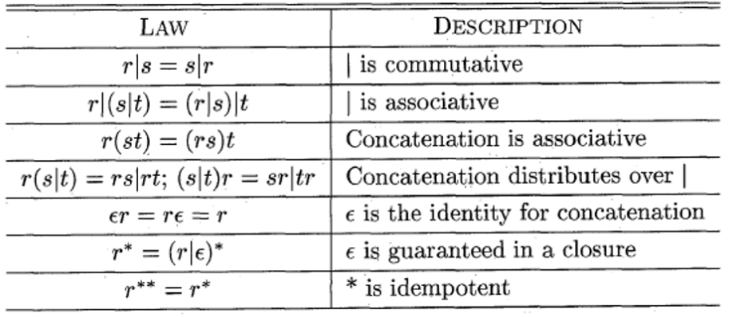
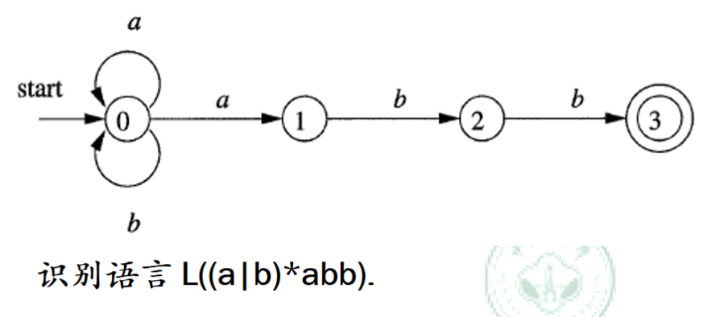
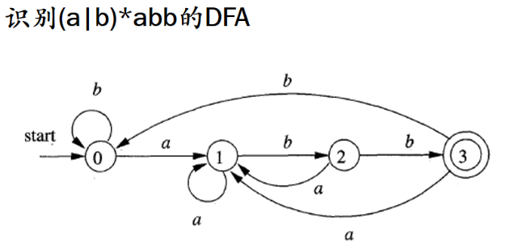
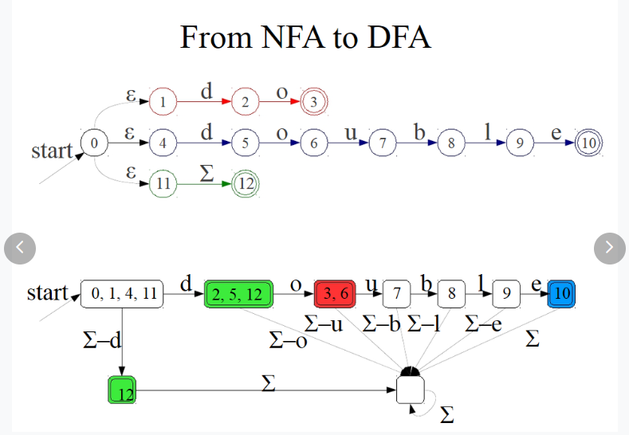

# Lecture 02 Lexical Analysis I

* 词法分析的任务
  * 源程序在经词法分析前是字符的序列，**词法分析器将其转化为Token的序列**
    * **Token**是指**带有附加信息**的字符串，**Lexeme**指单纯的字符串
      * Token举例：<"month", id>
      * **类别属性**是包括在Token中的基本信息
        * 程序语言中，类别可以是标识符、关键字（保留字）、常量、运算符、分界符
        * 语法分析器每此获得一个Token，根据其类别做相应处理

* 词法分析的关键问题：如何识别一个Token
  * 如何识别一个Lexeme：通过扫描（Scanning 模式匹配的一种特例）
  * 如何知道其类别属性：借助形式化的语言定义类别

* [3.3.1] 字符串和语言

  * 字母表：符号的有限集合

  * 语言：定义字母表$\Sigma$上的语言是由字母表$\Sigma$中的字符组成的字符串的集合

    * 自然语言和形式语言：前者有二义性，不精确，后者相反

    * 语言的运算：下表分别是并集、连接、**克林闭包**和正闭包

      

      （$L^i$表示所有长度为i的串的集合）

  * **正则语言（Regular Language）**

    * 正则表达式的递归定义：（expr：表达式）

      >Basis: 基
      >
      >​	$\epsilon$ is a regular expr that $L(\epsilon) = {\epsilon}$
      >
      >​	$ a \in \Sigma$ is a regular expr that $L(a) = {a}$
      >
      >Induction: 归纳 if $r$ and $s$ are regular exprs
      >
      >​	$r|s$ is a regular expr that $L(r|s) = L(r) \cup L(s)$
      >
      >​	$rs$ is a regular expr that $L(rs) = L(r)L(s)$
      >
      >​	$r^*$ is a regular expr that $L(r^*) = (L(r))^* $
      >
      >​	$(r)$ is a regular expr that $L((r)) = L(r)$

      * 规定：
        * 一元运算符$*$具有最高优先级
        * 连接运算符具有此高优先级
        * $|$运算符优先级最低
        * 上述运算符左结合

    * 正则语言的等价规则

      

      > $\epsilon$理解成零元，idempotent：幂等

    * （分步骤）定义正则表达式：$d_1\to r_1, d_2\to r_2, ..., d_n\to r_n$，满足：新定义的符号$d_i$全局唯一，对于每一个$r_i$，来自字母表并$\{d_1,d_2,...d_{i-1}\}$

      * 举例：C语言标识符的正则表达式

        > letter_ $\to$ A|B|...|Z|a|b|...|z|_ 也可以直接写成[aA-Za-z_]
        >
        > digit $\to$ 0|1|...|9
        >
        > id $\to$ letter_ ( letter_ | digit )*

    * 正则表达式的扩展：

      * $r^+ = rr^*$
      * $r? = r|\epsilon$
      * $[abc] = a|b|c$
      * $[a-z] = a|b|c|...|z, [0-9] = 0|1|...|9$

    * 正则表达式的应用：文本搜索和模糊匹配、合法性检查、文本自动更正和编辑、信息提取

  * Chomsky hierarchy 乔姆斯基层次结构

    | 层级     | 语言           | Automaton              | Production Rules                         |
    | -------- | -------------- | ---------------------- | ---------------------------------------- |
    | 0-型语言 | 可计算枚举语言 | 图灵机                 | $\alpha \to \beta$                       |
    | 1-型语言 | 上下文相关语言 | 线性有界非确定性图灵机 | $\alpha A \beta \to \alpha \gamma \beta$ |
    | 2-型语言 | 上下文无关语言 | 非确定性下推自动机     | $A \to \gamma$                           |
    | 3-型语言 | 正则语言       | 有限状态机             | $A \to a$, $A \to aB$                    |

  * **NFA 非确定有限自动机** Nondeterministic Finite Automaton

    * 组成：五元组：$(	S, \sum, T, s_0,F)$

      * 有限状态集$S$
      * 输入符号集$\Sigma$组成字母表，$\epsilon$表示空字符串
      * 一个转移函数$T$，$T(s,a) = S'$ 在给定状态和符号到下转移到下一个状态（集合），输入的符号$ S' \subseteq \sum \cup \{\epsilon\}$
      * 初始状态$s_0 \in S$

      * 结束状态集$F \subseteq S$

    * 举例：

      
      
      两个圈表示终结状态；转换函数可用矩阵表示：
      
      ``` 
         |   a   |   b   |
       0 | {0,1} |  {0}  |
       1 |  { }  |  {2}  |
       2 |  { }  |  {3}  |
       3 |  { }  |  { }  |
      ```
      
      

* **DFA 确定有限自动机** Deterministic Finite Automaton

  * NFA的一种特殊形式，区别点在输入符号不能输入$\epsilon$（不存在$\epsilon$的状态转移），**转移后的状态是唯一的状态**。

  * 组成：五元组$(S, \sum, T, s_0,F)$，其中$T(s,a) = t, s,t \in S, a \in \Sigma$

  * DFA举例：

    

    * 转换函数：

      ```
         |  a  |  b  |
       0 |  1  |  0  |
       1 |  1  |  2  |
       2 |  1  |  3  |
       3 |  0  |   0  |
      ```

      

* NFA转化为DFA实例：

  
