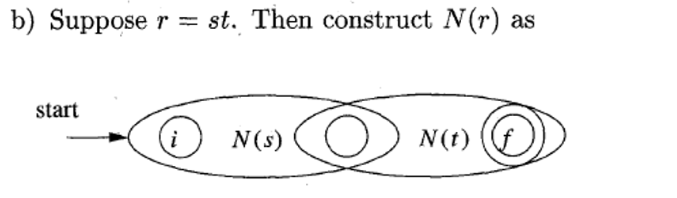

#  Lecture 03 Lexical Analysis II

* **根据正则表达式构建NFA**

  * NFA的递归构造过程

    * 基：

      

    * 递归：交、连接和任意长（*），注意到我们用的是**$\epsilon$的转移关**系进行构造

      

      

      

      * 上述过程的举例：

        

        

* **根据NFA构造DFA**（名词复习：非确定有限自动机到确定有限自动机）

  * 定义：

    * $\epsilon-closure(s)$：在NFA上的**给定状态s一路找$\epsilon$转移**，对应的圈圈都$\in \epsilon-closure$（包括s本身）

      

      $\epsilon-closure(0) = \{0,1,2,4,7\}$

    * $\epsilon-closure(T)$：在NFA上的**给定状态集合T一路找可达的$\epsilon$转移**

      * $\epsilon-closure(T) = \cup_{s \in T}\epsilon-closure(s)$

      * 以上图为例子：$\epsilon-closure(3，8) = \{1,2,3,4,6,7,8\}$

      * 计算算法：

        > push all states of T onto **stack**;
        >
        > initiallize $\epsilon-closure(T)$ to $T$:
        >
        > while ( stack is not empty ) {
        >
        > ​	pop t, the top element, off **stack**;
        >
        > ​	for ( each state $u$ with an edge from $t$ to $u$ labeled $\epsilon$ )
        >
        > ​		if ( $u$ is not in $\epsilon-closure(T)$ ) {
        >
        > ​			add $u$ to $\epsilon-closure(T)$;
        >
        > ​			push u onto **stack**;
        >
        > ​		}
        >
        > }

    * $move(T,a)$：状态的集合，**满足存在从状态集合$T$的任意状态$s$通过符号a直接可达的状态**

      * 以上图为例子：$move(\{0,1,2,4,7\}, a)= \{3, 8\}$

  * **子集构造法**：

    * 输入：NFA，输出：DFA（一个表Dtran，可以根据此表构建DFA）

      > initially, $\epsilon-closure(s_0)$ is the only state in Dstates (a queue), and it's unmarked
      >
      > while ( there is an unmarked state T in Dstates ) {
      >
      > ​	mark T;
      >
      > ​	for ( each input symbol a ) {
      >
      > ​		U = $\epsilon-closure(move(T,a))$;
      >
      > ​		if ( U is not in Dstates ) 
      >
      > ​			add U as an unmarked state to Dstates;
      >
      > ​		**Dtran**[T,a] = U;	
      >
      > ​	}
      >
      > }

    * 完整的例子：

      

      

* NFA模型判断字符串是否合法的算法

  

  

* DFA、NFA、正则表达式的描述能力是一样的

* **DFA的最小化**

  * 基本思路：
    * 如果沿着带有标签X的路径从S和T到达的状态中有一个是接受状态（终结状态），则字符串X将状态S和状态T区分开来
    * 如果存在一个**字符串**能够区分状态S与状态T，则这两个状态是可区分的。

  * 算法：
    * 做一个初始划分$\Pi$——将状态分成两组$F$和$S-F$，分别代表终止状态集合非终止状态集。
    * 构造划分$\Pi_{new}$：执行以下过程来获得一个新的划分（实际上是分组，划分应该指二分，不准确）
      * 对于划分集合的每一个分组：
        * 将一个分组分解为更小的组，两个状态 $s,t$ 在同一个组当且仅当对于所有输入符号$a$，$s,t$有通过$a$有转换函数转换到划分里的同一分组
        * 在最坏情况下，一个状态自己构成一个分组，
        * 更新划分和分组。
    * 若$\Pi = \Pi_{new}$，令$\Pi_{final} = \Pi$，进入步骤四，否则以$\Pi_{new}$代替$\Pi$，重复步骤二。
    * 选择$\Pi_{final}$中的每一个组的一个状态作为每一组的representative，它们是即将构造的最小DFA的状态，其中最小DFA $D'$的构造方法如下：
      * $D'$的开始状态和原来$D$的初始状态相同
      * $D'$的终止状态集是那些包含了一个D的终止状态的分组（注意到一个分组不是全为终止状态，就是全不为终止状态）
      * 令$s$是一个$\Pi_{final}$分组，令在D上从$s$到$t$通过输入$a$的转换函数。令$r$表示状态$t$所在的分组$H$，从而有——在$D'$中，有一个从$s$到$r$通过输入$a$的转换函数。（注意到在$D$中，分组$G$的每一个状态必然通过$a$到达分组$H$中的某些状态）

## 总结

这个课件要讲的就三个事情：将正则表达式变成NFA，将NFA变成DFA，最小化DFA

---

正则表达式变成NFA很简单：只要记住从一个开始状态和一个结束状态开始，递归展开以下三种情景，记得$\epsilon$的使用，每一个状态转换的对应字符都不该漏掉。

---

NFA变成DFA计算比较繁琐，首先是要弄明白三个式子：$\epsilon-closure$$，move(I,a)$ ，$\epsilon-closure(move(I,a))$，它的定义如下：

* **状态集的ε-闭包:** 状态集I中的任何状态s经任意条ε弧而能到达的所有状态的集合，定义为状态集I的ε -闭包，表示为ε -closure()。
* **状态集的a弧转换**: 状态集I中的任何状态s经过一条a弧而能到达的所有状态的集合，定义为状态集1的a弧转换，表示为move(l,a)。
* **状态集的a弧转换的闭包a**:  lg= ε-closure(move(l,a))

计算过程我总结下来是这样的：

首先计算开始状态的$\epsilon$闭包-$I_0$，根据这个闭包算出每一个符号a的$move(I_0,a)$，再算出$\epsilon-closure(move(I_0,a))$

可以列出这样一个表格，这个表头留着，每次计算的结果（第三栏作为新插入的$I_i$）更新到下一张表中

| $I$   | $move(I_0,a)$           | $\epsilon-closure(move(I_0,a))$ |
| ----- | ----------------------- | ------------------------------- |
| $I_0$ | ...                     |                                 |
|       | ...(因为一般有多个字符) |                                 |

| $I$                                 | $I_a$                  | ...(若干列字符) |
| ----------------------------------- | ---------------------- | --------------- |
| $I_0$（状态集合）                   | 根据上表算出的状态集和 | ...             |
| ...（根据之前状态集和算出的弧闭包） | 根据上表算出的状态集和 | ...             |

然后得到一张这样的状态转移表，每个$I$就是一个DFA的一个状态。

给每一个状态集和编号，$I$和$I_a$之间连接并标上转移字符$a$

最后还要标上结束状态，一个DFA状态是结束状态当且仅当该DFA状态对应的NFA状态集合里面包含原先NFA的一个结束状态。

---

第三部分是DFA的确定化和最小化。

首先了解无关状态（多于状态和死状态）、等价状态和可区别状态

* 多于状态：对于一个状态$S_i$，若从开始状态出发，不可能到达改状态$Si$，则$Si$为多余（无用）状态。
* 死状态：对于一个状态$S_i$，对于任意输入符号$a$，若转到它本身后，不可能从它到达终止状态，则称$S_i$为死状态。
* 等价状态：若$S_i$为自动机的一个状态，我们把从$S_i$出发能导出的所有符号串的集合记为$L(S_i)$。设有两个状态$S_i$和$S_j$，若有$L(S_i) = L(S_j)$，则称$S_i$和$S_j$是等价状态。
* 可区别状态：不等价的状态。

两个状态等价的判断条件：全为非终止状态或全为终止状态，对于任意的输入符，必须转移到等价的状态里。

DFA化简算法

1. **构建初始划分**：**{非终止状态集，终止状态集}**

2. **继续划分**：对于上一步划分的每一个组G
   
   * 把G划分成小组：G中的任意两个状态$S_i$和$S_j$在同一组中，当且仅当对于Σ中任意输入符号a ，$S_i$和$S_j$的a转换是到同一组中，$move(S_i,a) \in Gi$ ，$move(S_j,a) \in Gi$。
   
     > **划分过程可以通过列式子/表格**，以$\{2,3,4,5\}$为例（已知有划分$\{0,1\}, \{2,3,4,5\}$）
     >
     > | I    | I a  | I b  |
     > | ---- | ---- | ---- |
     > | 2    | 1    | 3    |
     > | 3    | 3    | 3    |
     > | 4    | 0    | 5    |
     > | 5    | 5    | 5    |
     >
     > 从上表：考虑Ia 2,4对应都转换{0,1}中，3,5都转化到{2,3,4,5}中，所有状态的Ib都转移到了{2,3,4,5}中，综合考虑可以产生划分{2,4}和{3,5}
   
3. 更新划分，重复上一步直至没有分组可以被划分

4. 合并等价状态，取每一份组的任意状态作为代表，删去其他状态，最后删掉无关状态

  

