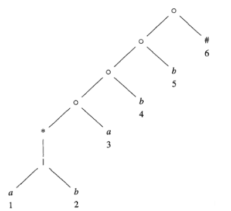
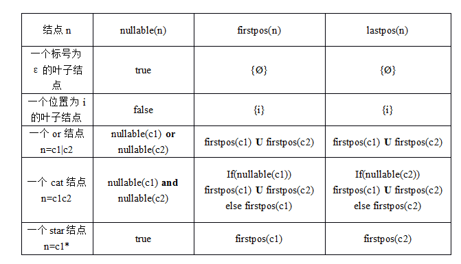

# Lexical Analysis III

* **根据正则表达式直接构造DFA** (Commonly used)

  1. **用位置的集合来表示状态**，例如`(a|b)*abb`，五个字母的位置从左到右依次是1、2、3、4、5。

  2. **构造正则表达式的语法树**：

     * 用'#'表示正则表达式的结束，叶子节点包含字符，其下的数字表示在正则表达式中的位置，语法树的每一个节点都代表一个子表达式

     * `nullable(n)`：用于判断一个节点是否可空——为真当且仅当n节点的子表达式可以为空集，如下图中的*结点

     * `firstpos(n)`：结点n对应的子树代表的子表达式的所有可作为初始状态的位置的集和（它是根结点n的子树中对应于子表达式语言中至少一个字符串的第一个符号的位置集），例如*结点，`firstpos(n) = {1,2}`，\*结点上面的点的`firstpos(n) = {1,2,3}`

     * `lastpos(n)`：结点n对应的子树代表的子表达式的所有可作为终止状态的位置的集和（它是根结点n的子树中对应于子表达式语言中至少一个字符串的最后一个个符号的位置集），例如*结点，`lastpos(n) = {1,2}`,\*结点上面的点的`lastpos(n) = {3}`

     * `followpos(p)`： 对于位置$p$，`followpos()`是整个语法树中位置$q$的集合，这样就有$L((r)\#)$中的某个字符串$x = a_1 a_2… a_n$，对于某些$i$，存在一种方法可以解释 $x$ 在 $L((r)\#)$ 中的隶属关系，方法是将$a_1$与语法树的位置$p$匹配，将$a_i+1$与位置$q$匹配。

       例如：$followpos(1) = followpos(2) = \{1,2,3\}, followpos(3) = \{4\}$

     > 例如：(a|b)*abb# 可以表示成
     >
     > 

  3. 上述一些列函数的计算方法：

     
     
     * or结点：标号为并运算符|的内部结点。
     
     * cat结点：标号为连接运算符·的内部结点。
     
     * star结点：标号为星号运算符*的内部结点。
     * 计算`followpos(i)`：(需要遍历所有的cat、star结点才能得到每一个位置的`followpos()`)
       * **当n是一个cat结点，且其左右子树分别为c1、c2，那么对于lastpos(c1)中的所有位置i，firstpos(c2)中的所有位置都在followpos(i)中。**
       * **当n是一个star结点，且i是lastpos(n)中的一个位置，那么firstpos(n)中的所有位置都在followpos(i)中。**
     * 最后用有向图根据`followpos()`函数连接（没啥用）
     
  4. 转换算法：
  
     > 我们使用一个状态集Dstates来保存所有的**状态（也就是编号集）**，使用一个表Dtran来表示转换，算法如下：
     >
     > 初始化Dstates，使之只包含未标记的状态 firstpos(n0)，n0是抽象语法的根节点，未标记就是未处理过该状态的转换；
     >
     > while(Dstates中存在未标记的状态S)
     > {
     >     标记S;
     >     for(每个输入符号a)
     >     {
     >         求出 编号集U = S中所有与a对应的编号的followpos集的并集；
     >         if( U 不在 Dstates中)
     >             将U作为未标记的状态加入到Dstates中；
     >         Dtran[S, a] = U;
     >     }
     > } // 作者：GC_CH https://www.bilibili.com/read/cv5901755/ 出处：bilibili

* 还得进行DFA的最小化

* 实际应用：
  * 匹配过程冲突的解决：取最长的匹配串，或规定接收状态的优先顺序
* 正则表达式、有限自动机的局限性：无法计数，例如多个括号嵌套、多层条件判断等等

