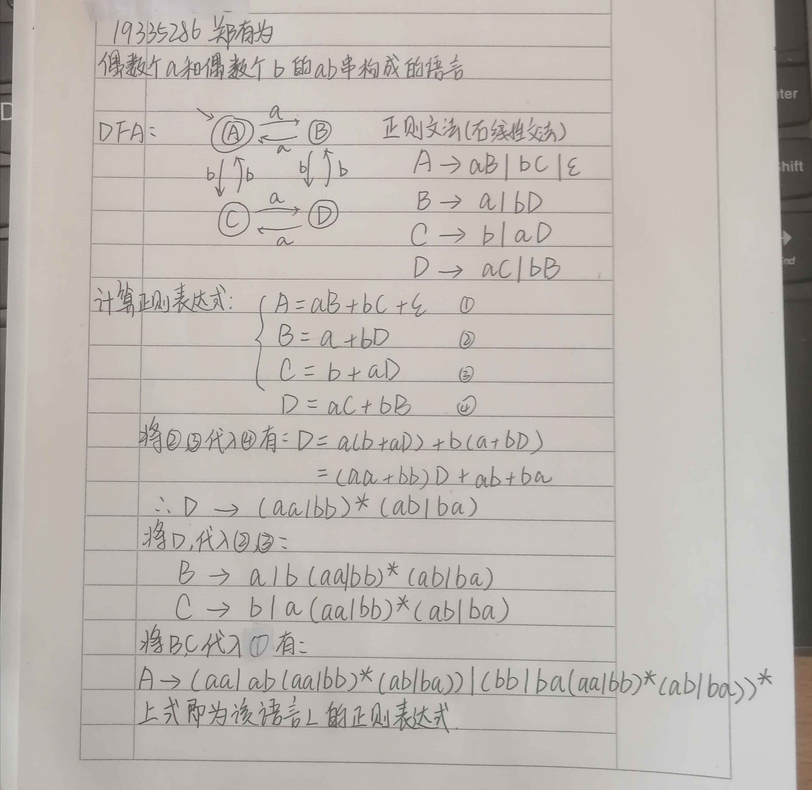
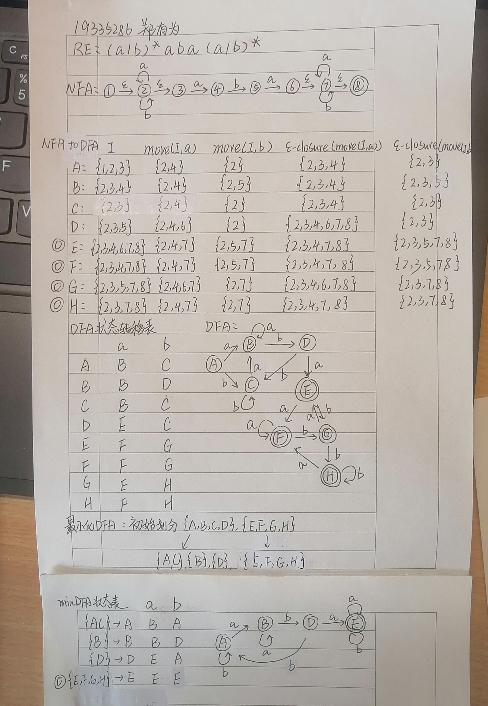
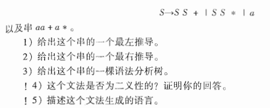
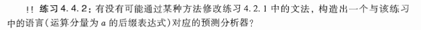
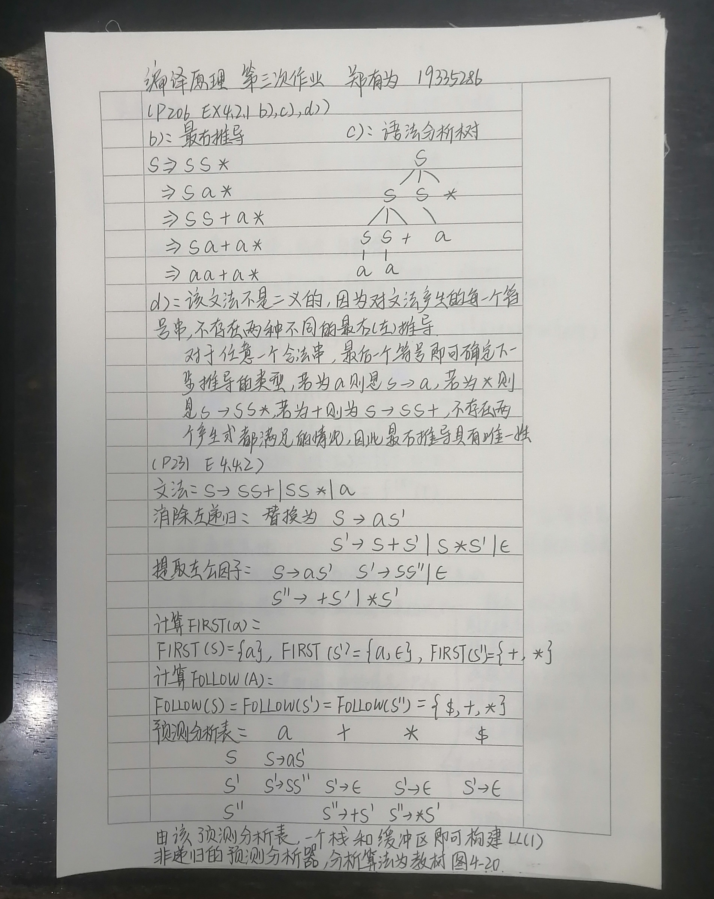

**编译器和解释器**

**编译程序结构**

**语言** 形式语言的定义 语言的运算

**正则表达式** 正则表达式的递归定义 正则表达式的构造方法 DFA转正则文法转正则表达式

**有限状态自动机** NFA DFA NFA和DFA的差别  正则表达式转NFA NFA转DFA DFA转最小状态DFA

---

**三次作业**

* 构建偶数个 a 和偶数个 b 的 ab 串构成的语言 L

  

* 将正则表达式 $(a|b)*aba(a|b)*$，转化为 NFA ，然后再转化为 DFA ，最后转化为最小化 DFA 。

  

* 课本习题 4.2.1 b,c,d 和 4.4.2

  

  

  
