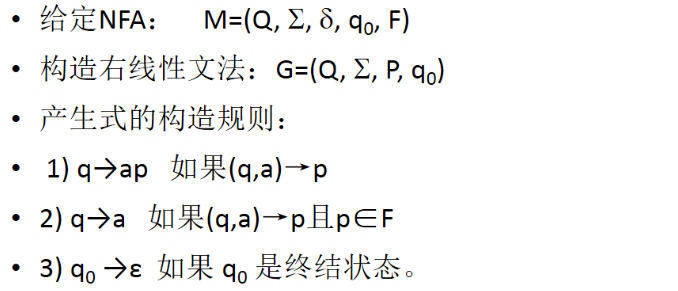
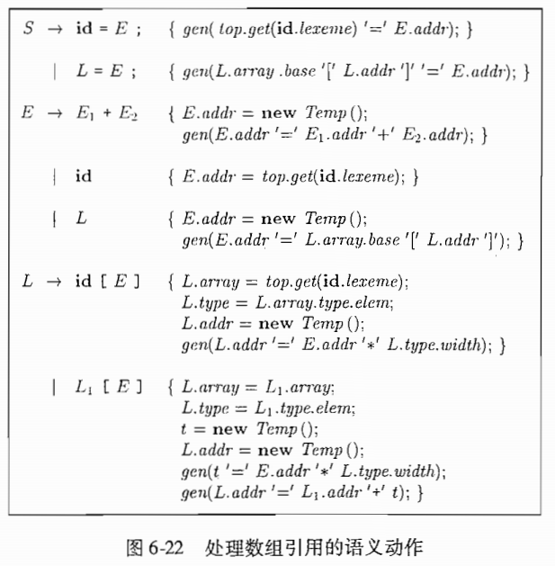

[toc]

---

* 往年都是英文题

* **考试题型**：
* **8道判断题：每题1分**
  
* **6道大题**

---

**第一二章**

* 编译器和解释器

* 编译程序结构

---

**第三章 词法分析**

* **语言** 形式语言的定义 语言的运算

* **正则表达式** 正则表达式的递归定义 正则表达式的构造方法 DFA转正则文法转正则表达式

* **有限状态自动机** NFA DFA NFA和DFA的差别  正则表达式转NFA NFA转DFA DFA转最小状态DFA

**词法分析例题：**求以下的正则表达式（方法：都从画DFA开始，DFA转RE有两种方法：列方程（DFA转右线性文法）、节点合并）

1. 偶数个 0 和偶数个 1 的正则表达式（4个状态）

2. 长度能被2或3整除的0串（6个状态）

   > 其实它根本不需要画DFA，就直接 $(00)^*|(000)^*$ 不就好了

3. 能被2或3整除的二进制字符串（6个状态）

---

**第四章 语法分析**

**上下文无关文法**

* 上下文无关文法定义
* 左递归的消除和提取左公因子

**自顶向下语法分析**（LL(1)文法）

* 计算 FISRT 和 FOLLOW 集
* 构造一个预测分析表
* 根据表来预测分析

**自底向上语法分析**

* 句柄是啥
* LR(0) 自动机：项、项集族、CLOSURE 和 GOTO
* 利用语法分析表来移入规约
* 构造 SLR 语法分析表
* 构造规范 LR 语法分析表

* **LALR不考**

---

**第五章 语义分析**

* 语法制导定义（SDD） 综合属性和继承属性
* 注释语法分析树 和 依赖图
* 语法制导翻译方案（SDT）翻译模式
  * 题型例如：构造一个八进制串 / 十进制串（可能含小数点）的翻译模式

---

**第六章 中间代码生成**

* 三地址码，简单翻译
* 控制流语句（if，while 等）三地址码的结构，然后来写翻译模式
* **回填不考**

---

**第七章 运行时环境**（没什么内容，很多都不考）

* 活动记录 活动记录包含哪些内容

---

**第八章 代码优化**（不考复杂的）

* 基本块：划分基本块，画流图（Flow Graph）
  * 他说画控制流图时可以偷懒，用标号代替代码

* DAG：画基本块的DAG，再根据DAG进行代码优化

* 代码优化：
  * 删除无用代码
  * 删除公共子表达式 
  * 强度削弱
  * 常量合并（常量替代）
* 循环的优化：
  * 求支配节点（DOM）集合 找回边 找自然循环
  * 删除归纳变量
* 计算引用定值链（UD链）和定值引用链（DU链）

---

## Chapter 01 综述

* **语言处理器** Processor

  * **编译器** Compiler：先翻译后执行
  * **解释器** Interpreter：边翻译边执行

* 语言处理系统 Language Processing System：

  * 预处理器 Prepocessor - 编译器 Compiler - 汇编器 Assembler - 链接器/加载器 Linker/Loader

* 编译器结构

  * 分析部分/前端 Analysis/Front end（到并包括中间代码生成）

  * 综合部分/后端 Synthesis/Back end（剩下的部分）

    

## Chapter 03 词法分析

### 3.1 正则表达式变成NFA

正则表达式变成NFA很简单：只要记住从一个开始状态和一个结束状态开始，递归展开以下三种情景，记得$\epsilon$的使用，每一个状态转换的对应字符都不该漏掉。

---

### 3.2 NFA转DFA

**首先是要弄明白三个式子：$\epsilon-closure$$，move(I,a)$ ，$\epsilon-closure(move(I,a))$**，它的定义如下：

* **状态集的ε-闭包:** 状态集I中的任何状态s经任意条ε弧而能到达的所有状态的集合，定义为状态集I的ε -闭包，表示为ε -closure()。

* **状态集的a弧转换**: 状态集I中的任何状态s经过一条a弧而能到达的所有状态的集合，定义为状态集1的a弧转换，表示为move(l,a)。

* **状态集的a弧转换的闭包a**:  lg= ε-closure(move(l,a))

计算过程我总结下来是这样的：

首先计算开始状态的$\epsilon$闭包-$I_0$，根据这个闭包算出每一个符号a的$move(I_0,a)$，再算出$\epsilon-closure(move(I_0,a))$

可以列出这样一个表格，这个表头留着，每次计算的结果（第三栏作为新插入的$I_i$）更新到下一张表中

| $I$   | $move(I_0,a)$           | $\epsilon-closure(move(I_0,a))$ |
| ----- | ----------------------- | ------------------------------- |
| $I_0$ | ...                     |                                 |
|       | ...(因为一般有多个字符) |                                 |

| $I$                                 | $I_a$                  | ...(若干列字符) |
| ----------------------------------- | ---------------------- | --------------- |
| $I_0$（状态集合）                   | 根据上表算出的状态集和 | ...             |
| ...（根据之前状态集和算出的弧闭包） | 根据上表算出的状态集和 | ...             |

然后得到一张这样的状态转移表，每个$I$就是一个DFA的一个状态。

给每一个状态集和编号，$I$和$I_a$之间连接并标上转移字符$a$

最后还要标上结束状态，一个DFA状态是结束状态当且仅当该DFA状态对应的NFA状态集合里面包含原先NFA的一个结束状态。

---

### 3.3 DFA的确定化和最小化

首先了解无关状态（多于状态和死状态）、等价状态和可区别状态

* 多于状态：对于一个状态$S_i$，若从开始状态出发，不可能到达改状态$Si$，则$Si$为多余（无用）状态。

* 死状态：对于一个状态$S_i$，对于任意输入符号$a$，若转到它本身后，不可能从它到达终止状态，则称$S_i$为死状态。

* 等价状态：若$S_i$为自动机的一个状态，我们把从$S_i$出发能导出的所有符号串的集合记为$L(S_i)$。设有两个状态$S_i$和$S_j$，若有$L(S_i) = L(S_j)$，则称$S_i$和$S_j$是等价状态。

* 可区别状态：不等价的状态。

**两个状态等价的判断条件：全为非终止状态或全为终止状态，对于任意的输入符，必须转移到等价的状态里。**

**DFA化简算法**

1. **构建初始划分**：**{非终止状态集，终止状态集}**

2. **继续划分**：对于上一步划分的每一个组G

   * 把G划分成小组：G中的任意两个状态$S_i$和$S_j$在同一组中，当且仅当对于Σ中任意输入符号a ，$S_i$和$S_j$的a转换是到同一组中，$move(S_i,a) \in Gi$ ，$move(S_j,a) \in Gi$。

     > **划分过程可以通过列式子/表格**，以$\{2,3,4,5\}$为例（已知有划分$\{0,1\}, \{2,3,4,5\}$）
     >
     > | I    | I a  | I b  |
     > | ---- | ---- | ---- |
     > | 2    | 1    | 3    |
     > | 3    | 3    | 3    |
     > | 4    | 0    | 5    |
     > | 5    | 5    | 5    |
     >
     > 从上表：考虑Ia 2,4对应都转换{0,1}中，3,5都转化到{2,3,4,5}中，所有状态的Ib都转移到了{2,3,4,5}中，综合考虑可以产生划分{2,4}和{3,5}

3. 更新划分，重复上一步直至没有分组可以被划分

4. 合并等价状态，取每一份组的任意状态作为代表，删去其他状态，最后删掉无关状态

---

### 3.4 NFA 转 RE

> 首先求出右线性文法，然后转化为等价的正规方程组，最后解此方程组

* **正规文法**：左线性文法和右线性文法的总称

  * 正规表达式、正归文法、有限自动机是等价的、
  * **右线性文法**：表达式只有两种格式 $A \to aB, A \to a$（$a$可以是$\epsilon$）
  * 左线性文法：表达式只有两种格式 $A \to Ba, A \to a$（$a$可以是$\epsilon$）

* **NFA to 右线性文法**

  > 课件中的算法
  >
  > 

  * 我的理解
    * 为NFA中的每一个状态$i$，创造一个非终端符号$A_i$，如果$i$是一个开始状态，$A_i$成为文法的开始符号
    * 如果状态$i$存在一个通过符号$a$到**非终结状态**$j$的转化，新建一个表达式$A_i \to aA_j$
    * 如果状态$i$存在一个通过符号$a$到**终结状态**$k$的转化，新建两个表达式$A_i \to a$和$A_i \to aA_k$
    * **如果开始符号$i$是一个终结状态，新建表达式$A_i \to \epsilon$**
  * 可以考虑化简：$A \to aA|a|\epsilon \Leftrightarrow A \to aA|\epsilon$

* **根据右线性文法列方程**

  * $\rightarrow$ 变成 $=$
  * $|$ 变成 $+$
  * 最后求出**开始符号**的结果就是 RE

* **方程的计算法则**
  * $A = aA+ bB + c \Longrightarrow A \to aA | bB | c \Longrightarrow A \to a^*(bB|c)$
  * $aA + bA = (a+b)A$ 
* **左右线性文法互转**（$S$是开始符号）
  * $A \to aB \Leftrightarrow B \to Aa$（$a$可以是$\epsilon$）
  * $A \to a \Leftrightarrow S \to Aa$（$a$可以是$\epsilon$）
    * $A \to \epsilon \Leftrightarrow S \to A$（空串与开始符号对应）

## Chapter 04 语法分析

### 4.2 上下文无关文法

* 上下文无关文法（简称文法）由终结符号、非终结符号、一个开始符号和一组产生式组成。
* 最左推导 / 最右推导：总是选择每个句型中最左 / 最右的非终结符号来进行推导（将非终结符号替换为产生式体）。
* 二义性文法：对同一个句子有多个最左推导或多个最右推导的文法（能够生成多棵语法分析树）。

### 4.3 设计文法

* **消除左递归**：
  $$
  A \to A \alpha_1 | A\alpha_2 | ... | A \alpha_m | \beta_1 | ... | \beta_m
  $$
  将这样的产生式替换为：
  $$
  A \to \beta_1 A' | ... | \beta_n A'\\ A' \to \alpha_1 A' | \alpha_2 A' | ... | \alpha_m A' | \epsilon
  $$

  * 算法：（要求无环、无$\epsilon$产生式）

    

* **提取左公因子**：如果
  $$
  A \to \alpha \beta_1 | \alpha \beta_2
  $$
  是两个A的产生式，并且输入的开头都是从$\alpha$推导得到的一个非空串，此时提取左公因子，原产生式转化成：
  $$
  A \to \alpha A' \\
  A' \to \beta_1 | \beta_2
  $$

### 4.4 自顶向下语法分析（LL(1)文法）

* **计算 FISRT 和 FOLLOW 集**

  * $FIRST(\alpha)$被定义为**可从$\alpha$（任意的文法符号串）推导得到的串的首符号的集合**
    * 向$FIRST(X_1 X_2... X_n)$中加入$FIRST(X_1)$中的非$\epsilon$符号
    * 接下来依次类推：如果$\epsilon \in FIRST(X_i)$，则加入$FIRST(X_{i+1})$中的非$\epsilon$符号。
    * 最后，如果$\forall i \in [1,n], \epsilon \in FIRST(X_i)$，则将加入$\epsilon$。
    * <b>考虑$\epsilon$</b>
    
  * 对于非终结符号$A$，$FOLLOW(A)$被定义为**可能在某些句型中紧跟在A右边的中间符号集合**
    * 将$\$$放入$FOLLOW(S)$，**其中$S$是开始符号，而$\$$是输入右端的结束标记**
    * **如果存在一个产生式：$A \to \alpha B \beta$（即$B$在产生式中间），那么$FIRST(\beta)$中除了$\epsilon$之外的所有符号都在$FOLLOW(B)$中。**
    * **如果存在一个产生式$A \to \alpha B$（即$B$在产生式尾部），或产生式$A \to \alpha B \beta$且$FIRST(\beta)$包含$ \epsilon$，那么$FOLLOW(A)$中所有符号都在$FOLLOW(B)$中。**

* **LL(1)文法**：L - 从左向右扫描，L - 最左推导， 1 - 每一步中只需要向前看一个输入符号来决定语法分析动作，是不需要回溯的递归下降语法分析器。

* **构造一个预测分析表**

  * **列索引：终结符号和结束标识$\$$，行索引：非终结符号，表中每一项为一个产生式，表示某个当前非终结符号遇到下一个输入符号是应做的推导。**

  * 方法一：

    * 输入为文法$G$，输出为预测分析表$M$
    * 对于每个产生式$A \to \alpha$：
      * **对于$FIRST(\alpha)$中的每个终结符号$a$，将$A \to \alpha$加入到$M[A,\alpha]$**
      * **如果$\epsilon$在$FIRST(\alpha)$中，那么对于$FOLLOW(A)$中的每一个终结符号$b$，将$A\to \alpha$加入到$M[A,b]$中。**
      * **如果$\epsilon$在$FIRST(\alpha)$中，且$\$$（终止标记）在$FOLLOW(A)$中，也将$A\to \alpha$加入到$M[A,\$]$中。**
    * 如果$M[A,a]$为空，则称它为错误条目。
    * 如果$M[A,a]$有多重定义，则文法是左递归或具有二义性的。

  * 方法二：直接利用SELECT集往预测分析表中填即可。

    * $SELECT$集：计算一个产生式的SELECT集可以用来很方便的构建预测分析表（课本没讲）
      $$
      \begin{equation}
      SELECT(A \to \alpha) = \begin{cases}
      FISRT(\alpha), \alpha \nRightarrow \epsilon \\
      (FIRST(\alpha) - {\epsilon}) \cup FOLLOW(A),\alpha \Rightarrow \epsilon
      \end{cases}
      
      \end{equation}
      $$

      * 对于$A \to \epsilon$，有$SELECT(A\to \epsilon) = FOLLOW(A)$。

* **根据表来预测分析**

  * 输入：一个串$\omega$，文法$G$，预测分析表$M$

  * 输出：如果$\omega$在$L(G)$中，**输出$\omega$的一个最左推导**，否则给出一个错误提示。

  * 初始化：输入缓冲区中是输入串$\omega$，而$G$的开始符号$S$位于栈顶，它的下面是$\$$。

  * 算法步骤：

    > 设置输入指针 $ip$ 使它指向 $\omega$ 的第一个符号
    >
    > 令 $X$ 为栈顶符号
    >
    > **while** $X \neq \$ $
    >
    > ​	**if** $X = a$，$a$ 为 $ip$ 指向的符号
    >
    > ​	**then** Pop出栈顶，$ip$前移  
    >
    > ​	**else if** $X$ 是一个终结符号 or $M[X,a]$是一个报错条目
    >
    > ​	**then** 出错
    >
    > ​	**else if** $M[X,a]$是一个产生式：$X \to Y_1 Y_2 ... Y_K$
    >
    > ​	**then** Pop出栈顶，将$Y_K, Y_{K-1}, ... , Y_1$依次压入栈中，其中$Y_1$位于栈顶
    >
    > ​	更新$X$为当前栈顶符号

  * **我们自己模拟时需要画一个表，显示栈、剩余输入串和匹配的产生式输出**

* 预测分析中的错误恢复：

  * **恐慌模式**：语法分析器忽略输人中的一些符号， 直到输人中出现由设计者选定的**同步词法单元集合**中的某个词法单元。  

### 4.5 自底向上语法分析

* **规约 Reduction**：每一次规约，一个与某个产生式体相匹配的特定子串被替换为改产生式头部的非终结符号。一次规约是一个推导步骤的反向操作。
* **句柄 Handle **：<u>与某个产生式体匹配的子串</u>，对他的规约代表了相应的最右推导中的一个反向步骤。
  * 一个句型的句柄一定是文法某产生式的右部。

* **移入规约技术**：
  * 移入操作：在从左到右扫描过程中，语法分析器将零个或多个输人符号**移到**栈的顶端
  * 规约操作：将栈顶的符号串 $\beta$ 归约为某个产生式的头，再加入到栈中
* 可能出现的冲突有：移入-规约冲突和规约-规约冲突

### 4.6 LR(0) / SLR

* **项、项集、项集族**：

  * **项的定义**：一个文法 G 的一个LR（0）项（简称为项）是 G 的一个产生式加上一个位于它体中某处的点。
    * 例如$A \to XY$产生了三个项，分别是$A\to \cdot XY | X \cdot Y | XY \cdot$
    * 理解：**指明了在语法分析进行到给定点上，我们已经、看到了一个产生式的哪些部分，如$X \cdot Y$表示我们刚刚在输入中看到了一个有 $X$ 推导得到的串，并且我们希望接下来能看到一个能从 $Y$ 推导得到的串。**

* **LR(0)自动机**：**规范LR(0)项集族**的一组项提供了构建一个确定有穷自动机的基础，**LR(0)自动机的每一个状态代表了规范LR(0)项集族中的一个项集**。

  

* **增广文法**：如果 G 是一个以 S 为开始符号的文法， 那么 G 的增广文法 G' 就是在 G 中加上新开始符号  S' 和产生式 $S' \to S$而得到的文法。

  * 引入目的：方便决定何时停止并接受输入符号串

* **项集的闭包** $CLOSURE(I)$：如果 I 是文法 G 的一个项集，项集 I 的闭包从根据下面两个规则构造得到：

  * **将 $I$ 的各项加入到 $CLOSURE(I)$ 中**
  * **如果 $A \to \alpha \cdot B \beta$在 $CLOSURE(I)$ 中，并且项 $ B \to \cdot\gamma$不在 $CLOSURE(I)$ 中，就将这个项加入到 $CLOSURE(I)$ 中** 
  * 对项进行分类：
    * 内核项：包括初始项$S' \to \cdot S$以及点不在最左侧的所有项
    * 非内核项：除了初始项$S' \to \cdot S$之外的点在最左侧的所有项（就是通过第二步引入的）
    * 对于点在开头的被称为移进状态；点在中间的为待约状态；点在末尾的被称为规约状态

* **GOTO函数**：$GOTO(I,X)$，其中 $I$ 是一个项集而 $X$ 是一个文法符号，该函数被定义为 $I$ 中所有形如 $[A \to \alpha \cdot X \beta]$的项所对应的项$[A \to \alpha X \cdot \beta]$的集合的闭包。

  * 它用于对应一个文法的LR(0)自动机中的转换：自动机的状态对应于项集，而该函数描述了输入为X时离开状态 I 的转换。

* **通过 $CLOSURE$ 和 $GOTO$ 计算一个增广文法的项集族**

  * 算法：

    > **void** items($G'$) {
    >
    > ​		$C$ = $\{CLOSURE(\{[S' \to S]\})\}$;
    >
    > ​		**repeat**
    >
    > ​				**for** ( $C$ 中每一个项集 $I$ ) {
    >
    > ​						**for** ( 每一个文法符号 $X$ ) {
    >
    > ​								**if** ( $GOTO(I,X)$ 非空且不在 $C$ 中 ) {
    >
    > ​										将 $GOTO(I,X)$ 加入到 $C$ 中				
    >
    > ​								}
    >
    > ​						}
    >
    > ​				}
    >
    > ​		**until** 在某一论中没有新的项集被加入到 $C$ 中
    >
    > }

* **SLR - 简单LR语法分析技术**：根据文法构造出 LR(0) 的自动机，**这个自动机的状态是规范LR(0)项集族中的元素，而他的转换由GOTO函数给出。**

  * 开始状态 0 ：$I_0 = CLOSURE(\{[S'\to \cdot S\})$ ，状态 j 对应于项集 $I_j$ 的状态。
  * 移入归约：假设文法符号串$\gamma$使自动机从开始状态$0$运行到某个状态 $j$；如果下一个输人符号为 $a$ 且状态 $j$ 有一个在 $a$ 上的转换， 就 **移人** $a$，否则选择 **归约** 动作，状态 $j$ 的项将告诉我们使用哪个产生式进行归约 

* **LR 语法分析算法**

  * **LR语法分析器**：有状态栈和符号栈，还有剩余输入串和动作（移入规约），分析表

  * **LR语法分析表**

    * 结构：**由动作分析函数 ACTION 和转换函数 GOTO 组成，行索引为自动机的状态，列索引为终端符号（ACTION部分），列索引为非终端符号（GOTO部分）**。
      * 表项：$ACTION[i,a]$：状态 $i$ ，终结符号 $a$ （包含输入结束标记 $ ）
        * **移入** $j$ ，状态 $j$ 表示 $a$
        * **归约** $A \to \beta$：把 $\beta$ 规约为产生式头 $A$
        * **接受**：完成语法分析过程
        * **报错**：发现错误并执行某个纠错程序
      * 表项：$GOTO[I_i, A]$：扩展为定义在状态集上的函数，表示状态转移
        * 如果$GOTO[I_i, A] = I_j$，那么也把状态 $i$ 和非终结符号 $A$ 映射到状态 $j$

  * **LR语法分析过程**

    

  * **LR分析器工作过程**

    * 初始化：

      | $S_0$ |                |
      | ----- | -------------- |
      | $\$$  | $a_1a_2...a_n$ |

    * 一般情况下：

      | $s_0s_1...s_m$ |                    |
      | -------------- | ------------------ |
      | $X_1X_2...X_m$ | $a_ia_{i+1}...a_n$ |

    * 如果有$ACTION[s_m,a_i] = sx$：

      | $s_0s_1...s_mx$   |                 |
      | ----------------- | --------------- |
      | $X_1X_2...X_ma_i$ | $a_{i+1}...a_n$ |

    * 如果有$ACTION[s_m,a_i]=rx$，用$A\to X_{m-(k-1)}...X_m$进行规约：

      | $s_0s_1...s_{m-k}$  |                    |
      | ------------------- | ------------------ |
      | $X_1X_2...X_{m-k}A$ | $a_ia_{i+1}...a_n$ |

      然后如果$GOTO[s_m,A]=y$：

      | $s_0s_1...s_{m-k}y$ |                    |
      | ------------------- | ------------------ |
      | $X_1X_2...X_{m-k}A$ | $a_ia_{i+1}...a_n$ |

    * 如果$ACTION[s_m, a_i] = acc$，那么分析成功
    * 如果$ACTION[s_m,a_i]=err$，那么出现语法错误

* **SLR(1) 语法分析表构造算法**：以LR(0)项和LR(0)自动机为基础，**此外它要求我们知道输入文法的的每一个非终结符号 A 的FOLLOW(A)**。

  * 第一步：文法改为增广文法，构造项集族$C$，（GOTO和CLOSURE的内容跟都表现在LR(0)自动机里了），项集族对应状态集合
  * 第二步：构造分析表（注意下面算法第二点，用到了FOLLOW的地方）

  

* **构造规范 LR 语法分析表**

  * 可行前缀：一个可行前缀是一个最右句型的前缀，并且它没有越过该最右句型的最右句柄的右端。因此我们总可以在一个可行前缀之后增加一些终结符号来得到一个最右句型。

    > 句柄：是和某个产生式体匹配的子串
    >
    > 句子：终结符号串
    >
    > 句型：终结+非终结符号串

  * 规范 LR(1) 项：项变成了一个二元组 $[A \to \alpha \cdot \beta, a]$，其中前者是一个产生式，后者是一个终结符号或结束标记， 后者又被称为这个项的向前看符号。

    * 唯一的用处：在形如 $[A \to \alpha \cdot, a]$的情形下，代表只有下一个输入符号为 $a$ 时才要求按照 $A \to \alpha$ 进行归约，这样的 $a$ 的集合总是 $FOLLOW(A)$的子集。

  * 构造 LR(1) 项集：本质上和 LR(0) 的相同，修改 CLOSURE 和 GOTO

    * **关注点 - $CLOSURE$：原来加入的是$B \to \cdot\gamma$，要改成$B \to \cdot \gamma, b$，其中$b$满足$A \to \alpha \cdot B \beta, a$中$b \in FIRST(\beta a)$**
    * **展望符（Lookahead）：在当前状态下，产生式头后面必须紧跟着的终结符**（它是一个个推下来的）

    

  * **规范LR(1)分析表构造算法**：

    * **关注点 - 规约项的填入：不用像SLR那样先算FOLLOW集，填入的规则依照项集的第二个元素。**

    

    

## Chapter 05 语义分析

### 5.1 语法制导定义

* **语法制导定义SSD** Syntax-Directed Definition：是一个上下文无关文法和属性及规则的结合。
  * 如果用 X 来表示一个符号， a 是 X 的一个属性，则用 X.a 来表示 a 在某个标号为 X 的分析书结点上的值。
  * 语法制导定义的组成：产生式和产生式对应的语义规则。
* 综合属性和继承属性：
  * **综合属性 Synthesized Attribute**：在分析树结点 N 上的非终结符号 A 的综合属性是由 N 上的产生式（$A \to something$）关联的语义规则来定义的。  
    * **S属性的SSD**：每个属性都是综合属性的SDD
  * **继承属性 Inherited Attribute**：在分析树结点 N 上的非终结符号 B 的继承属性是由 N 的父结点上的产生式（$something \to ...B... $）所关联的语义规则来定义的。  
    * **L属性的SDD**（L 属性定义 L-attributed definition）：在一个产生式体所关联的各个属性之间，依赖图的边总是从左到右。
* **注释语法分析树**：显示了各个属性值的语法分析树。
* **依赖图** Dependency Graph：用于确定一棵给定的语法分析树中各个属性实例的求值顺序，描述了某个语法分析树之间的信息。
* **语法制导翻译方案 SDT（翻译模式）**：它是对SDD的一种补充，在产生式体中嵌入一些程序片段，这些程序片段称为语义动作，我们只需要在这些动作两边加上花括号以标注。
  * **后缀翻译方案**：所有动作都在产生式最右端的 SDT
    * 后缀 SDT 的语法分析栈实现
  * **从SDT中消除左递归**：当转换文法的时候，将动作当成终结符号处理  
  * **L属性定义的SDT**
* 一些例题：
  * 数组类型的语法制导翻译（5.3例题）
  * 去除表达式的冗余括号（5.3练习题）
  * While语句的SDD/SDT（5.4例题）
  * 计算被声明变量的相对地址的SDT（6.3例题）
  * 构造一个八进制串 / 十进制串（可能含小数点）的翻译模式 

## Chapter 06 中间代码生成

* 为表达式构建DAG（有向无环图）

* **三地址码**
  $$
  x = y\text{ op }z \\
  x = \text{op }y \\
  x = y \\
  \text{goto } L \\
  \text{if } x \text{ goto } L \\
  \text{if False } x \text{ goto } L \\
  \text{if } x \text{ relop } y \text{ goto } L \\
  \text{param } x \text{; call } p, n \text{; return } y \\
  x = y[i] \text{; } x[i] = y \\
  x = \&y \text{; } x = * y \text{; } *x = y
  $$

* 四元式、三元式和间接三元式

  * 四元式：$[op | arg_1 | arg_2 | result]$
  * 三元式：$[op | arg_1 | arg_2]$，用运算的位置来表示它的结果，而非用一个显式的临时名字表示
  * 间接三元式：包含了一个指向三元式的指针的列表，而不是列岀三元式序列本身  

  | 四元式                                   | 三元式                                   | 间接三元式                               |
  | ---------------------------------------- | ---------------------------------------- | ---------------------------------------- |
  |  |  |  |

* 类型与声明：类型检查、翻译时推断存储空间等

* **数组元素的寻址和翻译**

  * 数组的类型的表示：$array(3,array(4,array(5, integer)))$

  $$
  A[i_1][i_2] = base + (i_1 \times n_2 + i_2) \times w = base + i_1 \times w_1 + i_2 \times w_2\\
  A[i_1][i_2][i_3] = base + ((i_1 \times n_2 + i_2)\times n_3 + i_3) \times w
  $$

* **控制流语句的翻译**

  * **布尔表达式**：
    $$
    B \text{ || }B , B \text{ \&\& } B, !B , (B), E \text{ rel } F , true , false \\
    \text{ rel: } >, >=, =, <, <=, !=
    $$
    

  * **控制流语句**：
    $$
    S \to \text{ if } (B) S_1 \\
    S \to \text{ if } (B) S_1 \text{ else } S_2 \\
    S \to \text{ while } (B) S_1 \\
    $$
    

---

## Chapter 07 运行时环境

* 存储分配：静态 OR 动态，分别表示编译时刻和运行时刻分配储存

* 空间的栈式分配

  * **活动记录 Activation Record**（又称为帧 Frame）

    

    * **保存的机器状态**：包含对此过程的此次调用之前的机器状态信息，通常包括返回地址（程序计数器的值，被调用过程必须返回到该值所指位置）和一些寄存器中的内容（调用过程会使用这些内容， 被调用过程必须在返回时恢复这些内容）

    * **访问链**：**当被调用过程需要其他地方（比如另一个活动记录）的某个数据时需要使用访问链进行定位**

      

    * **控制链**：**指向调用者的活动记录**  

    * **活动栈**：用一个栈来保存产生的活动记录。

---

## Chapter 08 代码生成

* 指令集

  |  |  |
  | ---------------------------------------- | ---------------------------------------- |

* **基本块**：满足以下条件的最大的连续三地址指令序列

  * 条件1：控制流只从基本快的第一个指令进入该块
  * 条件2：除了基本块的最后一个指令，控制流在离开基本块之前，不会跳转或停机。
  * 一个基本块的指令要么都不执行，要么全部执行。

  * **基本快生成算法**
    * 首先确定一个块的首指令：
      * 中间代码的**第一个三地址指令**是一个首指令。
      * 转移指令的**目标指令**是一个首指令。（不是指转移语句本身）
      * **紧跟**在一个转移指令之后的指令是一个首指令。
    * 然后，每个首指令对应的基本块包括了从它自己开始，直到下一个首指令（ 不含） 或者中间程序的结尾指令之间的所有指令。  

* **流图**：基本块形成了流图的结点。，流图的边指明了哪些基本块可能紧随一个基本块之后运行。  

  * 从基本块 B 到基本块 C 之间有一条边当且仅当基本块 C 的第一个指令可能紧跟在 B 的最后一个指令之后执行。S 是 C 的前驱 predecessor , 而 C 是 B 的一个后继 successor。  
  * 画控制流图时可以偷懒，用标号代替代码（**但是别忘了 ENTRY 和 EXIT**）

* **基本块的优化**

  * DAG表示

    

  * 消除局部公共子表达式：我们的DAG可以做到消除局部公共子表达式。

  * 消除死代码：我们从一个 DAG 上删除所有没有附加活跃变量的根结点。重复应用这样的处理过程就可以从 DAG 中消除所有对应于死代码的结点。  

  * 代数恒等式的使用：

    * 局部强度消减：比如$x^2 \to x\times x, 2 \times x \to x+x, x/2 \to x\times0.5$，还有乘除二转化成位运算。
    * 常量合并：在编译时刻对常量表达式求值，并把此常量表达式替换为求出的值  

  * 数组引用的表示、指针赋值和过程调用

    * 在 DAG 中， 表示数组访问的正确方法如下。
      * 从一个数组取值并赋给其他变量的运算（比如 x = a[ i ] ）用一个新创建的运算符为 $=[]$ 的结点表示。这个结点的左右子结点分别代表数组**初始值和下标**。 变量 $x$ 是这个结点的标号之一。
      * 对数组的赋值（比如 a[ j ] = y ）用一个新创建的运算符为$[]=$ 的结点来表示。这个结点的三个子结点分别表示$a_0$、 j 和 y。**没有变量用这个结点标号，在于此结点的创建杀死了所有当前已经建立的，其值依赖于$a_0$的结点**。一个被杀死的结点不可能再获得任何标号。也就是说，它不可能成为一个公共子表达式。  

* 窥孔优化 Peehole：它在优化的时候检查目标指令的一个滑动窗口，并且只要有可能就在窥孔内用更快或更短的指令来替换窗口中的指令序列。 也可以在中间代码生成之后直接应用窥孔优化来提高中间表示形式的质量。  
  * 冗余指令消除、控制流优化、代数化简、机器特有指令的使用

## Chapter 09 机器无关优化

> 第八章介绍了局部优化，本章注重讲解全局优化，绝大部分优化都是基于数据流分析实现的。

* 数据流分析：到达定值、活跃变量、可用表达式

  

* 流图循环的优化：

  * **支配节点**（DOM）：**如果每一条从流图的人口结点到结点n的路径都经过结点d**，我们就说d支配n, 记为 d dom n。 每个结点支配它自己。

    *   **不用看算法了，自己看流图就能找出来**

  * 找**回边**：$a \to b$，且$b$支配$a$。

  * 找**自然循环**：根据回边找自然循环，**自然循环就是 d 加上那些不经过 d 就能到达 n 点的集合**

  * 代码移动 Code Motion：能被移动的指令$x = y \text{ op } z$满足：是一个循环无关操作；循环内无对$x$的定义，循环内对$x$的使用都是由该指令定义的。

  * 强度削弱和删除归纳变量 Reducing Strength 和 Eliminating Induction Variables  

    * 考虑基本的归纳变量：$i = i + C$
    * 考虑归纳变量一族：$j = C_1 * i + C_2$

    

* 引用定值链（UD链）和定值引用链（DU链）

  * **到达定值分析：**

    * **定值 Definition**：变量 x 的定值是（可能）讲一个值赋给 x 的**语句**

    * **到达定值 Reaching Definition**：对于某一个变量 x ，定值 d 到达程序点 p ，说明再点 p 处使用的 x 的值可能是由 d 最后赋予的。

    * 分析到达个基本块入口处的定值，可以用一个表写出来：

      

    * **UD链：UD链是一个列表，对于变量的每一次引用，到达该引用的所有定值都在该列表中。**

  * **活跃变量分析：**

    * **活跃变量**：对于变量 x 和程序点 p，如果流图中沿着从 p 开始的某条路径会引用 x 在 p 点的值，则称 x 在 p 点是活跃的。

    * 分析每个基本块的活跃变量，可以用一个表写出来：

      

    * **DU链：变量 x 有一个定值 d，该定值所有能够到达引用 u 的集合称为 x 在 d 处的DU链。**

---

* 符号表的作用：符号表是编译程序的一个主要数据结构,符号表通常与编译程序的各个阶段有关,编译程序的各阶段需要不断向符号表输入信息,或者通过它消除二义性。

* 句型、短语、句柄：https://blog.csdn.net/qq_43543789/article/details/104818368

  * 短语：一个句型的语法树中任一子树叶结点所组成的符号串都是该句型的短语

  * 直接短语：如果子树中不再包含其他的子树，即A只能推导出b，而b不能再推出其他的式子，则b为此句型的直接短语。

  * 句柄：直接短语中的最左直接短语为该句型的句柄。

    

    
