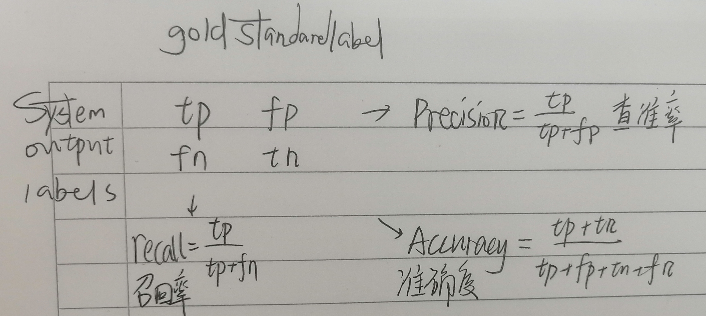

# 浅学一下吧

[toc]

## L1 Introduction

* Difficulties of NLP
  * Ambiguity
    * Lexical Ambiguity 分词
    * Part-of-speech Ambiguity 词性
    * Structural Ambiguity 句法结构
  * Unknown Language Phenomena
    * New terms, person / place names 新名词、人名地名
    * New meaning 新含义 
    * New language usage 新用法
* Applications of NLP
  * Machine Translation
  * Text Generation
  * Information Retrieval 检索
  * Question Answering & Dialogue Systems
  * Knowledge Graph
  * Automatic Summarization
  * Sentiment Analysis

* 语料库 **Corpus** ：一个语料库可以是单个文档，也可以是文档的集合
* **Text Normalization** 

  * Segmenting Sentences 分句
  * Tokenizing(Segmenting) Words 分词
  * Normalizing Word Formats: Do,Did,Doing
* **Segmenting Sentences**

  * "!" "?" -Unambiguous
  * "."(Period) - Ambiguous, it can be
    * Sentence Boundary
    * Abbreviations Like Inc.
      * An Abbreviation dictionary can help
    * Number Like 1.5
  * Or done by rules based on tokenization
*  **Word Tokenization: Based on Space**

  * Tokenizing - Merging - Sorting (By counts)

  * Issues: 

    * Some words can't blindly remove punctuation(标点符号)
      * URL / Price / Date / Email
    * Multiword Expression
    * Some Language don't use spaces to seperate words
      * 分字不分词 Single-character Segmentation

  * Subword Tokenization

    * Token Learning：采用原始语料库并归纳词汇的符号学习器
    * Token Segmenter：标记分段程序，接受几个测试句子并根据该词汇表对其进行标记

    * **BPE Byte Pair Encoding** 字节对编码
      * 扫描词表（Vocabulary）获得符号集（Individual Character Set）
      * 重复执行：合并当前词表中相邻频率最高的符号，将合并的符号加入到词表中去，把语料库（Corpus）中相邻的该符号对合并起来
      * BPE Tokens 特性
        * 包含频繁出现的词
        * 发现频繁出现的子词，比如前缀后缀
      * 建议参考：https://zhuanlan.zhihu.com/p/164520154
* **Word Normalization** 词语的规范化处理
  * 大小写统一转换
  * Lemmatization：以词根 Lemma 重现这些单词
  * Reduce terms to stems 词干，chopping off affixes crudely 去后缀
  * **Porter stemmer 分词算法**：基于一系列重写规则

## L2 Text Classification

* Spam Detection 垃圾邮件识别
* Sentiment Analysis 情感分析

* **朴素贝叶斯分类器 Naive Bayes Classifier**

  * 基于**词袋 Bag of words**，将其作为分类器的输入

    * 会丢失语法结构信息，词语间的依赖信息

  * 对于文档 d 和类别 c：$P(c|d) = \frac{P(d,c)}{P(d)} = \frac{P(d|c)P(c)}{P(d)}$，选出条件概率最高的对应的类别作为输出，即$c_{MAP}= \arg\max_{c \in C}P(d|c)P(c)$，这里因为分母的$P(d)$不变而消除了。

    * $P(d|c)$ **似然** Likelihood 
      * 假设每一个词语相对独立：$P(x_1, x_2, \dots, x_n | c) = P(x_1|c)P(x_2|c)\dots P(x_n|c)$ 
    * $P(c)$ **先验** Prior 某一个类别出现的概率，可以通过训练集来估计

  * 公式：$C_{NB} = \arg\max_{c_j \in C}P(c_j)\Pi_{i \in positions}P(x_i|c_j)$

    * 会出现的问题：数据下溢，往往再前面使用 log 函数才避免数据下溢

      * $log(ab) = log(a) + log(b)$

    * 最终得到公式：
      $$
      C_{NB} = \arg\max_{c_j \in C}\log(P(c_j)\Pi_{i \in positions}P(x_i|c_j)) \\
      = \arg\max_{c_j \in C}[\log(P(c_j) + \sum_{i \in positions}\log (P(x_i|c_j))]
      $$

  * 极大似然估计获取公式中的值：

    *  **每个类别的概率**：$\hat{P}(c_j)= \frac{N_{c_j}}{N_{total}}$

    * **每个词语在每个类别出现的概率**：$\hat{P}(w_i|c_j) = \frac{count(w_i,c_j)}{\sum_{w \in V}count(w,c_j)}$

  * 一些问题：
  
    * 有些词语在测试集中出现了，但在训练集中没有出现
  
      * 结算出来的结果为 0 
  
      * 解决方案 I ：**拉普拉斯平滑**
        $$
        \hat{P}(w_i|c_j) = \frac{count(w_i,c_j) + 1}{\sum_{w \in V}count(w,c_j) + |V|}
        $$
  
      * 解决方案 II：忽略他它们
  
    * Stop Word **停用词**：有些平凡出现，但没有具体含义的词，对分类任务没有什么作用
  
      * 例如：the，of 
      * 解决方案：
        * 使用停用词表来进行过滤
        * 丢弃频率最高的某些词语
        * 也可以选择保留停用词

* **情感分析和贝叶斯分类**

  * 分类任务： "+" OR "-"
  * 步骤：计算 Piror 和 Likeihoods、抛弃停用词、计算测试样本对每个类别的分数
  * 情感分析的优化
    * 问题：频率可能不是很重要
      * 解决：**二元朴素贝叶斯** Binary NB - 考虑一个词语是否出现而非一个词语的概率
        * 对每个样本的重复词语去重

* **Precision, Recall and F measure** 精确率/查准率，召回率/查全率

  * **混淆矩阵** Confusion Matrix：行是系统预测的标签的情况，列是真实的标签的情况

    

  * 使用准确度 Accuracy 来衡量模型的问题：会受样本类别不均衡的影响

  * F measure：将 Percision 和 Recall 两个指标结合在一起（不知道有没有抄错）
    $$
    F_\beta = \frac{(\beta^2+1)PR}{\beta^2P+R}
    $$

    * F1指标：$F_1 = \frac{2PR}{P+R}$

* 训练集、验证集、测试集

## L3 N-Gram Language Model

* 概率语言模型 Probabilistic Language Model：对一个句子赋予一个概率 $P(W) = P(w_1,w_2,...w_n)$

  * 机器翻译：通顺的句子概率高
  * 拼写检查 Spell Correction：词语正确拼写的句子概率高
  * 语音识别 Speech Recognition：通顺的句子概率高

* 链式法则
  $$
  P(W) = P(w_1,w_2,...w_n) = \Pi_iP(w_i|w_1w_2...w_{i-1})
  $$

  * 模式是有序的，需要从前往后算，如果假设这些$w$是相对独立的，则退化成词袋模型。
  * 举例：$P(^{"}What\text{ }the\text{ }hell^{"}) = P(what)P(the|what)P(hell|what\text{ }the)$

* **n-gram 语言模型**

  * Markov 马尔可夫假设：$P(w_i|w_1,w_2,...w_{i-1}) \approx P(w_i|w_{i-k},...w_{i-1})$
  * Unigram(1-gram), Bigram(2-gram，一阶马尔可夫)...
  * 问题：长句中的从句会把强依赖关系强的词组分开，n-gram 无法发现企其关系。
  * $P(w_i|w_{i-1}) = \frac{count(w_{i-1}, w_i)}{w_{i-1}}$
  * 处理细节：在句子之前和句子之后加标识符号再计算。
  * 反应语言学上的分布情况和语法上的知识

* 评估和困惑度 Evaluation & Perplexity

  * 能否判断句子的好坏
  * 从训练集上训练出模型的参数指词语出现的概率
  * 外部指标：将模型放在某个任务上应用来评估好坏
  * 内部指标：
    * **困惑度 Perplexity**：$PP(W) = P(w_1w_2,...,w_N)^{-\frac1N}$
      * 香农游戏：如何预测句子的下一个单词
      * 困惑度的假设：独立同分布（IID）测试集和训练集有一致的分布，并且独立
      * 出现 0 的情况：测试集有但训练集没有的情况，进行拉普拉斯平滑操作

## L4 Vector Semantics

> 用向量的方式表达词语的语义

* Lemmas & Sense 词干与词义

  * Lemmas：词干，除去词缀
  * Sense：词语的含义，可能有多重含义 Ploysemous

* 词语间的关系 Relation：

  * 同义词 Synonyms：表达同一个意思的词语应该存在关联，例如 automobile 和 car
  * 词语间的相似性 Similarity：比如 car 和 bicycle
  * 词语间的相关性 Word Relatedness：比如 coffee 和 cup
  * 语义场 Semantic Field：比如（House）kitchen 和 bedroom
  * 反义词 Antonyms：比如 hot 和 cold
  * 情感属性 Connotation(Sentiment)：
    * Positive / Negative
    * 微妙的情感属性 Subtle Connotation：比如 copy 和 fake

* 语义向量 Vector Semantics

  * 强假设：所有词语的含义都是用周围的词语决定的
  * 如果两个词语的使用场景完全相同，则他们是同义词
  * 两个方法：
    * 方法1：根据词语在语言学上的分布
    * 方法2：将词语映射到空间中的一个点
      * 将一个词语映射到三维空间（警觉维度，唤醒度维度，支配维度）

* 根据词语在语言学上的分布定义语义向量

  > Defining meaning as a point in space based on distribution 
  >
  > 语言学上的分布指：在词语的语言环境上的分布

  * 如果两个词语很相似，那么他们在向量空间中的举例很近。

* Embedding 嵌入：将词语映射到一个向量表示（细粒度表示：向量高维度）。

* Word Model

  * **Tf-idf**：词频-文档频率 

    * 引入：

      * Information Retrival Workhorse 信息检索普遍使用
      * 稀疏表示 Sparse Vector
      * Word-Document Matrix
        * 行是不同的文档，列是不同的词语，统计词语在不同文档出现的次数
        * 文本的向量表示，计算文本相关性，实现信息检索
      * Word-Word Matrix
        * 行和列都是词语，矩阵记录两个词语同时出现在一个语境（或者一个文本窗口）里的次数
      * 相似度计算方法：向量的角度
        * Cosine(v,w)：计算 v 和 w 的点积，再除以两个向量的长度
        * 由于计数非负，所以计算结果是0-1之间的值
      * 丢失了词语中顺序关系，like 词袋模型
      * 改进：通过调整词语权重，终于开始讲 Tf-idf 了

    * **Tf-idf** 词语$t$在文本$d$中出现的频率：$w_{t,d} = tf_{t,d} \times idf_t$

      * $\text{tf}_{t,d} = \log_{10}(\text{count}(t,d)+1)$ 

      * $idf_t = \log_{10}(\frac N{df_t})$

        * df 指在不同文档中出现的次数，在一个文档中出现若干次算一次
        * 常见词的 idf 低

        

    * PMI Pointwise Mutual Information （另一种方法）

  * **Word2Vec**

    * 稠密表示 Dense Vector
    * **Skip-Gram**：窗口内同时出现的单词作为正样本对，不出出现的作为负样本对，训练不是Triplet Loss，而是将样本对拼接在一起，扔进模型做二分类（训练正样本，负样本）
      * 因为这个过程不需要人为额外标记标签，所以是自监督的。
      * 将点积表示为概率，用来做逻辑回归训练。最大化目标词和其上下文词汇的相似性，最小化目标词和k个非上下文词汇的相似性。
      * 作为 Target Word 和 Content Word 有不同的 Embedding，即两个不同的向量表示，然后将他们两个加在一起得到一个唯一的词向量
        * 原因：计算方便；同一个词汇同时出现在目标词和上下文中，导致计算结果被多次计算，不符合常理。
      * 一个词向量如何表示多义词汇的问题？首先，取决于训练集；新的模型：动态的词向量
      * 为什么要负采样？让词向量在空间中有好的分布。
    * 发现相似关系
      * 基于平行四边形的类比推理，词向量之间可以进行一些运算：
        * apple is to tree as grapes is to vine apple的词向量 - grape 的词向量 = tree 的词向量 - vine 的词向量
        * king 的词向量 - man 的词向量 + woman 的词向量 = queen 的词向量
        * 透露出一些偏见：father 的词向量 - doctor 的词向量 + mother 的词向量 = nurse 的词向量
      * 表现了词语含义的演化：如果用不同时代的文本进行单独的训练，可以观察词语含义的变化

## LX Recurrent Neural Network

## LXI Part of Speech 词性划分

* Speech Tagging 词性标注
  * 一些现有的词性标签
  * Closed Class
  * Open Class 
* 词性标签的用途：句法分析，辅助机器翻译，情感/兴趣分析
* Named Entities 命名实体识别
  * 人名、地名、组织名
  * 日期、时间、价格
  * BIO 标记方法 Begin-Inter-Other 将命名实体识别转换为序列标注任务 B I 还要接具体的实体标签例如 PER
    * BIO 的变体： IO 、BIOES(E Ending S Single)

## LXX Machine Translation 机器翻译

* Parallel Corpus 平行语料：Source Sentence and Target Sentence

* Free Running Model：训练时传给下一时刻的是预测词语，测试时传预测词语
  * 难收敛
* Teacher-Forcing Mode：训练时传给下一时刻的是真实词语，测试时传预测词语
  * 曝光偏差问题：训练和测试参数一致，但输出不一致
    *  解决方案：一定概率是个预测词，一定概率使用真实词。
* Multi-layer Deep Encoder-decoder machine translation net

* 缺点：难以解释、不可控（例如偏见）

### 9.4 解码策略 Decoding Strategies

* 推理和测试 Inference & Test
* **贪婪解码 Greedy Decoding**：每一步都取 argmax，没有考虑到整个序列是不是最优的
* **束搜素解码 Beam Search Decoding**：在每个解码位置维护 K（Beam Size，一般设为 5 到 10） 个序列（K most probable partial translations），每个序列维护一个分数（概率模型） $\sum_{i = 1}^{t}\log P_{LM}(y_i|y_1,...y_{i - 1}, x)$。
  * 不能保证全局最优；
  * Stopping Criterion：特殊的终止符号 <END>，如果前面已经解码出了 <END> Beam Size - 1，维护的序列个数减少一个； 
  * 最后不应该直接选择分数最高的，因为序列长短不一，越长的序列分数越低，可以用除以序列长度，在挑选最高的。

## 10 Attention 注意力机制

* Seq2Seq with Attention: 
  * Attention Scores：将编码器的每一个位置的隐状态与解码器的每一个位置的隐状态做点积，然后对注意力分数做归一化（Softmax）Attention Distribution，与编码器的每一个位置的隐状态加权求和 Attention Output。Attention Output 最后与解码器隐状态的输出合并（Concatenate），在计算输出。
    * 要求编码器和解码器隐状态维度一致。
    * 训练和测试过程都需要算 Attention Output，测试过程应该是把隐状态的矩阵算好了，直接算就可以得到注意力了。注意力机制调整隐状态的参数。
    * 解码器的隐状态的输出是怎么和注意力输出合并在一起的

## 10.2 Evaluationg ET: BLEU

* BLEU：Bilingual Evaluation Understudy
  * N-Gram模型
  * Breity Penalty 惩罚项，惩罚短的翻译结果

## L11 Constituency Parsing

* Constituency Parsing 成分分析
* Constituency Syntactic Structure
  * 给每一个词语的词性打标签，单词可以构成不同类别的短语，名词短语可以合并
* Dependency Syntactic Structure 依存句法结构：扁平化的结构，获取句子之中词语之间的修饰关系，可以获得长距离词语之间的依赖关系。

* CFG Content-Free Grammars 上下文无关文法

* PCFG 基于概率的上下文无关文法（可以解决二义性）

