[toc]

### Lec 01 Intro

1. **自然语言处理的概念、挑战（2）、应用**

   1. **NLP的概念**：<u>自然语言处理是一门**通过可计算的方法**对自然语言进行**转换、分析、处理和理解**的学科。</u>
      
      * 它是计算机科学和语言学的交叉学科，也是人机交互、搜索引擎、机器翻译、信息抽取等应用的支撑技术
      * 自然语言处理是语言学、计算机科学和人工智能的一个分支，主要研究计算机与人类语言之间的交互作用，特别是如何设计计算机进行处理和分析
      
   2. **NLP的挑战**：

      1. 二义性 Ambiguity 
         * 分词歧义 Lexical
         * 词性歧义 Part-of-speech
         * 结构歧义 Structural
      2. 新的语言现象 Unknown language phenomena
         * 新词语、人名、地名
         * 词语的新含义
         * 新的词组用法 New language usage

   3. **NLP的应用**：机器翻译、文本生成、信息检索、智能问答 / 对话系统、知识图谱、摘要生成、情感分析

      

2. **文本预处理的步骤（3）和方法**

   * 语料库 Corpus ：一个语料库可以是单个文档，也可以是文档的集合

   1. **文本预处理的步骤**：分句、分词、单词格式规范化

   2. **文本预处理的方法：**

      1. **分句** Segmenting Sentences：

         * 直接跟据标点符号划分：感叹号、问号直接视为分隔‘；句号（英）存在二义性，也可能出现在数字、单词缩写中
         * 基于标记化的规则划分
         * 使用机器学习的方式学习一个分类器

      2. **分词** Tokenizing Words：

         * **基于空格 Based on Space**：有些单词不能盲目删除标点符号（URL、价格、日期、电子邮件）、有些语言不使用空格分隔单词、不能识别词组

         * **子词标记 Subword Tokenization**：采用原始语料库归纳词汇
      * **字节对编码 BPE Byte Pair Encoding**：扫描词表 Vocabulary 获得符号集 Individual Character Set ，重复一些步骤：合并当前词表中相邻频率最高的符号，将合并的符号加入到词表中去，把语料库 Corpus 中相邻的该符号对合并起来
        
      * Unigram模型（Lec 03）
      
   3. **规范化单词格式** Normalizing Word Formats
      
      * 大小写统一转换
         * 词根化 Lemmatization：以词根 Lemma 重现这些单词
         * 词干化 Stemming：通过粗略地切掉词缀将词语缩减为词干
      
      * 英文分词算法 Porter stemmer：基于一系列重写规则
      
        
   
3. 自然语言处理与人工智能及机器学习的关系：

   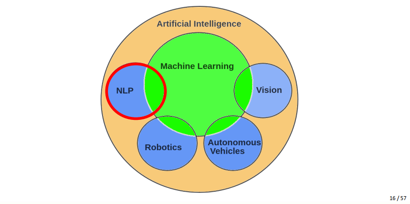

   

4. 自然语言处理的不同发展阶段

   1. 第一阶段：以统计机器学习为代表
   2. 第二阶段：以 Word2Vec为代表
   3. 第三阶段：以 BERT 为代表（2018）

### Lec 02 文本分类

1. **文本分类任务的定义与意义**

   1. **文本分类任务的定义**：给定文本 $d$ 和一组类的集合 $C = \{c_1, c_2,...c_n\}$，判断文本属于哪一类（输出预测类 $c \in C$）

   2. **文本分类任务的意义**：**识别文本的类型、属性、意图等**，例如分析情感、检测垃圾邮件、识别语句类型、文本主题流派等

      

2. **朴素贝叶斯分类训练器的原理和训练方法**

   * 词袋模型：统计在文本中出现的单词和次数（组成二元组集合）。

   * 贝叶斯规则在文档-类别模型上的数学模型：对于文档 $d$ 和类别 $c$
     $$
     P(c|d) = \frac{P(d|c)P(c)}{P(d)}
     $$

   1. **朴素贝叶斯分类器原理**：
      $$
      C_{MAP} = \arg\max_{c\in C}	P(c|d) = \arg\max_{c\in C}	\frac{P(d|c)P(c)}{P(d)}\\
      = \arg\max_{c\in C}P(d|c)P(c) = \arg\max_{c\in C}P(x_1,x_2,...,x_n|c)P(c)
      $$
      其中文档 $d$ 可以表示为特征 $x_1,x_2,...,x_n$，$P(c)$ 指类为 $C$ 的文档在数据集中的概率，$P(c|d)$ 可以理解为文档 $d$ 属于类为 $C$ 的概率，假设文档 $d$ 的各个特征相互独立，即：
      $$
      P(x_1, x_2, ...,x_n | c) = P(x_1|c)P(x_2|c)...P(x_n|c)
      $$
      最后分类器可以表示为：（取对数以方便计算，防止概率累乘）
      $$
      C_{NB} = \arg\max_{c\in C}\log(P(c)\prod_{x_i\in X}P(x_i|c))\\
      = \arg\max_{c\in C}(\log P(c) + \sum_{x_i\in X}\log P(x_i|c))
      $$

   2. **朴素贝叶斯分类器训练方法**：计算每个类在训练集中的概率 $\hat P(c_j)$ 和每个单词在各个类的文本中出现概率 $\hat P(w_i|c_j)$：$W$ 指出现的词汇的集合
      $$
      \hat P(c_j) = \frac{N_{c_j}}{N_{total}} \\
      \hat P(w_i|c_j) = \frac{count(w_i, c_j) + 1}{\sum_{w \in W}count(w,c_j) + |W|}
      $$

      * 拉普拉斯平滑：计算 $\hat P(w_i|c_j)$ 时使用了拉普拉斯平滑，总计词语的出现次数时统一加一，避免概率为零的情况
      * 未知词 Unknown Words：出现在测试集但未出现在训练集中的词。处理策略：将其忽略
      * 停用词 Stop Words：出现频率非常高的词语。处理策略：按出现的概率对词典出现的词从大到小排序，将出现次数最多的10或者50个词语视为停用词，将其删除

   * 二值朴素贝叶斯：词语出现比词语频率更重要，将词语出现的次数固定为 1，可以作为基于朴素贝叶斯分类器实现情感分析的优化版本

     

3. **文本分类的性能评估指标（3）**

   1. 准确度 Accuary

   2. 精确度（查准率） Precision：模型预测为正的样本中实际标签为正的比率，$Precision = \frac{true Positive}{turePositive+falsePositive}$

   3. 召回率 Recall：实际标签为正的样本中模型预测为正的比率，$Recall = \frac{true Positive}{turePositive+falseNegative}$

   4. 综合评价指标 F-Measure：（$F_1 = \frac{2PR}{P+R}$，即$\beta = 1$）
      $$
      F_\beta = \frac{(\beta^2+1)\cdot Precision\cdot Recall}{\beta^2 \cdot Precision + Recall}
      $$

   

4. 基于朴素贝叶斯分类器实现情感分析：计算 Piror $P(c)$  和 Likeihoods $P(w|c)$、抛弃停用词、计算测试样本对每个类别的分数

   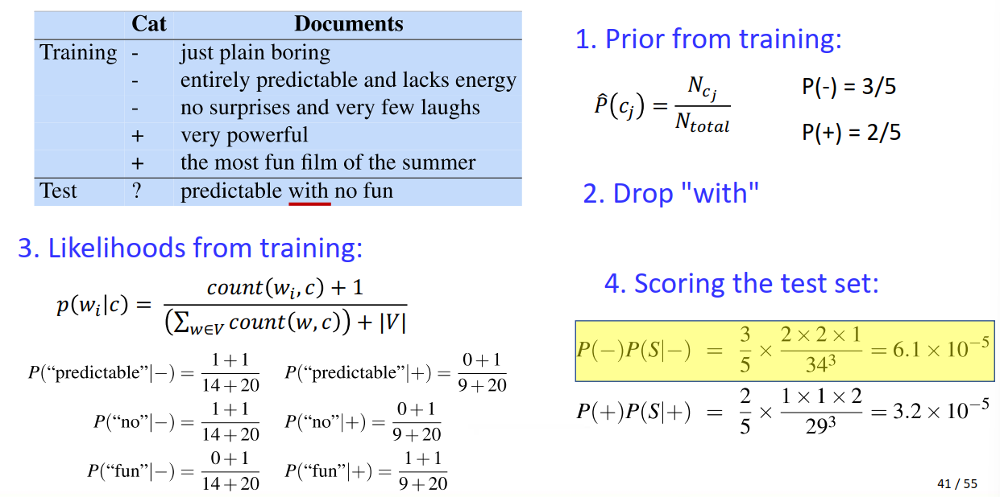

### Lec 03 N-gram模型

1. **语言模型（概率语言模型）的概念和目的**

   1. **语言模型的概念：为单词序列分配概率，以判断序列是否通顺的模型就叫做语言模型。对于任意的词序列，它能够计算出这个序列是一句话的概率，也能预测单词序列的下一个词是什么。**
      $$
      P(w_1,w_2,...,w_n) \text{ and } P(w_n|w_1, w_2,...w_{n-1})
      $$

   2. **语言模型的目的：通过计算一个句子或一系列单词的概率来判断某个句子是否语义通顺，句子的概率可以表示为各个词的联合概率：$P ( s ) = P ( w_1 , w_2 , . . . , w_n ) $**

      

2. **N-gram 和基于极大似然估计的语言模型计算方法**

   * 概率计算的链式法则：
     $$
     P(x_1, x_2,...,x_n)=P(x_1)P(x_2|x_1)P(x_3|x_1,x_2),...,P(x_n|x_1,x_2,...,x_{n-1})
     $$

   * 马尔科夫假设：
     $$
     P(w_i|w_1,w_2,...,w_{i-1}) \approx P(w_i|w_{i-k}, w_{i-k+1},..., w_{i-1})
     $$

   * **N-gram 语言模型**：（基于 K = N 的马尔可夫假设）

     * Unigram 语言模型：（基于 K = 1 的马尔可夫假设）
       $$
       P(w_1,w_2,...,w_n) \approx \prod_iP(w_i)
       $$

     * Bigram 语言模型：（基于 K = 2 的马尔可夫假设）
       $$
       P(w_i|w_1,w_2,...,w_{i-1}) \approx P(w_i|w_{i-1}) \\
       P(w_1,w_2,...,w_n) \approx P(w_1)\prod_{i>1}P(w_i|w_{i-1})
       $$

   1. **基于极大似然估计的N-gram计算方法**：
      $$
      P(w_i|w_{i-1}) = \frac{count(<w_i-1,w_i>)}{count(w_{i-1})}
      $$
      算句子的概率是可以套一个对数，让乘法边加法：
      $$
      \log P(w_1,w_2,...,w_n) \approx\log P(w_1)\sum_{i>1}\log P(w_i|w_{i-1})
      $$

   

3. 语言模型的意义（？）

   

4. 语言模型的评估：为更真实或更常观察到的句子分配更高的概率

   * 外在评价：用两个语言模型运行在同一个任务上，例如拼写更正、语音识别、机器翻译，执行任务并分别获取正确率，比较正确率高低（耗时）
   * 内在评价：困惑度 Perplexity $PP(W) = P(w_1w_2,...,w_N)^{-\frac1N}$ 越小越好

   

5. 语言模型的平滑

   * 部分解决训练时的稀疏性问题
   
   * 拉普拉斯平滑：
     $$
     P(w_i|w_{i-1}) = \frac{count(w_{i-1}, w_{i}) + 1}{\sum_{w \in W}count(w_
     {i-1}) + |W|}
     $$

### Lec 04 向量语义和嵌入 TF-IDF

1. **词向量的动机与意义**

   1. 词向量的动机：（和意义并在一起说吧）
      * 对于训练中未出现过的词语，传统方法无法进行预测
      * 如何得到词语之间的相似度，以生成未出现过的词语

   2. 词向量的意义：建立了一个如何表达词义的理论
      0. 一个词的词义在于它在语言中的使用，即词语是由其所处的环境来定义的
      1. 可以根据语言的分布来定义词语的意思，相似的词在语义空间上是相近的
      2. 词语的意思可以视为高维空间中的一个点

   * 词嵌入 Embedding：将词语映射到一个向量表示

     

2. **使用 TF-IDF 获取词向量和文本向量的方法**

   * Word-Document Matrix：行是不同的文档，列是不同的词语，统计词语在不同文档出现的次数，
     * 列向量是文档的向量，可以用于比较文档相似性
     * 行向量是文档的向量，可以用于比较单词相似性

   * Word-Word Matrix：行和列都是词语，矩阵记录两个词语同时出现在一个语境（或者一个文本窗口）里的次数
   * 余弦相似度 Cosine(v,w)：计算 v 和 w 的点积，再除以两个向量的长度

   1. **TF-IDF 计算公式**：对于单词 $t$ 的文本 $d$
      $$
      w_{t,d} = TF_{t,d} \times IDF_t \\
      \text{TF}_{t,d} = \log_{10}(\text{count}(t,d)+1) \\
      IDF_t = \log_{10}(\frac N{DF_t})
      $$

      * $DF_t$ 指单词 $t$ 在不同文档中出现的次数，在一个文档中出现若干次算一次，$N$ 是文档的数目。常见词的 $IDF$ 低

        

3. **基于 TF-IDF 计算词语、文本相似性的方法**

   1. 点积：$dot(v,w)=v^Tw$ 越大越相似

   2. **余弦相似度**：$cos(v,w)=\frac{v^Tw}{|v||w|}$

      

4. 词义的概念

   1. 词义与单词有复杂的**多对多**关联
   2. Lemmas & Sense 词干与词义
     * 词干：除去词缀的部分
     * 词义：词语的含义，可能有多重含义 Ploysemous
   3. 词义关系：同义词 Synonyms，相似词语 Similarity，相关词语 Relatedness，同语义场词语 Semantic Field，反义词 Antonyms，[微妙的] 情感属性 [Subtle] Connotation(Sentiment)
   

### Lec 05 神经网络

1. **神经网络的原理和训练方法**

   1. 神经网络的原理：（分类为例）

      1. 神经单元：$Z = WX+b$；激活函数：$y = a(Z)$，例如 Sigmoid、ReLU

      2. 前馈神经网络：输入层 - 隐层 - 输出层
         $$
         \hat y(\mathbf x) = softmax(\mathbf W_L a(...a(\mathbf W_2a(\mathbf W_1x))))
         $$

      3. 损失函数：交叉熵损失 
         $$
         L_r(\theta) = \frac1N\sum_{(x,y)\in D}\sum_{k = 1}^K -y_k\log \hat y_k(x)
         $$

      4. 反向传播：链式法则计算梯度 $\frac{\part L}{\part \mathbf W_t}$
         $$
         \frac{\part L}{\part w_i} = \frac{\part L}{\part y}\frac{\part y}{\part z}\frac{\part z}{\part w_i}
         $$

      5. 权重更新：
         $$
         w_{t+1}=w_t-lr\times\nabla f(w_t)
         $$

      

   2. 神经网络训练方法：对于每一个训练样本 $(x,y)$，前馈计算预测输出 $\hat y$，反向传播更新模型权重：通过$y, \hat y$ 计算损失函数 $L$，计算关于权重的偏导，以学习率 $lr$ 更新权重。

      

2. **基于神经网络实现文本分类**

   1. 提取（选取）文本特征组成向量作为模型输入
   2. 每一个词映射到嵌入层的一行（词向量），随机初始化词嵌入层并将其作为参数训练模型
      1. 对于不同长度的文本，去最长文本作为模型规模，其余补零
      2. 模型训练出嵌入层，可以作为单词的词向量表示

   

3. 链式法则
   $$
   \frac{\part L}{\part w_i} = \frac{\part L}{\part y}\frac{\part y}{\part z}\frac{\part z}{\part w_i}
   $$
   

### Lec 06 向量语义和嵌入 Word2Vec

1. **Word2Vec 模型计算词向量的原理和优点**

   1. Word2Vec 的原理：预测而非计数，使用自监督的思想训练一个预测任务上的二分类器（词语 $w$ 是否在 $w'$ 附近），无需关心任务本身，只需要学习到的分类器的嵌入层的权重作为词向量。

      * 自监督：无需人工标记，将 $w$ 是否出现在 $w'$ 附近作为监督学习的答案

   2. Word2Vec 的优点：

      1. 对比 TF-IDF，词向量是稠密向量而非稀疏向量，词向量更短更稠密有利于实际存储
      2. Word2Vec能更好地捕捉同义词，词向量具有平行四边形相似关系
      3. 训练速度快，在实际投入使用中效果更好
      
      

2. **Word2Vec 模型的训练方法**

   * **Skip-Gram 模型**：窗口内（单词出现处左右的 N 个单词）同时出现的单词作为正样本对，不出现的作为负样本对，训练时将样本对拼接在一起，扔进模型做二分类（训练正样本，负样本）

     1. 将目标词 $t$ 和相邻的上下文词 $c$ 视为**正样本对**。
     1. 随机采样词典中的其他词语 $d$ 作为**负样本对**。
     1. 训练一个逻辑回归分类器用于分辨两种样本对。
     1. 使用学习到的权重作为词向量。

     * 将点积表示为概率，用来做逻辑回归训练。
       $$
       \log P(+|w,c_{1:L})=\sum_{i=1}^L \log\sigma(c_i\cdot w)=\sum_{i=1}^L\log\frac1{1+e^{-c_i\cdot w}} \\
       \log P(-|w,c_{1:L})=\sum_{i=1}^L\log(1-P(+|w,c_i))=\sum_{i=1}^L\log\sigma(-c_i\cdot w)=\sum_{i=1}^L\log\frac1{1+e^{c_i\cdot w}}
       $$

     * 作为 Target Word 和 Content Word 有不同的 Embedding，即两个不同的向量表示，然后将他们两个加在一起得到一个唯一的词向量
       * 原因：计算方便；同一个词汇同时出现在目标词和上下文中，导致计算结果被多次计算，不符合常理。
   
   
   * **如何学习词向量**：
   
     * 对于每一个正样本对，随机选取 K 个负样本对。
   
     * 学习的目标是：最大化目标词和其上下文词汇的相似性，最小化目标词和非上下文词汇的相似性。
   
     * 关于目标词 $w$ 和上下文词 $c_{pos}， c_{neg_1}, ...,c_{neg_K}$ 的损失函数定义如下：
       $$
       L_{CE} = -\log (P(+|w,c_{pos})\prod_{i=1}^KP(-|w,c_{neg_i})) \\
       = -\log\sigma(c_{pos}\cdot w) + \sum_{i=1}\log\sigma(-c_{neg_i}\cdot w)
       $$
   
     * **最后：词 $i$ 的词向量表示为 $w_i + c_i$**，词向量的两部分分别位于目标词的 Embedding 矩阵 M 和上下文词的 Embedding 矩阵
   
     

3. **负采样的原理和目的**
   1. **负采样的原理：**通过随机采样词典中的不出现目标词上下文中的词语组成负样本对，训练分类器分辨无关词语的能力。
   2. **负采样的目的**：让词向量在向量空间中有较好的分布，仅有训练正样本对不能保证不相似的词语距离尽可能大。

4. 词向量的属性

   1. 平行四边形相似关系：基于平行四边形的类比推理，词向量之间可以进行一些运算，例如：V("king") - V("man") + V("woman") = V("queen")
      $$
      \hat b^* = \arg\min_x distance(x, a^*-a+b)
      $$

      * 显示偏见：father 的词向量 - doctor 的词向量 + mother 的词向量 = nurse 的词向量
      * 表现了词语含义演化：如果用不同时代的文本进行单独的训练，可以观察词语含义的变化

5. Skip-gram的实现（重复）

### Lec 07 循环神经网络

1. **神经语言模型的原理和概念**

   1. 神经语言模型的概念：基于更强大的神经网络技术的语言模型，用于预测下一个词或判断一串词序列的概率。

   2. 神经语言模型的原理：以一种简单的前馈神经网络模型为例（猜）

      1. 任务：在给定先验词：$w_{t-1}, w_{t-2},...$ 的情况下，预测下一个词 $w_t$
      2. 难点：处理任意长度的序列
      3. 解决策略：使用固定长度的滑动窗口，窗口的长度就是神经网络输入层的长度，输入的单词跟据编号获取对应的独热向量，独热向量与嵌入层运算得到对应的”词向量“，再通过隐层最终到达Softmax输出层，词典的长度就是输出层的长度

      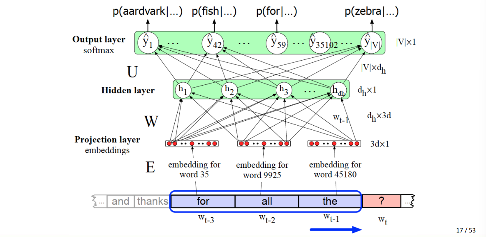

   

2. **循环神经网络的原理以及训练方法**

   1. **循环神经网络原理**：使用 RNN单元处理变长的序列数据，RNN单元共享参数（$W_h$ 和 $W_e$），参数更新方法就是：下面$h^{(t)} $和$\hat y^{(t)}$的式子

      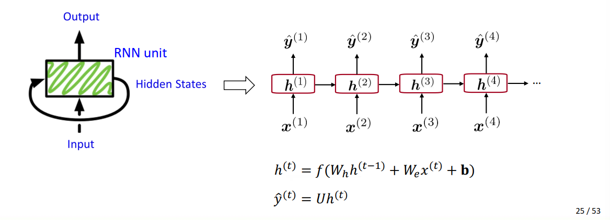

   2. **循环神经网络的训练方法**：

      1. 对于输入序列：$[\mathbf x^{(1)}, \mathbf x^{(2)}, ...,\mathbf x^{(T)}]$

      2. 将每个序列逐词输入RNN，计算每个时间步的输出概率
         $$
         \mathbf h^{(t)} = f(W_h\mathbf h^{(t-1)} + W_e \mathbf x^{(t)} + \mathbf b) \\
         \hat{\mathbf  y}^{(t)} = U\mathbf h^{(t)}
         $$

      3. 在每一个时间步，使用交叉熵函数就算损失：
         $$
         J^{(t)}(\theta) = -\sum_{w\in V}\mathbf y_w^{(t)}\log \hat{\mathbf y}_w^{(t)}
         $$

      4. 计算所有时间步的平均损失：
         $$
         J(\theta)=\frac1T\sum_{t=1}^T J^{(t)}(\theta)
         $$
         上面步骤只是对于一个样本，对于 N 个样本，还要取平均才能得到最终的损失函数：
         $$
         L =\frac1N\sum_{i=1}^N J_i(\theta)
         $$

      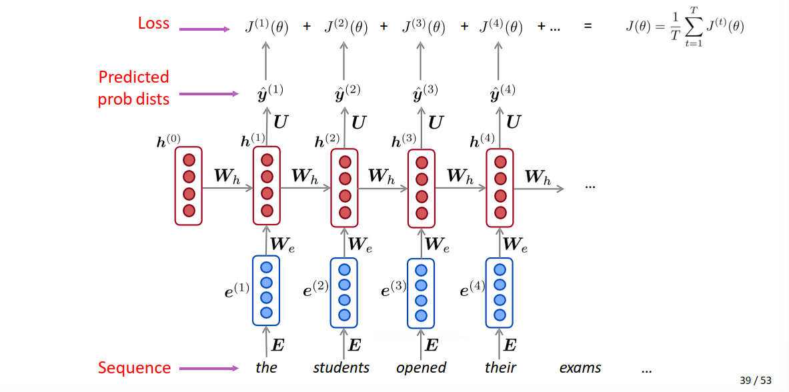

   

3. **循环神经网络的优缺点**

   1. **优点**：

      1. 能够处理变长输入
      2. 可以访问（利用到）之前任何一个时间步的信息
      3. 对于长输入，模型的大小保持不变
      4. RNN单元共享参数

   2. **缺点**：

      1. 循环过程计算缓慢

      2. 在实践中，很难获得离当前时刻较远的信息（在训练过程中丢失了）

         

4. 循环神经网络的优化细节（不会就是随机梯度下降吧）

   * Batch SIze：单次批处理中的训练示例总数
   * Epoch：一个 Epoch 指整个数据集仅通过模型向前和向后传递一次
   * Iterations：完成一个 Epoch 所需的批数

   1. SGD的算法步骤：

      1. 随机初始化权重
      2. 循环直至收敛：
         1. 选取 Batch Size 个样本点
         2. 计算这批样本点的损失函数的平均梯度
         3. 更新权重
      3. 返回权重

   2. RNN的反向传播：更新 $W_h$ 
      $$
      \frac{\part J^{(t)}}{\part W_h} = \sum_{i=1}^t\frac{\part J^{(t)}}{\part W_h}|_{(i)}
      $$

   3. RNN模型：LSTM / Bi-LSTM、GRU、双向 RNN、多层 RNN

      

### Lec 08 词性与命名实体

1. **词性标注的概念和意义** PoS Tagging, PoS: Part-of-speech

   1. **词性标注的概念**：用词性标记标注句子中的每个单词，它是句法分析的最低层次

   * 词性分类：

     * Close Class：由一组特定语言的小的、固定的语法功能词组成，如代词、介词、情态动词、限定词、小词、连词

     * Open Class：有大量的单词，而且很容易发明新的单词，如名词，动词，形容词，副词

   2. **词性标注的意义**：

      1. 对其他 NLP 任务有用。例如使用词性标注改善语法解析、为机器翻译任务重新排列形容词和名词、在情感分析中识别形容词，辅助文本语音合成。

      2. 对语言学或语言分析计算任务有用。例如在研究语言变化（如新词或词义变化）时需要控制词性；需要控制词性以衡量词意的相似或不同。

         

2. **命名实体识别的概念和意义** Named Entity Recognition NER

   * 命名实体：指任何可以用适当名称引用的东西，主要包括人名、地名、组织名、地缘政治实体，常以复合词组的形式存在，但这个词也可以扩展到非实体的事物如日期、时间、价格。

   1. **命名实体识别的概念：命名实体识别用于查找组成专有名称的文本范围，并标记实体的类型**
   2. 命名实体识别的意义：对其他 NLP 任务有用
      1. 情感分析：可以判断消费者对特定公司或个人的情感
      2. 问答系统：可以回答关于命名实体的问题
      3. 信息提取：从文本中提取有关命名实体的事实

   

3. 如何实现词性标注

   1. 基于监督机器学习算法（需要手工标记的训练集）

      1. 基于人造特征：隐马尔可夫模型、条件随机域

      2. 基于表示学习：神经序列模型如 RNN、大型语言模型如 BERT

         

4. 如何实现命名实体识别

   * 命名实体识别的难题：
     1. 分割 Segmentation：实体常以复合词组的形式存在，必须找到并分割实体
     2. 命名实体的类型歧义：例如一个词既可以代表人名又可以表示地名

   1. BIO Tagging：对每一个词进行分类（B：命名实体开头，I：命名实体其余部分，O：非命名实体）
   2. IO Tagging：对每一个词进行分类（I：命名实体部分，O：非命名实体部分）
   3. BIOES Tagging：对每一个词进行分类（B：命名实体开头，I：命名实体其余部分，O：非命名实体，E：命名实体结尾，S：只有一个词的命名实体）
   4. 同样使用基于监督机器学习算法解决分类问题
      1. 基于人造特征：隐马尔可夫模型、条件随机域
      2. 基于表示学习：神经序列模型如 RNN、大型语言模型如 BERT

### Lec 09-10 神经机器翻译

1. **神经机器翻译的原理** Neural Machine Translation MT

   * 机器翻译任务：将句子 $x$ 从一种语言（源语言）翻译成另一种语言（目标语言）的句子 $y$ 的任务。

   * **神经机器翻译的原理**：利用单个端到端神经网络进行机器翻译的方法

     * 这种神经网络结构被称为 seq2seq 模型，有编码器和译码器组成。编码器用于理解源 语言，译码器用于在目标语言中生成语言。
       $$
       P(y|x) = P(y_1|x)P(y_2|y_1,x)...P(y_T|y_1,...,y_{T-1},x)
       $$
       

   

2. **和统计机器翻译相比，神经机器翻译的优点（2）**：

   1. 神经机器翻译具有更好的性能：翻译结果更加清晰、可读、自然，更好地利用上下文的信息；
   2. 只有单个神经网络用于优化端到端模型，没有需要单独优化的子组件；
   3. 需要更少的人力资源：无需特征提取，对所有语言都适用。

   * 缺点：缺乏可解释性、无法调试；难以进行控制，也存在一些安全问题

     

3. **神经机器翻译的训练方法**

   * 准备平行语料库作为训练样本，输入设计好的网络进行训练。因为 seq2seq 被优化为单个系统，反向传播操作从端到端，即计算最后翻译结果的平均，再反向传播，经过解码器和编码器并调整权重参数。

   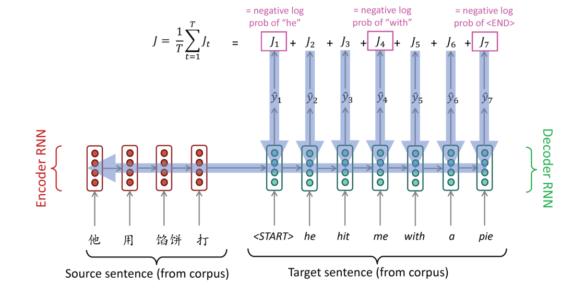

   

4. **Free-Running和Teaching-Forcing方法的原理和差异**

   1. Free-Running 的原理：在循环神经网络中，训练时传给下一时刻的是预测词语，测试时传预测词语

   2. Teaching-Forcing 的原理：在循环神经网络中，训练时传给下一时刻的是真实词语，测试时传预测词语

   3. 二者的差异

      1. Free-Running Mode 在实际训练过程中难收敛，模型不稳定；而 Teaching-Forcing Mode 有很快的收敛速度，并且模型稳定。
      2. Teaching-Forcing 存在的问题：这个模型从来没有在它自己的错误上训练过，可能对它们不健壮；同时还会面临曝光偏差问题，即训练和测试参数一致，但输出不一致。而 Free-Running Mode 不会出现这样的问题。
      
      

5. **神经机器翻译的解码方法：贪婪和束搜索**（解码器的解码方法）

   1. **贪婪解码 Greedy Decoding**：解码器的每一个位置都取 argmax，不考虑到整个序列是不是最优的

   2. **束搜素解码 Beam Search Decoding**：在每个解码位置维护 K（Beam Size，一般设为 5 到 10）个序列（K most probable partial translations），每个序列维护一个分数 $\frac1t\sum_{i = 1}^{t}\log P_{LM}(y_i|y_1,...y_{i - 1}, x)$。

      * 不能保证全局最优，但比穷举搜索要高效得多；

      * 停止准则：特殊的终止符号 <END>，如果前面已经解码出了 <END> Beam Size - 1，维护的序列个数减少一个； 

      * 最后不应该直接选择分数最高的，因为序列长短不一，越长的序列分数越低，可以用除以序列长度，在挑选最高的。

        

6. **注意力机制** Attention

   * 注意力机制为 seq2seq 模型的瓶颈问题（编码器最后一个单元需要捕获源句的所有信息）提供了一个解决方案

   * **注意力机制的核:heart:思想**：在解码器的每个步骤中，使用与编码器的直接连接来关注源序列的特定部分。

     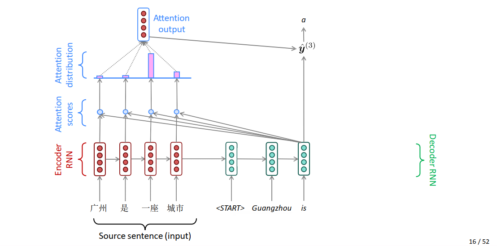

     在考虑解码器每一个位置的输出时：

     1. 将编码器的每一个位置的隐状态分别与解码器的对应输出位置的隐状态做点积得到（关于该解码器输出位置和每一个编码器位置的）注意力分数
     2. 对注意力分数做归一化（Softmax）得到注意力的分布
     3. 将注意力分布与编码器的每一个位置的隐状态加权求和得到注意力输出
     4. 注意力输出最后与解码器隐状态的输出合并（Concatenate），得到最终输出。

     * 要求编码器和解码器隐状态维度一致。
     * 训练和测试过程都需要算注意力输出，测试过程应该是把隐状态的矩阵算好了，直接算就可以得到注意力了。注意力机制调整隐状态的参数。
     * 解码器的隐状态的输出是怎么和注意力合并在一起，长度就变为了原来的两倍

   * **注意力机制的数学表达**：

     * 编码器隐状态：$h_1, ..., h_N \in R^h$
     * 对每一个时间步 $t$ ，解码器有一个隐状态 $s_t\in R^h$
     * 首先计算注意力分数：$e_t = [s_t^Th_1, ..., s^T_th_N] \in R^N$
     * 取 Softmax 得到注意力分布：$\alpha_t = softmax (e_{t})\in R^N$
     * 对注意力分布和编码器隐状态做内积求和得到注意力输出：$a_t = \sum_{i=1}^N\alpha^t_ih_i\in R^h$
     * 最后将注意力输出与解码器隐状态输出合并：$[a_t;s_t]\in R^{2h}$

   * **注意力机制的好处**：

     * 注意力显著提高了神经机器翻译性能，允许解码器专注于输入源的某些部分
     * 注意力解决瓶颈问题，允许解码器直接利用输入源，绕过瓶颈
     * 注意力有助于解决消失的梯度问题，为遥远的状态提供了一条捷径
     * 注意力提供了一些可解释性，通过观察注意力分布，可以观察到解码器关注的是什么

     

7. 机器翻译面临的挑战

   1. 自然语言中出现的二义性和未知现象：例如句法歧义、词汇歧义、语用歧义、新词、新术语、新结构、新语义等
   2. 机器翻译的结果不是唯一的

   

8. 机器翻译的实现

   * 解码器编码器各一个 RNN
   * Multi-layerRNNs：多层堆叠的 RNN 模型，Encoder 和 Decoder 堆叠的层数可能是不一样的。

* 评估机器翻译：

  * 人为评估：流畅度、准确度
  * 自动评估：根据与参考译文的相似度对输出进行评分

  1. BLEU Bilingual Evaluation Understudy

     * N-Gram 精确度：正确的 n-grams 与输出 n-gram 总数的比率

     * 不考虑召回率的原因：它考虑多个参考翻译，每个参考翻译可能使用不同的词选择来翻译相同的源词，而一个好的翻译结果应召回其中一个而非全部 (?) 。

     * Unigram 的例子：

       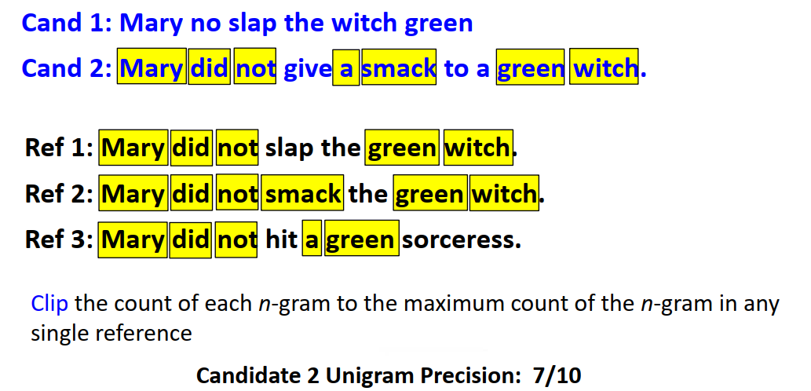

     * Bigram 的例子：

       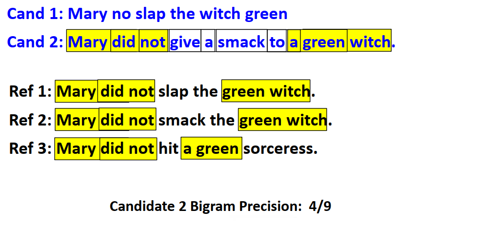

  * Breity Penalty 惩罚项 $min\{1, \frac{|output|}{|reference|}\}$，惩罚短的翻译结果

    

### Lec 11 成分句法分析

1. **句法结构的概念**

   1. **句法结构 Syntactic Structure 的概念**：句法结构指的是词与词之间相互联系、相互作用的方式，包括成分句法和依存句法（Constituency 和 Dependency）。

   * **句法分析 Syntactic Parsing** 是识别一个句子并为它指定一个**结构**的任务，我们可以使用语法树来表示句子的结构（成分句法）；

   * 句法分析的作用：语法检查、用作下游任务的中间表示（机器翻译、信息提取、机器问答）

     

2. **成分句法的概念**

   1. **成分结构 Constituency Structure 的概念**：短语结构将单词组织成嵌套成分（Nested Constituents）。最开始为每一个单词分配一个词性标签类别；单词之间可以组成短语，短语被赋予一个类别；短语之间也可以递归地组成更大的短语，新短语同样拥有类别。

   * **成分分析 Constituency Parsing** 是识别一个句子并为其指定**成分结构**的任务。我们可以使用语法树来表示句子的结构；

     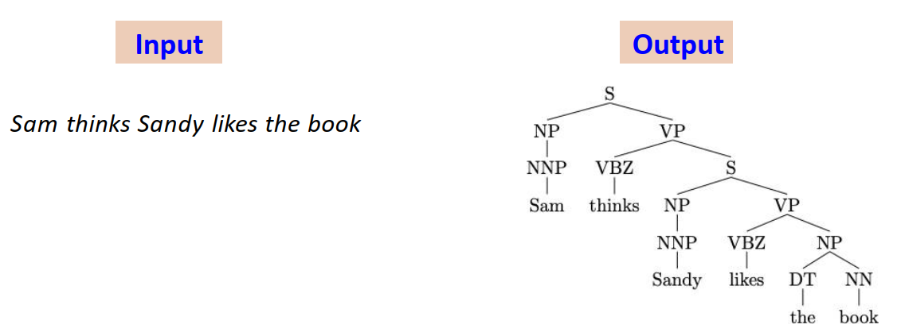

     

3. **上下文无关文法的概念及作用** Context-free grammars (CFG)

   1. **上下文无关文法的概念**：

      * **数学定义**：$G = (N,\Sigma,R,S)$
        * $N$：非终止符号集（由短语的类别和词性类别组成）
        * $\Sigma$：终止符号集（由单词组成）
        * $R$：规则集 $X\to Y_1Y_2...Y_n, n \ge 0, X\in N, Y_i\in(N\cup \Sigma)$
        * $S$：开始符号
      * 最左推导 Left-most Derivations：从 S 推导到实际语句时，从左往右推导，每次展开最左边的非终结符号。
        * 原因是：一些句子的不同推到顺序会导致生成结果不同，为避免二义性，规定单一的推导方式

   2. **上下文无关文法的作用**：

      * 在成分句法分析中，上下文无关文法是最广泛使用的形式系统。

      * 利用上下文无关文法可以构建出语法分析树，以表示句法结构，分析句法成分。

        

4. **概率上下文无关文法的意义** Probabilistic Context-free Grammar (PCFG)

   * 与上下文无关文法的差别：每一条规则都有一个概率，并且左式相同的推导规则概率之和为 1

   1. PCFG 的意义：（编的）

      1. PDFG 计算每个解析树的概率，并返回最可能的一个，能够从众多语法树中选出最合适的一棵

      2. 允许规则列表出现左式相同右式不同的规则，并解决了 CFG 的二义性问题

      3. 提高了上下文无关文法的准确性，一定程度上解决了上下文无关文法无法纠错的缺点

         

5. 如何得到概率上下文无关文法中每条规则的概率

   * 统计 TreeBank 中的规则，计算最大似然：
     $$
     p_{ML}(\alpha\to\beta)=\frac{Count(\alpha\to\beta)}{Count(\alpha)}
     $$
     

   

6. 如何计算整棵成分句法树的概率

   * 对于所有树边，求其概率的乘积，选择概率最高的解析。（可以取 Log 再累加）
     $$
     \prod_{i=1}^l p(\alpha_i\to\beta_i)
     $$
     

7. CKY 算法和词汇化概率上下文无关文法

   * Chomsky 范式 CNF：
     $$
     X\to Y_1Y_2 \text{ where } X,Y_1,Y_2\in N \\
     X \to Y \text{ where } X\in N, Y\in \Sigma
     $$

   1. CKY 算法：

      1. 首先将规则集转换为 Chomsky 范式  

         * $X\to ABC$ 变成 $	X \to AD, D\to BC$
         * $X\to A, A\to B$ 变成 $X \to B$

      2. 动态规划：给定句子 $x_1, x_2,..., x_n$ ，令 $\pi(i,j,X)$ 是对于任何以  $x_i$ 到 $x_j$ 并以非终止符 $X$ 作为根的解析树的最高分数

         1. 初始化：
            $$
            \pi(i,i,X) = p(X\to x_i) \text{ if } X \to x_i \in R \\
            \pi(i,i,X) = 0 \text{ else }
            $$

         2. 双重循环：
            $$
            \pi(i, j, X) = \max_{X\to YZ\in R, i\le k < j}p(X\to YZ)\times\pi(i,k,Y)\times \pi(k+1, j, Z)
            $$

      2. 词汇化概率上下文无关文法

         * 核心思想：给树结点增加词条，每个上下文无关规则都有一个特殊的子节点，它是规则的头部，例如
           $$
           S \to N V (V \text{ is the head})
           $$
           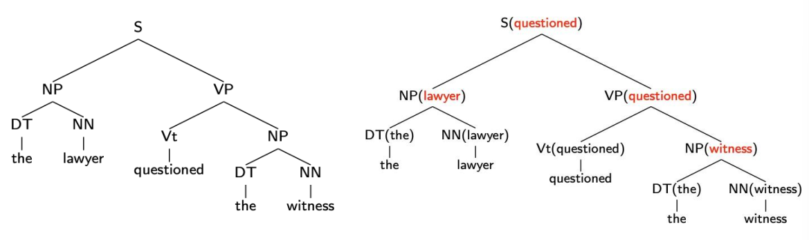

      

* Dependency Syntactic Structure 依存句法结构：扁平化的结构，获取句子之中词语之间的修饰关系，可以获得长距离词语之间的依赖关系。

