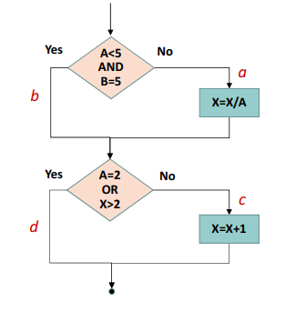
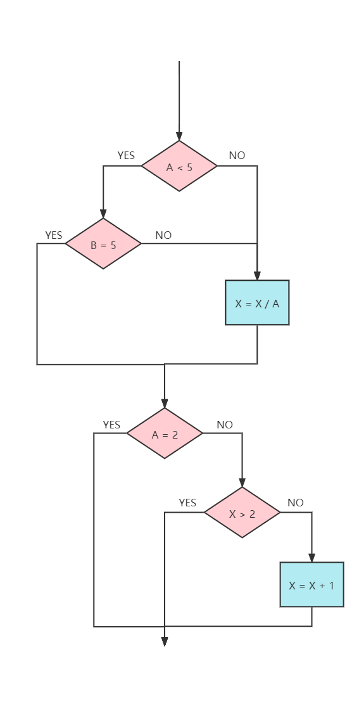
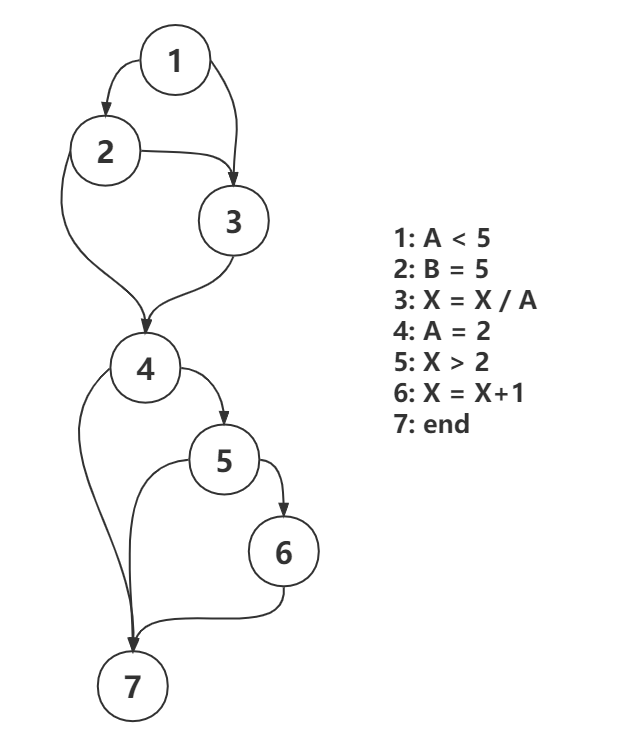

<h1>
    软件测试第六次作业
    </h1></cenetr>

<b>郑有为 19335286</b>

[toc]

## **问题**

根据下侧的程序流程图，完成：

1. **转换单条件判定结构；**
2. **画出相应的程序控制流图；** 
3. **给出控制流图的邻接矩阵；**
4. **计算 McCabe 环形复杂度；**
5. **找出程序的一个独立路径集合。**   

## **回答**

1. **转换单条件判定结构：**

   

2. **画出相应的程序控制流图：** 

   

3. **给出控制流图的邻接矩阵：**
   $$
   \begin{bmatrix}
   0 & 1 & 1 & 0 & 0 & 0 & 0 \\
   0 & 0 & 1 & 1 & 0 & 0 & 0 \\
   0 & 0 & 0 & 1 & 0 & 0 & 0 \\
   0 & 0 & 0 & 0 & 1 & 0 & 1 \\
   0 & 0 & 0 & 0 & 0 & 1 & 1 \\
   0 & 0 & 0 & 0 & 0 & 0 & 1 \\
   0 & 0 & 0 & 0 & 0 & 0 & 0 \\
   \end{bmatrix}
   $$

4. **计算 McCabe 环形复杂度：**McCabe 环路复杂度为程序逻辑复杂性提供定量测度。该度量
   用于计算程序的基本独立路径数目，也即是确保所有语句至少执行一次的起码测试数量。  

   上述程序控制流图有7个结点和10条边，有环形复杂度如下
   $$
   V(G) = m - n +2 = 10 - 7 + 2 = 5
   $$

5. **找出程序的一个独立路径集合：** 独立路径指至少沿一条新的边移动的路径。以下是一组独立的基本路径

   | 编号 | 独立路径              |
   | ---- | --------------------- |
   | 1    | 1 - 2 - 4 - 7         |
   | 2    | 1 - 3 - 4 - 7         |
   | 3    | 1 - 2 - 3 - 4 - 7     |
   | 4    | 1 - 2 - 4 - 5 - 7     |
   | 5    | 1 - 2 - 4 - 5 - 6 - 7 |

   
