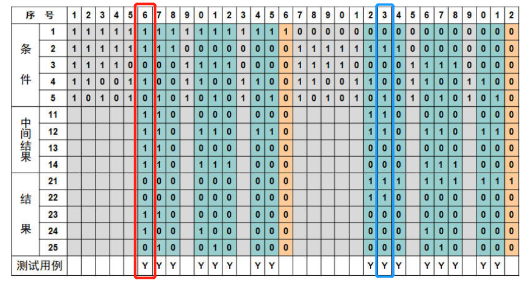
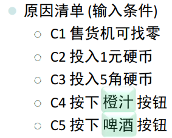
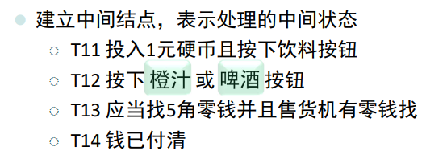
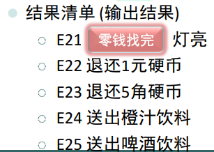
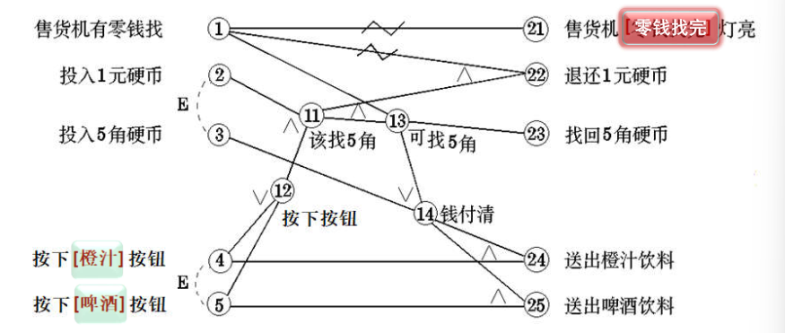

<h1>
    软件测试第八次作业
    </h1></cenetr>

<b>郑有为 19335286</b>

## **问题**

分析 Chap.5 (Lec.19) 自动售货机软件例子生成的判定表图例的第6列和第23列，分别给出：

* **输入条件的自然语义陈述；**

* **输出结果的自然语义陈述；**

* **用命题逻辑形式描述实现上述输入-输出过程所应用的判定规则，并写出获得输出结果的推理演算过程。**

  

**判定表图例：**

| 条件                                      | 中间结果                                  | 结果                                      |
| ----------------------------------------- | ----------------------------------------- | ----------------------------------------- |
|  |  |  |

**对应因果图：**

## **回答**

**判定表图例的第6列：**

* 输入条件的自然语义陈述：在售货机可以找零时，操作者投入1元硬币并按下”橙汁“按钮。

* 输出结果的自然语义陈述：售货机送出橙汁饮料，退还5角硬币。

* 根据因果图，给出判定规则：
  $$
  C4 \vee C5 \Rightarrow T12 \\
  C2 \wedge T12 \Rightarrow T11 \\
  T11 \wedge C1 \Rightarrow T13 \\
  T13 \vee C3 \Rightarrow T14 \\
  T13 \Rightarrow E23 \\
  T14 \wedge C4 \Rightarrow E24 \\
  \\
  C1 \Rightarrow \neg E21 \\
  \neg C1 \wedge T11 \Leftrightarrow E22 \\
  C5 \wedge T14 \Rightarrow E25 \\
  $$
  
* 推理演算过程：证明 $C1 \wedge C2 \wedge \neg C3 \wedge C4 \wedge \neg C5 \Rightarrow \neg E21 \wedge \neg E22 \wedge E23 \wedge E24 \wedge \neg E25$
  $$
  \because C1 \\
  C1 \Rightarrow \neg E21 \\
  \therefore \neg E21 \\
  \\
  \because \neg C1 \wedge T11 \Leftrightarrow E22 \\
  \therefore C1 \vee \neg T11 \Rightarrow \neg E22 \\
  \therefore \neg E22 \\
  \\
  \because C5 \wedge T14 \Rightarrow E25 \\
  \therefore \neg C5 \vee \neg T14 \Rightarrow \neg E25 \\
  \because \neg C5 \\
  \therefore \neg E25 \\
  \\
  \because C4 \\
  C4 \vee C5 \Rightarrow T12 \\
  \therefore T12 \\
  \because C2 \\
  C2 \wedge T12 \Rightarrow T11 \\
  \therefore T11 \\
  \because C1 \\
  T11 \wedge C1 \Rightarrow T13 \\
  \therefore T13 \\
  \because T13 \vee C3 \Rightarrow T14 \\
  \therefore T14 \\
  \because T14 \wedge C4 \Rightarrow E24 \\
  \therefore E24 \\
  \\
  \because T13 \\
  T13 \Rightarrow E23 \\
  \therefore E23 \\
  \\
  \therefore C1 \wedge C2 \wedge \neg C3 \wedge C4 \wedge \neg C5 \Rightarrow \neg E21 \wedge \neg E22 \wedge E23 \wedge E24 \wedge \neg E25
  $$
  **判定表图例的第23列：**
  
  * 输入条件的自然语义陈述：在售货机不可以找零时，操作者投入1元硬币并按下”啤酒“按钮。
  
  * 输出结果的自然语义陈述：售货机的“零钱找完”灯亮起，退还1元硬币。
  
  * 根据因果图，给出判定规则：
    $$
    \neg C1 \Rightarrow E21 \\
    C4 \vee C5 \Rightarrow T12 \\
    C2 \wedge T12 \Rightarrow T11 \\
    \neg C1 \wedge T11 \Rightarrow E22 \\
    $$
  
  * 推理演算过程：证明 $\neg C1 \wedge C2 \wedge \neg C3 \wedge \neg C4 \wedge C5 \Rightarrow E21 \wedge E22 \wedge \neg E23 \wedge \neg E24 \wedge \neg E25$
    $$
    \because \neg C1 \\
    \neg C1 \Rightarrow E21 \\
    \therefore E21 \\
    \\
    \because C5 \\
    C4 \vee C5 \Rightarrow T12 \\
    \therefore T12 \\
    \because C2 \\
    C2 \wedge T12 \Rightarrow T11 \\
    \therefore T11 \\
    \because T11 \wedge \neg C1 \Rightarrow E22 \\
    \therefore E22 \\
    \\
    \therefore \neg C1 \wedge C2 \wedge \neg C3 \wedge \neg C4 \wedge C5 \Rightarrow E21 \wedge E22 \wedge \neg E23 \wedge \neg E24 \wedge \neg E25
    $$
    
  
  