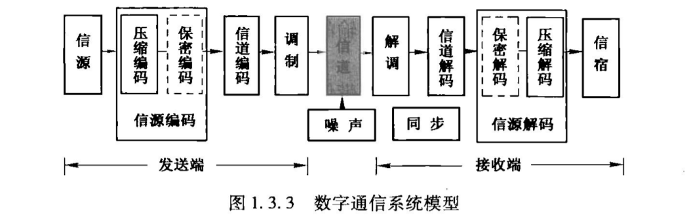
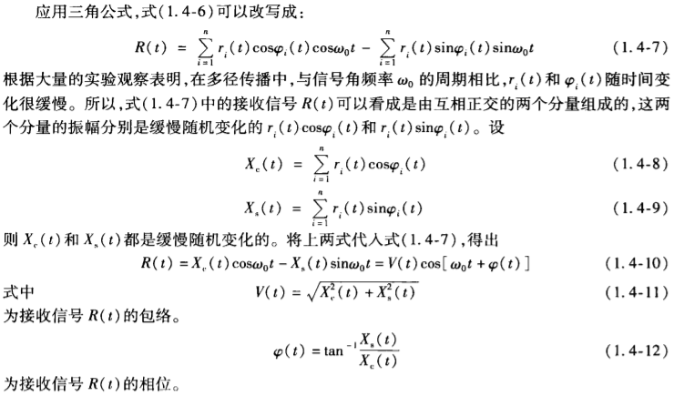

# CHAPTER 01 概论

1. 通讯的目的：传递消息中包含的信息。

   1. **消息**（message）：例如语音、文字、图形、图像
   2. **信息**（information）：消息中包含的有效内容
   3. **信号**（signal）：消息的载体，消息必须通过转化成（电）信号，才能在通信系统中传输。

   * 消息和信息区别：信息是消息中包含的有意义的内容，不同形式的消息可以包含相同的信息
   * 信息与信号的区别：**？**

2. **信息量 I**：使用“ 信息量”来衡量传输消息的多少
   
   * 从事件的不确定程度来描述信息量的大小
   * $I = I[P(x)] = \log_a\frac{1}{P(x)} = -\log_aP(x)$
     * $a = 2$时，表示信息量的单位为比特
     * 假设需要传输M个独立的等概率离散消息之一，信息量为 $ I = \log_2M$
   
3. 模拟信号和数字信号
   * 模拟信号（连续信号）：其电压可以用取值连续的时间函数表示
   * 数字信号（离散信号）：其电压尽可能取有限个离散值
     * 码元：波形表示下，代表一个取值的波形
   * 区分二者：看取值（纵轴）是否连续，而不是看时间（横轴）
   
4. 模拟通信系统与数字通信系统
   * 模拟通信系统：传输模拟波形，要求在接收端能以高保真度来复现原发送的模拟波形
     * 传输质量的衡量准则：**输出信号的噪声功率比**（信噪比）
     * **信噪比**：代表系统输入波形与输出波形之间的均方误差
   * 数字通信系统：传输的信息包含在信号的某个离散取值中，要求在接收端能正确判断接受的是哪一个离散值
     * 传输质量的衡量标准：**产生错误判决的概率**

3. 数字通信主要优点：

   * 取值有限，失真不超过给定范围不影响接收的正确判决；再转发过程中，中继站能对是真的信号进行整形，消除沿途误差
   * 可采用纠错编码等差错控制技术，提高抗干扰性
   * 允许使用数字加密技术
   * 可综合传输各类输入信息
   * 通信设备制作成本更低，体积更小，质量更轻
   * 可通过信源编码进行压缩
   * 输出信噪比随带宽指数增长（模拟通信仅是正比增长）

4. 数字通信系统模型：

   * 

     * 信源：把消息转成电信号的设备
     * 信道编码：提高信号传输的可靠性，在信号中增加多余字符（用于纠错检错）
     * **调制**：使得经过编码的信号特性与信道的特性相适应，使信号顺利通过信道 、 区分多个独立源在同一信道传输（多路复用）的信号
       * **基带**：基本频带，来自信源的信号所占用的**频带**。
         * 带通调制：通常包含低频率、直流分量（而许多信道不能传输这些），因此需要使基带信号对一个载波进行调制，将基带信号的频率范围搬移到足够高的频段（被载波调制后的信号称为带通信号。
         * 基带调制：只对波形作出适当改变，使其与信道特性相适
     * 信道：基带信道和带通信道
       * 对信号的影响：信道传输特性的影响、外部加性噪声的影响。

     * 模拟痛惜系统模型不含编码和解码。

5. 性能指标：有效性和可靠性

   * 有效性：信道传输信息的速度快慢（**传输速率**）
     * 码元速率$R_B$：单位时间内传输码元数目（单位：波特）
     * 信息速率$R_b$：单位时间传输的信息量（单位：比特/秒）
     * 消息速率$R_M$：单位时间内传输的消息数目（单位：字/秒）
     * 对于二进制信号，$R_B = R_b$
       * 对于M进制，每个码元的信息量是$I_M = \log_2M$，因而有$R_b = R_B\log_2M$
   * 可靠性：信道传输信息的准确程度（**错误率**）
     * 误码率$P_e$：错误接收码元数目在传输码元总数中所占的比例
     * 误比特率$P_b$：错误接收比特数在传输总比特数中所占的比例
     * 误字率$P_w$：错误接收字数在传输总字数中所占的比例
   * 频带利用率：单位频带内所能到达的信息速率
   * 能量利用率：传输每一比特所需的信号能量

6. 信道：无线信道和有线信道

   > 频带就是信号包含的最高频率与最低频率这之间的频率范围
   >
   > 频段实质上是硬性划分的

   * 无线信道：利用电磁波在空间中的传播来实现的
     * 无线信道的频段划分：极低频、...、低频、....、高频、...、红外、可见光、紫外
       * 微波频段划分：1~300GHz
       * 蜂窝网：特高频，基站和手机间使用地波传播
       * 卫星通信：特高频和超高频，视线传播
     * 电磁波传播：视线传播（更高频率，例如三颗赤道卫星 ）、地波（沿地面绕射，低频率）、天波（电离层反射波，高频率）
       * 大气层氧气、水蒸气、降水都会吸收和散射电磁波，1GHz以上的电磁波有明显的衰减
   * 有线信道：
     * 传输电信号：明线、对称电缆、同轴电缆
       * 电气特性：通话容量和频率范围依次增大，传输距离依次减小
     * 传输光信号：光纤
   
9. 信道模型：

   * 调制信道模型：输出电压与输入电压的关系：$e_u(t) = f[e_i(t)] + n(t)$，其中$n(t)$为噪声电压（加性干扰），通常假设$e_u(t) = k(t)e_i(t) + n(t)$，其中$k(t)$反应信道的特性（乘性干扰）——使信号产生各种失真
   * 编码信道模型：01序列，令$P(0/1)$表示发送1而受到0的概率，正确率等于$P(0/0) = 1 - P(1/0)$（考虑对称$P(0/0) = P(1/1)$）

10. 信道特性对信号传输的影响（好数学）

    >  码间串扰：数字信号波形畸变引起相邻码元波形之间发生部分重叠

    * 恒参信道

      * 频率失真：线性，可以借助线性补偿网络补偿
      * 相位失真：线性，可补偿，对数字信号影响大（造成码间串扰）
      * 非线性失真：造成谐波失真

    * 随参信道：信道特性是时变的（信号随时间衰减的，时延随时间改变，存在多径传播现象）

      * 设发射信号为$R(t) = \sum^n_{i = 1}r_i(t)\cos\omega_0[t-\tau_i(t)]$，其中n表示多路径，$r_i(t)$为接收信号振幅，$\tau_i(t)$为到达时延，经一些列化简有

        

        可以将$R(t)$看作一个**包络**和**相位**随机缓慢变化的**窄带**信号。（起伏信号）

        > 窄带：频率分布是一个窄带

11. 噪声：（来源分类）人为、自然噪声 热噪声 （性质分类）脉冲、窄带、起伏噪声

