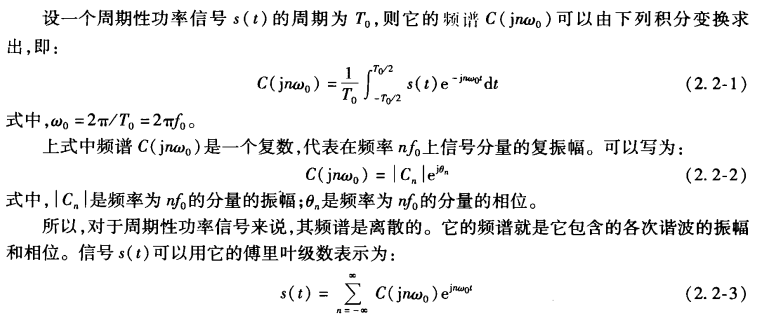
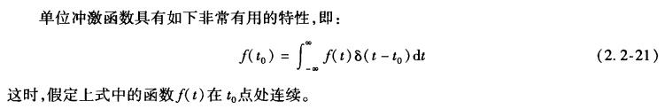
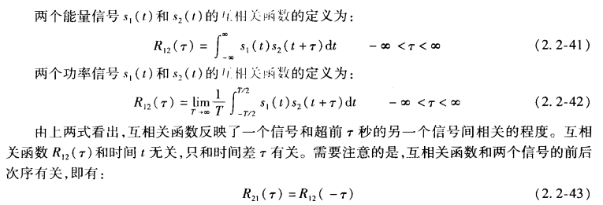

# 第二章 信号

### 1. 信号的类型

1. 确知信号和随机信号

2. 能量信号和功率信号：

   1. 能量信号：能量为有限正值，平均功率为零。

   2. 功率信号：能量无穷大，平均功率为有限正值。

   3. 公式理解：

      >信号功率：电流在单位电阻上消耗的功率，$P = V^2 = I^2$ 
      >
      >用 s(t) 来表示信号的电压或电流随时间变化的函数
      >
      >信号能量：信号瞬时功率的积分 $ E = \int s^2(t) dt$  
      >
      >信号的平均功率：$P = \mathop{lim}\limits_{T \to \infty} \frac{1}{T} \int^{T/2}_{-T/2}s^2(t)dt$ 

### 2. 确知信号的性质

#### 1. 频率特性

频率特性：由各频率分量的分布表示，有四种：频谱、频谱密度、能量谱密度和功率谱密度

1. ***功率信号* 的频谱**$C(jn\omega_0)$：

   

   > 你看傅里叶变换的左边是信号关于时间的函数，右边有一部分是频谱
   >
   > 对于一个周期信号：它的频谱就是各次谐波的振幅和相位

2. ***能量信号* 的频谱密度$S(\omega)$**：

   设一个能量信号为 $s(t)$，则它的频谱密度 $ S(\omega)$可以由它的傅里叶变换求出：

   

   > **单位门函数**：矩形脉冲
   >
   > 
   >
   > **抽样函数**：$Sa(t) = \sin t / t$，其频谱密度$Sa(\omega)$为一个门函数（不是单位门，反傅里叶得到）
   >
   > **单位冲激函数**：
   >
   > 
   >
   > 
   >
   > 
   >
   > 上述积分的物理意义可以看作用单位冲激函数在$t=t_0$时刻对$f(t)$抽样。

3. **能量信号的频谱密度和周期性功率信号的频谱的差别**：

   

4. **能量谱密度$G(f)$**

   

   

5. **功率谱密度**$P(f)$（针对功率信号，功率信号的能力无穷大，不能算出能量谱密度）

   

#### 2. 时域特性

主要性质：自相关函数和互相关函数。

1. 自相关函数：反映了一个信号与其延迟了$r$秒后的信号之间的相关程度。

   

   

2. 互相关函数

   

## 3. 随机信号的性质

#### 1. 随机变量的概率分布

* 随机变量：$X$
* 随机变量的分布函数：$F_X(x) = P(X \le x)$
* 随机变量的概率密度：$p_X(x)$，为分布函数的导数（连续的情况，对于离散的情况引入单位冲激函数）

## 4. 随机变量举例

#### 1. 正态分布

#### 2. 均匀分布

#### 3. 瑞利分布

## 5. 随机变量的数字特征

#### 1. 数学期望

#### 2. 方差

#### 3. 矩

* 随机变量$X$的$k$阶矩

  

## 6. 随机过程

#### 1. 随机过程的基本概念

#### 2. 平稳随机过程

* 严格平稳随机过程：若一个随机过程的统计特性与时间的起点无关，则该过程为严格意义上的平稳随机过程。
* 广义平稳随机过程：若一个随机过程的平均值、方差、自相关函数与时间的起点无关，则该过程为广义上的平稳随机过程。

#### 3. 各态历经性

* 一个随机过程具有各态历经性，则它的统计平均值就等于时间平均值

* 各态历经性表示一个平稳随机过程的一个实现能够经历的过程的所有状态

  

#### 4. 平稳随机过程的自相关函数和功率谱密度

* 自相关函数的性质：P34
* 功率谱密度的性质：P35

## 7. 高斯过程

* 高斯过程又称为正态随机过程，$X(t)$都一维概率密度函数**服从正态分布**

   

* 用误差函数表示正态分布

  

## 8. 窄带随机过程

* 窄带随机过程：随机过程的频带宽度$\Delta f << f_0$，$f_0$为中心频率。

  

* 窄带随机过程的性质

  * 统计特性有$a_x(t)$和$\varphi_x(t)$确定，或由$X_c(t)$和$X_s(t)$决定。

  假设$X(t)$是一个均值为0的平稳窄带高斯过程

## 9. 正弦波加窄带高斯过程

## 10. 信号通过线性系统