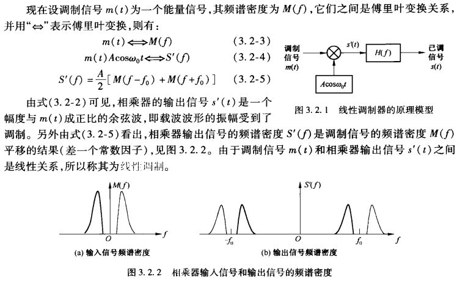
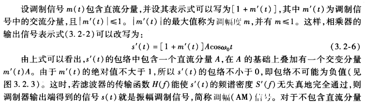
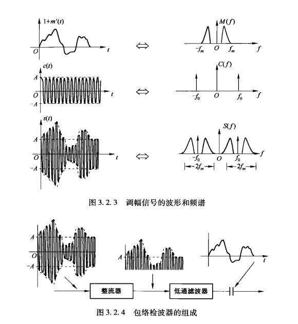
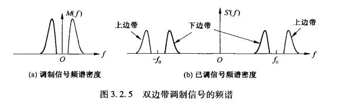
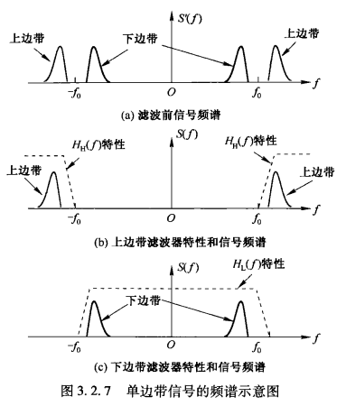
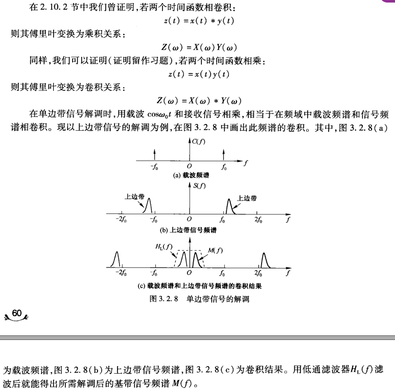
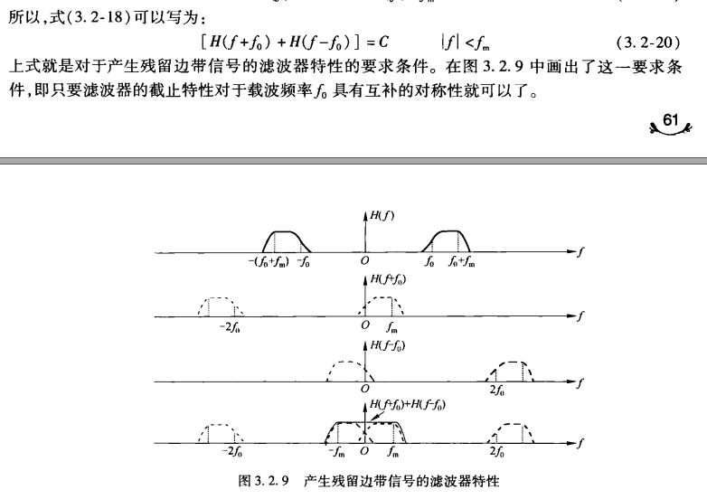
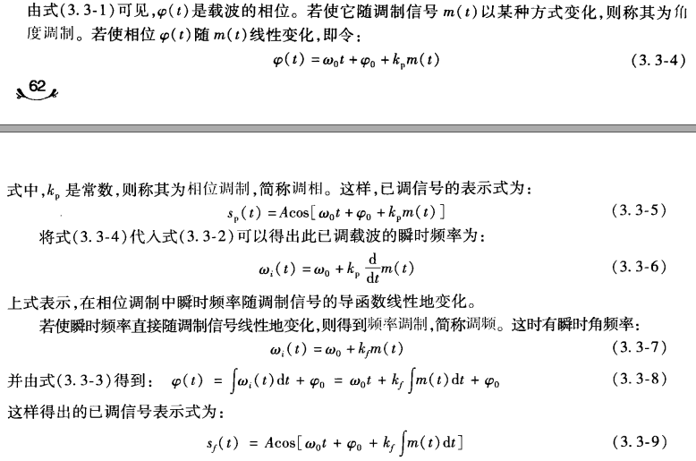
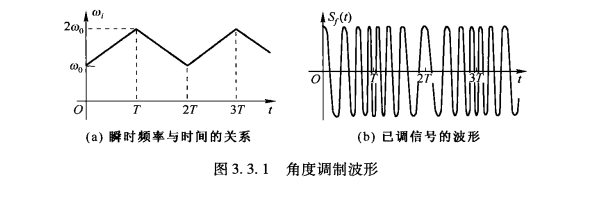

# 第3章 模拟调制系统

[toc]

## 3.1 概述 

* 模拟调制：指用来自信源的基带模拟信号去调制某个载波。调制的结果将使载波的某个参量随信号而变，或者说是用载波的某个参量值代表自信源信号的值。
* 载波：一个确知的周期性波形（具有恒定振幅、恒定频率、恒定相位的正（余）弦波），本章讨论余弦波，载波的三个参量是振幅$A$、载波角频率$\omega_0$和初始相位$\varphi_0$。
* 调制信号和已调信号：前者是自信源来的信号，后者是受调制后的载波。
* 调制的目的：
  * 频谱搬移：通过调制，把基带调制信号的频谱搬移到载波频率附近，这样就将基带信号变换为带通信号。 
  * 抗干扰：通过调制提高信号通过信道传输时的抗干扰能力，提高传输效率。
* 调制的分类：
  * 线性调制（幅度调制）：频谱沿频率平移的调制，已调信号和调制信号的频谱结构相同。
    * 线性调制的已调信号种类包括：调幅信号、单边带信号、双边带信号和残留边带信号。
  * 非线性调制（角度调制）：已调信号和调制信号的频谱结构有很大的不同，所占用的频带宽度也可能大大增加。
    * 非线性调制的已调信号种类包括：调频信号和调相信号两大类。

## 3.2 线性调制

* 线性调制器模型：首先载波与调制信号$m(t)$直接相乘，然后将结果$s'(t)$通过一个传输函数为$H(f)$的带通滤波器，得出已调信号$s(t)$。

  

* 振幅调制（AM）：调幅信号

  

  * 调幅信号：调幅信号的包络形状和调制信号的波形是一样的

  * 包络检波器：由一个整流器和一个低通滤波器组成，由于低通滤波器不会滤掉直流分量，所以输出端还有一个隔直流装置。

    

* 双边带（DSB）调制：此时调制信号没有直流分量，导致乘法结果不含载波分量

  

  * 发送 DSB 信号时不发送载波，所以可以节省发送载波的功率，但在解调时需要加入载波

* 单边带调制（SSB）：利用线性调制器中的滤波器将一种一个边带过滤掉，因为两个边带包含相同信息，只需要传输一个即可。

  * 要求频谱中不能有太低的频率分量

  * 使用高通滤波器得到上边带信号，使用低通滤波器得到下边带信号

    

  * 解调：用载波与单边带信号相乘。

    

* 残留边带（VSB）调制：线性调制器方框图和之前的一致，只是在滤波器上做相应修改。
  * 

## 3.3 非线性调制

* 基本原理：线性调制是将调制信号（关于时间的函数）附加在载波的振幅上（就直接相乘），而非线性调制将调制信号附加到载波的相位上。

  * 瞬时频率：相位关于时间的导数

  * 若使相位随调制信号$m(t)$以某种方式变化，则为角度调制

    

    * 相位调制和频率调制：分别是上图中的3.3-5和3.3-7，一个$k_p$，一个$k_f$

    * 若相位随调制信号线性地变化，即令$\varphi(t) = \omega_0t + \varphi_0 + k_p m(t)$，其中$k_p$为常数，则称为相位调制（调相），载波相位随着调制信号线性地变化，而频率调制中载波相位随调制信号的积分线性地变化，二者无本质区别。

      

---

# JOJO 我再也不看教材啦

