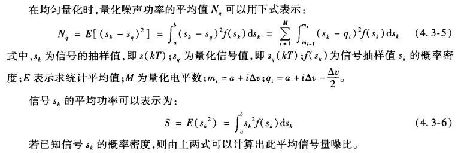
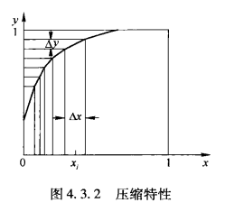
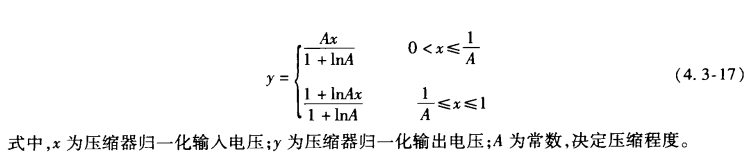
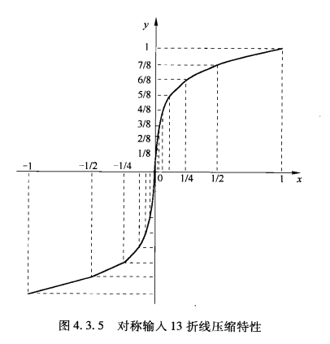
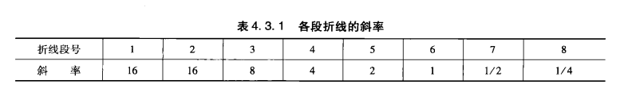
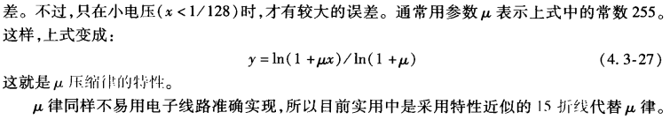
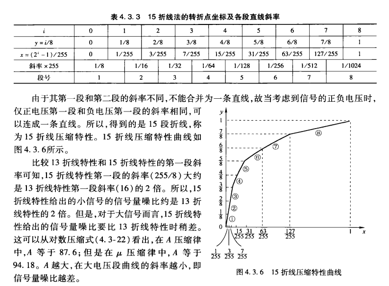

# 第4章 模拟信号的数字化

## 4.1 引言

* 通信系统的两类信源：模拟信号、数字信号。
  * 前者例如语音、图像信号，后者例如文字、计算机数据。
* 模数变换的基本三步骤：抽样、量化和编码。
  * 最常用的编码方法：脉冲编码调制（PCM）

## 4.2 模拟信号的抽样

* 低通信号的抽样：

  * 抽样：在一系列离散点上，对这种信号抽样取值成为抽样，一般在等时间间隔上对连续的模拟信号抽样取值
    * 理论上，抽样过程可以看作周期性单位冲激脉冲和此模拟信号相乘。
    * 实际上，用很窄的周期性脉冲代替冲激脉冲
    * 对一个宽带有限的连续模拟信号进行抽样时，如果抽样速率足够大，则抽样值可以完全代表该信号，也就是说可以用抽样值来复原模拟信号波形。

  * 抽样定理：若一个连续的模拟信号$s(t)$的最高频率小于$f_H$，则以间隔时间$T \le 1/2f_H$为的周期性脉冲对其进行抽样时（即抽样频率$\ge 2f_H$），$s(t)$将被这些抽样值所完全确定。
    * $2 f_H$也叫做Nyquist抽样频率，如抽样频率小于这个，相邻周期的频谱间将发生频谱重叠（混叠）
      * 实际上，由于滤波器的截止边缘做不到如此陡峭，所以使用的抽样频率都会比Nquist抽样频率大许多。

* 带通模拟信号的抽样
  * 带通信号的频率（限制在$f_L$与$f_H$之间）限制不同于低通信号（只存在最高频率限制）
  * 这时抽样频率需要满足：$f_s = 2B + \frac{2kB}{n}$，其中$B$为信号带宽，$n$是小与$f_H /B$的最大整数部分，$0 < k < 1$
* 模拟脉冲调制

## 4.3 抽样信号的量化

* 量化原理：
  * 目的：将抽样信号数字化；
  * 量化方法：使用N为二进制数字码元来代表此抽样值的大小，将抽样值划分为$2^N$个区间，每一个区间用一个点评表示。根据划分方式由均匀量化和非均匀量化两种。
  * 量化的考虑：误差最小化

* **均匀量化**：先平均划分量化区间，在取每个量化区间的中点最为量化输出电平

  * 量化噪声：量化输出电平与量化前信号的抽样值之差

  * **量噪比**（平均量化的信噪比）：平均信号功率 / 平均量化噪声功率

    

  * 不足：量化早噪声是确定的，信号小时量噪比也小，对小输入信号不利。

* **非均匀量化：**

  * 量化间隔不相等，信号抽样值越小时量化间隔越小
  * 先将信号的抽样值压缩，在进行均匀量化来实现。

  * **压缩**：用一个非线性电路将输入电压变化成输出电压  $y = f(x)$，为了保证对不同信号强度保持信号量噪比恒定（要求$\Delta x$与$x$成比例），求得压缩函数具有对数特性：$y = 1 + \frac1kln(x)$。

    

  * **A 压缩率**

    

    实际运用是 A 一般等于 87.6（A 越大对小信号越好，但A大使得大电压段斜率减小，信号量噪比越差）

  * **13 折线压缩特性**

    A 压缩率的一种近似，其实只有 8 条线，从左到右标号（1,2,...,8），注意横纵坐标，且第一段和第二段的斜率是一样的（可以归为一段），在考虑（-1，0）,加起来就一共有13段了（第一段，第二段，负数第一段，负数第二段斜率相等归为一段）。

    

    

* $\mu$ 压缩率 和 15 折线压缩特性

  

  

* 比较：
  * 15折线与13折线比较：小区间15好，大区间13好。
  * 非均匀和均匀比较：在保证小信号量化间隔相等的条件下，非均匀编码节省比特

## 4.4

* 自然二进制码和折叠二进制码
* 13位折线法中编码：（1位表示极性，3位段落码（8段），4位段内码（16个量化电平））要注意每一个段落的长度是不一样的。

## 4.5 差分脉冲编码调制

* 线性预测
* 线性预测编解码器
* 增量调制：（可以节省同步的开销）
  * 帧同步：确定一个帧从哪个字节开始

